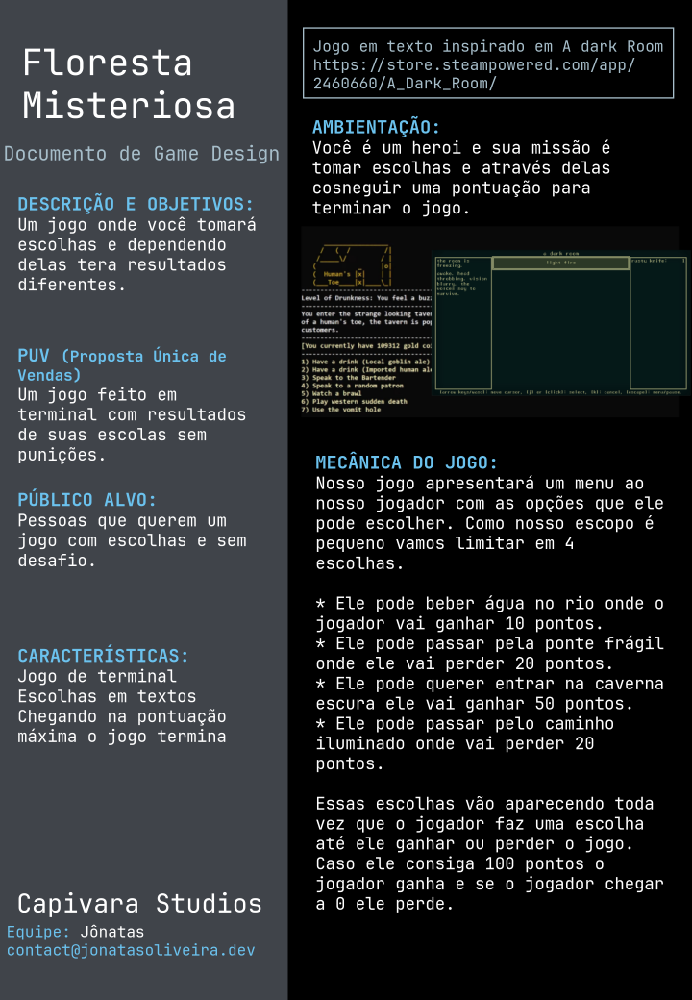

# Floresta Misteriosa

Para iniciar vamos dar um raio-x sobre nosso primeiro jogo, em a floresta misteriosa o jogador assume um papel de um aventureiro corajoso  que se aventura por uma floresta misteriosa. A cada escolha que o jogador faz vão influenciar a sua jornada, dependendo da sua decisão você vai ganhar ou perder pontos se você alcançar 100 pontos você vence o jogo.


## Regras

Nosso jogo apresentará um menu ao nosso jogador com as opções que ele pode escolher. Como nosso escopo é pequeno vamos limitar em 4 escolhas.

* Ele pode beber água no rio onde o jogador vai ganhar 10 pontos.
* Ele pode passar pela ponte frágil onde ele vai perder 20 pontos.
* Ele pode querer entrar na caverna escura ele vai ganhar 50 pontos.
* Ele pode passar pelo caminho iluminado onde vai perder 20 pontos.

Essas escolhas vão aparecendo toda vez que o jogador faz uma escolha até ele ganhar ou perder o jogo. Caso ele consiga 100 pontos o jogador ganha e se o jogador chegar a 0 ele perde.

## Criando o projeto

Vamos criar um diretório onde vamos armazenar nossos projetos do curso, minha sugestão é criar um diretório chamado projects. Abrindo um terminal usando o comando `cd` para ir até o diretório `Home` do seu computador e depois vamos usar o comando `mkdir` para criar um diretório.

```bash
cd
mkdir projects
```

Caso queria se aprofundar sobre os comandos via terminal minha sugestão é dar uma conferida no [guia focalinux](https://www.guiafoca.org/) ele vai lhe ajudar a ter um entendimento melhor do funcionando dos comandos _posix_ mas, vou explicando cada comando no terminal que vamos usar ao decorrer do curso.

Agora vamos acessar o diretório que criamos.

```bash
cd projects
```

Agora que acessamos o diretório que vamos trabalho, o próximo passo é criarmos nosso projeto em rust, para criar um projeto em rust vamos usar o comando `cargo new` e o nome do nosso projeto é chamado `mysterious_forest`. Assim ele vai criar um diretório chamado `mysterious_forest` para confirmar se a pasta foi criada vamos usar o comando `ls -la` onde o `-la` é um parâmetro apenas para listarmos também os arquivos ocultos.

```bash
cargo new mysterious_forest
ls -la
```

Agora vamos acessar o diretório que criamos no qual podemos acessá-lo através do comando `cd mysterious_forest`.

```bash
cd mysterious_forest
```

Agora podemos usar novamente o comando `ls -la` para vermos o que o comando cargo criou no nosso projeto.

```bash
.git
.gitignore
Cargo.toml
src
```

Uma observação os arquivos com o `.` na frente como o `.git` e o `.gitignore` são arquivos ocultos no Linux responsável pelo nosso versionador. `Cargo.toml` é um arquivo de configuração do nosso projeto Rust e o diretório `src` é onde vamos criar o nosso código, pra isso nesse comando ele cria um projeto de exemplo já com um `main.rs`.

Vou dar o comando `cargo run` para executar meu projeto.

Assim vamos ter a saída.

```bash
➜ cargo run
   Compiling mysterious_forest v0.1.0 (/home/feanor/projects/mysterious_forest)
    Finished dev [unoptimized + debuginfo] target(s) in 0.12s
     Running `target/debug/mysterious_forest`
Hello, world!
```

Uma coisa interessante de notar quando executamos um projeto rust é que na primeira linha:
`Compiling mysterious_forest v0.1.0 (/home/feanor/projects/mysterious_forest)`
Nós temos o nome do nosso executável, no caso `mysterious_forest` e a versão do nosso executável no caso `v0.1.0`.

Na segunda linha temos:
`Finished dev [unoptimized + debuginfo] target(s) in 0.12s`
Aqui temos a informação que nosso executável foi compilado em modo dev e o tempo de compilação no caso `0.12`

Na terceira linha temos:
`Running target/debug/mysterious_forest`
Essa linha nos mostra onde fica nosso executável ele que vamos distribuir para os usuários jogarem nosso jogo. No caso aqui temos ele em modo `debug`, mas a nossa versão final distribuiríamos a versão _release_ que é mais otimizada.

Certo agora vamos entrar no projeto no arquivo no caminho `src/main.rs`

```rust
fn main() {
    println!("Hello, world!");
}
```

Isso é um "Hello, world!" padrão de um projeto rust, então nesse caso não começamos com um "Hello, world!" no projeto pois ele já vem no momento da criação de um projeto.

## Uma introdução a tipagem de dados

A tipagem em programação é a maneira como as linguagens de programação tratam os tipos de dados, ou seja, como elas definem e gerenciam os diferentes tipos de valores que podem ser usados em um programa. Vamos ter tipos que são números inteiros, ou números com virgula ou um dados alfanuméricos. Rust é uma linguagem de programação que utiliza um sistema de tipagem estática, o que significa que os tipos de dados são verificados em tempo de compilação, tornando o código mais seguro e eficiente.

### Tipagem Estática

Em Rust, você precisa declarar explicitamente o tipo de dado que uma variável pode armazenar. Isso é feito durante a declaração da variável, permitindo que o compilador verifique se o valor atribuído à variável é compatível com o tipo declarado. Se houver uma incompatibilidade de tipos, o código não será compilado, o que ajuda a evitar erros em tempo de execução.

### Tipos Primitivos em Rust

Rust possui uma série de tipos primitivos que podem ser usados para representar diferentes tipos de dados. Vamos dar uma olhada nos tipos primitivos mais comuns em Rust:

*1. Integer Types (Tipos Inteiros)*

Os tipos inteiros em Rust representam números inteiros sem parte fracionária. Aqui estão alguns dos tipos inteiros mais comuns, junto com sua faixa de valores:

    i8: Intervalo de -128 a 127.

    i16: Intervalo de -32,768 a 32,767.

    i32: Intervalo de -2,147,483,648 a 2,147,483,647.

    i64: Intervalo de -9,223,372,036,854,775,808 a 9,223,372,036,854,775,807.

    i128: Intervalo extremamente grande de números inteiros com sinal.

Por exemplo, você pode declarar uma variável inteira em Rust da seguinte forma:

```rust
    let numero: i32 = 42;
```

Os tipos inteiros sem sinal, representados com u, têm os mesmos tamanhos que os tipos inteiros com sinal e representam apenas valores não negativos. Por exemplo, `u8` varia de 0 a 255, `u16` varia de 0 a 65,535 e assim por diante.
*2. Floating-Point Types (Tipos de Ponto Flutuante)*

Os tipos de ponto flutuante em Rust representam números com parte fracionária. Os tipos mais comuns são:

    f32: Representa números de ponto flutuante de precisão simples.

    f64: Representa números de ponto flutuante de dupla precisão (mais precisos).

Exemplo:

```rust
    let pi: f64 = 3.14159;

``` 

*3. Boolean Type (Tipo Booleano)*

O tipo booleano em Rust é usado para representar valores verdadeiro (true) ou falso (false). É frequentemente usado em expressões condicionais e lógicas.

Exemplo:

```rust
    let esta_chovendo: bool = true;
``` 

*4. Character Type (Tipo de Caractere)*

Rust também possui um tipo de caractere chamado char, que representa um único caractere Unicode. Isso é útil para lidar com texto e caracteres especiais.

Exemplo:

```rust
    let letra: char = 'A';
```

5. String Type (Tipo de Texto)

Rust diferencia entre dois tipos relacionados: `str` e `String`.

    str: Representa uma sequência de caracteres imutável (não pode ser modificada após a criação) e é frequentemente usado com referências (&str) para manipulação de texto eficiente.

    String: Representa uma sequência de caracteres mutável (pode ser modificada) e é mais flexível, geralmente alocada na memória de forma dinâmica.

Exemplo:

```rust
    let texto_estatico: &str = "Isso é um texto imutável";
    let mut texto_mutavel: String = String::from("Isso é um texto mutável");
```

Essa é uma explicação mais abrangente sobre a tipagem em Rust, os tipos primitivos mais comuns e a diferença entre `str` e `String`. À medida que você se familiariza mais com Rust, poderá explorar tipos compostos, `structs`, `enums` e outros recursos poderosos que a linguagem oferece para lidar com problemas específicos de programação.

## Variáveis

Bom para começar nosso jogo precisamos definir algumas estruturas de dados que vão armazenar a pontuação do nosso jogador e o qual escolha ele vai fazer em seguida, pra isso vamos precisar criar variáveis.

As variáveis em rust são declarados usando a palavra reservada `let` o nome da variável e o tipo dela além do seu valor de inicialização.
Uma variável em rust é diferente de outras linguagens pois ela é imutável ou seja quando inicializamos ela, a mesma não altera seu valor, há uma forma de informar explicitamente que queremos que a variável receba valores dinamicamente mas, vamos ver mais a frente.

Então agora dentro do nosso main vamos declarar a primeira variável do nosso projeto.

```rust
fn main() {
    let pontuacao: i32 = 0;
}
 ```

Vamos da uma olhada mais de perto no nosso código:
`fn` é a palavra reservada para declarar uma função
`main` é o nome da nossa função e os parenteses `()` é a estrutura que usamos para declarar os parâmeros da nossa função que no caso não temos nenhum então ela está vazia.
Para simplificar um pouco as coisas parâmetros nada mais é que as variáveis que uma função vai receber quando ela for executada, mas não tema em um outro momento vamos falar mais de funções e parâmetros.
`{}` determina um bloco de código então o que estiver ali dentro vai ser o código que será executado pela nossa função main.
`let pontuacao: i32 = 0;` aqui declaramos nossa variável começando com a palavra reservada `let` depois o nome da variável que no caso é `pontuacao` o tipo dela que no nosso caso é um `i32` ai temos o `=` que o nosso simbolo de atribuição ou seja, que `pontuacao` vai receber um valor, na sequencia temos o valor que estamos inicializando que no caso é o valor `0` e finalmente temos o simbolo `;` que indica pro compilador que a linha de execução foi encerrada finalizando a instrução.

Com isso podemos criar nossa segunda variável:

```rust
fn main() {
    let pontuacao: i32 = 0;
    let escolha: i32 = 1;
}
```

Então criamos uma variável escolha que também é uma `i32` só que agora colocamos como valor inicial `1`.

Para dar sequência no nosso projeto vamos criar uma mensagem de boas-vindas, pra isso vamos usar uma macro no rust que nada mais é que uma sequência de instruções que vão rodar internamente quando ela for executada que no nosso caso é o `println!` o  `!` no final nos indica que ela é uma macro.

```rust
fn main() {
    let pontuacao: i32 = 0;
    let escolha: i32 = 1;

    ==println!("Bem-vindo à floresta misteriosa")==
}

```
Um ponto importante pra se observar nós não usamos o simbolo `;` no final da nossa macro `println!` isso por que em rust dentro de um bloco de código a ultima linha não precisa ter esse simbolo pois ele interpreta essa última linha como o valor a se retornar da função no nosso caso porém estamos executando uma macro que vai imprimir valores na tela então ele basicamente não está retornando nada.
Você pode observar que dentro dos parenteses da nossa macro temos os simbolo de aspas `""` e dentro delas colocamos nosso texto com acentos. Como o rust usa o padrão _unicode_ para caracteres podemos usar qualquer simbolo ou diagrama representado pela tabela _unicode_. Mas, no nosso código em si nós evitamos usar acentos e caracteres especiais.

Agora vamos imprimir na tela o valor da nossa escolha e a pontuação pra isso vamos usar novamente a macro `println!`.
```rust
fn main() {
    let pontuacao: i32 = 0;
    let escolha: i32 = 1;

    println!("Bem-vindo à floresta misteriosa");
    ==
    println!("A sua escolha foi {}", escolha);
    println!("A sua pontuação foi {}", pontuacao)
    ==
}

```
Observe que só deixamos sem o `;` a ultima linha por isso no nosso primeiro `println!` agora tem a pontuação. Outra coisa é que nosso código está usando a macro de uma forma diferente.
Temos o simbolo das chaves `{}` dentro das aspas, isso indica que queremos imprimir o valor de uma variável que no nosso caso são as variáveis `escolha` e `pontuacao`. No caso se quisermos colocar mais variáveis dentro de uma string que é o caso do nosso `println!` podemos usar mais chaves que ele vai entender.

Agora podemos rodar novamente  o `cargo run` para ver o retorno da nossa função.

```bash
➜ cargo run
   Compiling mysterious_forest v0.1.0 (/home/feanor/projects/mysterious_forest)
    Finished dev [unoptimized + debuginfo] target(s) in 0.12s
     Running `target/debug/mysterious_forest`
Bem-vindo à floresta misteriosa
A sua escolha foi 1
A sua pontuação foi 0
```

Perfeito tudo funcionando!

## Controle de fluxo condicional com if

Vamos da uma olhada agora em como dar escolhas para nosso jogador. Primeiro vamos colocar um `println!` pedindo a escolha e 4 opções numéricas para ele escolher.

```rust
\\ código
    println!("Bem-vindo à floresta misteriosa");

    println!("Por favor escolha uma opção:");
    println!("1 - Entrar na caverna escura");
    println!("2 - Seguir no caminho iluminado");
    println!("3 - Cruzar a ponte frágil");
    println!("4 - Descansar na beira do riacho");
\\código
```

Agora precisamos de um recurso que nos mostre que quando digitarmos no teclado a opção 1 ele faça a ação `Entrar na caverna escura` e assim com as demais opções e quando ele escolher a opção faça a soma ou a subtração dos pontos. Pra isso vamos usar o `if` ele é nosso primeiro condicional e com ele podemos fazer que com determinada escolha ele faça uma sequencia de ações no nosso caso se o jogador escolher a opção 1 precisa realizar a ação de somar 50 pontos na pontuação atual.

```rust
\\código
    println!("4 - Descansar na beira do riacho");
    if escolha == 1 {
        pontuacao = pontuacao + 50;
    }
\\código
```

Vamos ter um erro mas, vamos ignorá-la por enquanto, agora precisamos colocar as outras condições então usamos a palavra reservada `if` e podaríamos ficar usando ela para as demais opções mas, há um problema, nosso código usando 4 `if's` nesse caso ele vai verificar todas 4 vezes em todos os casos. Então podemos usar um outro recurso que é o _senão se_  que basicamente vai verificar a primeira condição e se ela não for verdade e vai verificar a próxima condição e assim sucessivamente.  
O código ficaria assim:

```rust
fn main() {
    let pontuacao: i32 = 0;
    let escolha: i32 = 1;

    println!("Bem-vindo à floresta misteriosa");

    println!("Por favor escolha uma opção:");
    println!("1 - Entrar na caverna escura");
    println!("2 - Seguir no caminho iluminado");
    println!("3 - Cruzar a ponte frágil");
    println!("4 - Descansar na beira do riacho");

==
    if escolha == 1 {
        pontuacao = pontuacao + 50;
    } else if escolha == 2 {
        pontuacao = pontuacao - 20;
    } else if escolha == 3 {
        pontuacao = pontuacao - 20;
    } else if escolha == 4 {
        pontuacao = pontuacao + 10;
    }
==

    println!("A sua escolha foi {}", escolha);
    println!("A sua pontuação foi {}", pontuacao)
}
```

Agora vamos rodar nosso código ele vai receber um erro igual o abaixo:

```bash
error[E0384]: cannot assign twice to immutable variable `pontuacao`
  --> src/main.rs:20:9
   |
2  |     let pontuacao: i32 = 0;
   |         ---------
   |         |
   |         first assignment to `pontuacao`
   |         help: consider making this binding mutable: `mut pontuacao`
...
20 |         pontuacao = pontuacao + 10;
   |         ^^^^^^^^^^^^^^^^^^^^^^^^^^ cannot assign twice to immutable variable

```

Aqui ele está dizendo que não pode mudar uma variável imutável e é isso que vamos explorar a seguinte.


## Introdução a variáveis e imutabilidade

Se você está começando a aprender sobre programação, é importante entender o que são variáveis e constantes em Rust, uma linguagem de programação moderna e segura. Vamos explorar esses conceitos e suas implicações, incluindo exemplos de constantes.
Variáveis em Rust

Uma variável em Rust é uma forma de armazenar e manipular dados em um programa. É como uma caixa que você pode usar para guardar informações temporariamente. No entanto, Rust difere de muitas outras linguagens de programação em um aspecto fundamental: por padrão, as variáveis são imutáveis, o que significa que não podem ser alteradas após a primeira atribuição.

Por exemplo, considere o seguinte código:

```rust
    let nome = "Alice";
    nome = "Bob"; // Isso geraria um erro de compilação!
```

Neste exemplo, a tentativa de mudar o valor de nome para "Bob" resultaria em um erro de compilação. Isso ocorre porque, por padrão, Rust preza pela segurança e evita que você modifique dados acidentalmente.
A Palavra Reservada `mut`.

Mas e se você quiser que uma variável seja mutável, ou seja, que possa ser alterada? É aí que entra a palavra reservada `mut`. Quando você declara uma variável com a palavra-chave `mut`, você está indicando explicitamente que a variável pode ser modificada.

Exemplo:

```rust
    let mut contador = 0;
    contador = contador + 1; // Isso é permitido, pois 'contador' é mutável
```

Neste caso, contador é uma variável mutável, e você pode aumentar seu valor sem problemas.
Constantes em Rust

Além de variáveis, Rust também oferece o conceito de constantes. As constantes são valores imutáveis que são definidos em tempo de compilação. Elas são declaradas usando a palavra-chave `const` e sempre devem ter um tipo de dado específico.

Exemplo:

```rust

    const PI: f64 = 3.14159;
```

Aqui, PI é uma constante que representa o valor de `π`(pi) com uma precisão de ponto flutuante de dupla precisão `f64`. Essa constante não pode ser alterada após sua definição e é acessível em todo o escopo em que está definida.
Vantagens e Desvantagens da Imutabilidade por Padrão

A abordagem de imutabilidade por padrão em Rust oferece algumas vantagens importantes:
1. Segurança:

    Evita erros comuns relacionados à mutação de dados, como condições de corrida (race conditions) em programas concorrentes.

    Facilita a previsibilidade do código, uma vez que você não precisa se preocupar com efeitos colaterais inesperados.

2. Melhora a Legibilidade:

    Torna o código mais fácil de entender, uma vez que você sabe que uma variável não será alterada em lugares inesperados.

3. Facilita a Concorrência:

    Permite que Rust garanta a segurança na concorrência, pois a imutabilidade reduz o risco de acesso concorrente a dados mutáveis.

No entanto, essa abordagem também pode ter desvantagens, como:
1. Mais Digitação:

    Pode ser necessário digitar mais código para criar variáveis mutáveis quando necessário.

2. Curva de Aprendizado:

    Pode levar algum tempo para se acostumar com a imutabilidade por padrão, especialmente se você está familiarizado com linguagens que não a adotam.

Outras Linguagens com Características Semelhantes

Algumas outras linguagens de programação também adotam a imutabilidade por padrão ou oferecem suporte a variáveis imutáveis:

    - *Haskell* 

    - *Elm*

    - *Clojure*

Em resumo, variáveis e constantes em Rust têm a característica única de serem imutáveis por padrão, proporcionando segurança e legibilidade. A palavra-chave `mut` permite que você torne variáveis mutáveis quando necessário, mantendo o controle sobre a mutabilidade dos dados em seu código. Rust também suporta constantes, que são valores imutáveis definidos em tempo de compilação. Essa abordagem pode ser diferente de outras linguagens, mas traz benefícios significativos em termos de segurança e concorrência.

É importante reforçar que com isso você pode usar uma variável imutável durante a maior parte da execução e quando ela precisar ser alterada redeclarar ela como mutável mais a frente vamos falar do conceito de como funciona o gerenciamento de memória do rust e isso vai acabar ficando mais claro.

## Variáveis e mutabilidade

Bom conforme vimos anteriormente nosso código estava dando erro pois o rust acusava que estávamos tentando mudar uma variável imutável. Isso acontece por que em rust todas as variáveis por padrão são imutáveis, então não podemos modificá-la depois inicializar ela.
Para isso vamos precisamos indicar pro rust que nossa variável é mutável usando a palavra reservada `mut` depois do `let`.

```rust
fn main() {
    ==let mut pontuacao: i32 = 0;== 
    let escolha: i32 = 1;

    // código
}

```

Agora você pode ver que seu editor deve parar de dar algum aviso de erro. Vamos tentar rodar nosso código.

```bash
mysterious_forest on  main [?] is 📦 v0.1.0 via 🦀 v1.73.0 on ☁️  (eu-west-2) took 4m4s
➜ cargo run
   Compiling mysterious_forest v0.1.0 (/home/feanor/projects/mysterious_forest)
    Finished dev [unoptimized + debuginfo] target(s) in 0.12s
     Running `target/debug/mysterious_forest`
Bem-vindo à floresta misteriosa
Por favor escolha uma opção:
1 - Entrar na caverna escura
2 - Seguir no caminho iluminado
3 - Cruzar a ponte frágil
4 - Descansar na beira do riacho
A sua escolha foi 1
A sua pontuação foi 50

```

Certo agora nosso código foi executado com sucesso mostrando que nossa pontuação foi 50.

## Recebendo parâmetros do jogador e usando a condicional match

Bom nosso jogo está nos devolvendo a pontuação da nossa escolha, mas nosso jogador ainda não consegue nos passar a opção que ele quer, então pra isso vamos precisar receber os dados do usuário isso quer dizer que precisamos pedir pro rust pedir o _input_ do teclado do usuário.
Pra isso vamos importar uma biblioteca que existe dentro do _built in_ do rust ou seja uma biblioteca que ele já nos fornece por padrão pra ser usada.

Para importá-la precisamos usar a palavra reservada `use` chamar a biblioteca que queremos que no caso é a `std` que á biblioteca _standard_ do rust, e no caso eu quero um módulo especifico da biblioteca e não ela toda pra chamar o módulo precisamos usar o simbolo `::` para indicar que vamos selecionar um módulo e escolhê-lo que no caso é o módulo `io`.

Nosso código ficaria assim:
```rust
use std::io;
```

Agora vamos precisar criar uma variável mutável para receber a escolha do nosso usuário, no caso a escolha de um usuário sempre será uma sequencia de caracteres no caso podemos inicializá-la com uma `String` vazia conforme abaixo:

```rust
    //código
    println!("4 - Descansar na beira do riacho");

    ==let mut escolha_str: String = String::new();==

    if escolha == 1 {
    //código
```

Aqui usamos o simbolo `::` para chamar um método associado chamado `new` dentro da `Struct` chamada `String` que é uma sequência de caracteres.

Agora vamos usar o módulo `io` e chamar duas funções a `stdin` e a `read_line`, nesse primeiro momento não precisa se preocupar muito com a chamada que vou fazer, mas atente-se que vou colocar como parâmetro de `read_line` nossa variável `escolha_str` mais a frente vamos explicar com mais detalhes como funciona essa chamada que vamos fazer.

```rust
    // código
    let mut escolha_str: String = String::new();

    ==io::stdin().read_line(&mut escolha_str);==

    if escolha == 1 {
    // código

```

Agora vamos fazer um `println!` para imprimir o que o usuário escolheu no meu caso vou escolha a opção `4`.

```rust
    // código
    io::stdin().read_line(&mut escolha_str);

    ==println!("Escolha str é {}", escolha_str);==

    if escolha == 1 {
    // código
```

Com a saída:

```rust
warning: `mysterious_forest` (bin "mysterious_forest") generated 1 warning
    Finished dev [unoptimized + debuginfo] target(s) in 0.13s
     Running `target/debug/mysterious_forest`
Bem-vindo à floresta misteriosa
Por favor escolha uma opção:
1 - Entrar na caverna escura
2 - Seguir no caminho iluminado
3 - Cruzar a ponte frágil
4 - Descansar na beira do riacho
5
Escolha str é 4

A sua escolha foi 1
A sua pontuação foi 50
```

Atente-se que a escolha é ainda 1 mas, a escolha `str` foi 4.

Agora quero que meu escolha receba o valor de `escolha_str`, porém o `escolha_str` é uma `String` e o escolha é um `i32`. Então pra conseguir fazer o que quero vou mudar minha variável escolha para `u32` para não receber número negativos e vou converter minha `String` para isso preciso remover espaços e quebras de linha e pra isso uso a função `trim` e depois chamo a função `parse` que vai tentar converter pro tipo da variável que quero.

É importante ressalta que a função `parse` vai me voltar um `Rusult` que é uma estrutura no formato abaixo:

```rust
    (OK, Err)
```

Onde `OK` vai ter o valor do parse caso de certo e em `Err` vai voltar o erro caso ocorra um erro. Essa estrutura nunca vai voltar os dois valores. Pois ele ou vai retornar um valor do tipo `OK` ou um valor do tipo `Err` assim não precisando ter recursos como o null de algumas linguagens.

Então vamos mover nosso escolha para abaixo de escolha_str e fazer o parse.

```rust
    println!("Escolha str é {}", escolha_str);
    ==let escolha: i32 = escolha_str.trim().parse();==

    if escolha == 1 {

```

No caso como o `parse` vai nos retornar ou `OK` ou `Err` eu quero que quando vier um erro nossa escolha receba o valor `0`.
Poderíamos fazer isso com um `if` que nossa estrutura condicional que já conhecemos, mas, nesse momento quero lhe mostrar outra estrutura que no caso é o `match`.

```rust
    //código
    println!("Escolha str é {}", escolha_str);
    let escolha: i32 = match escolha_str.trim().parse() {
        Ok(num) => num,
        Err(_) => 0,
    };

    if escolha == 1 {
```

Sua estrutura é:
```rust
    match <condição> {
        possivel retorno => retorno do código,
        possivel retorno 2 => retorno do código,
        ...
        possível retorno n => retorno do código
    }
```

Outro ponto é o simbolo `_` que é um coringa o que quer dizer que não importa o valor que vir ele vai considerar ele um valor válido é como uma condição "Se tudo que foi verificado antes não deu certo me use".
Tudo certo agora vamos rodar nosso código.

Agora nossa saída fica assim:
 ```bash
warning: `mysterious_forest` (bin "mysterious_forest") generated 1 warning
    Finished dev [unoptimized + debuginfo] target(s) in 0.14s
     Running `target/debug/mysterious_forest`
Bem-vindo à floresta misteriosa
Por favor escolha uma opção:
1 - Entrar na caverna escura
2 - Seguir no caminho iluminado
3 - Cruzar a ponte frágil
4 - Descansar na beira do riacho
4
Escolha str é 4

A sua escolha foi 4
A sua pontuação foi 10

```

## Trabalhando com loop

Bom agora a primeira coisa que quero fazer é parar de dar o warning na linha onde capturamos a entrada do jogador pra isso vamos fazer uma alteração no código:

```rust

    let _ = io::stdin().read_line(&mut escolha_str);
```

Há outras formas de resolver isso mas, nesse momento vamos fazer esse que é o mais simples. Agora vamos fazer nossa condição de vitória e derrota.

```rust
// main.rs
use std::io;

fn main() {
    let mut pontuacao: i32 = 0;

    println!("Bem-vindo à floresta misteriosa");

    println!("Por favor escolha uma opção:");
    println!("1 - Entrar na caverna escura");
    println!("2 - Seguir no caminho iluminado");
    println!("3 - Cruzar a ponte frágil");
    println!("4 - Descansar na beira do riacho");

    let mut escolha_str: String = String::new();

    let _ = io::stdin().read_line(&mut escolha_str);

    let escolha: i32 = match escolha_str.trim().parse() {
        Ok(num) => num,
        Err(_) => 0,
    };

    if escolha == 1 {
        pontuacao = pontuacao + 50;
    } else if escolha == 2 {
        pontuacao = pontuacao - 20;
    } else if escolha == 3 {
        pontuacao = pontuacao - 20;
    } else if escolha == 4 {
        pontuacao = pontuacao + 10;
    }
    ==
    if pontuacao >= 100 {
        println!("Parabéns você é um verdadeiro aventureiro!");
    } else if pontuacao <= 0 {
        println!("Que pena você perdeu");
    }

    println!("Obrigado por jogar 'A floresta misteriosa!'")
    ==
}

```

Aqui eu fiz um if verificando se a pontuação é maior ou igual a 100 coloco um print parabenizando pela vitória ou se a pontuação for menor ou igual a zero informando a derrota.
Há também mais um print para informar o fim do jogo além de ter tirado nosso `println!` para escolha `str`.

Agora podemos rodar nosso jogo e ver a condição de derrota já que a de vitória ainda não vamos conseguir por conta da pontuação.

```bash
✦ ➜ cargo run
   Compiling mysterious_forest v0.1.0 (/home/feanor/projects/mysterious_forest)
    Finished dev [unoptimized + debuginfo] target(s) in 0.17s
     Running `target/debug/mysterious_forest`
Bem-vindo à floresta misteriosa
Por favor escolha uma opção:
1 - Entrar na caverna escura
2 - Seguir no caminho iluminado
3 - Cruzar a ponte frágil
4 - Descansar na beira do riacho
3
Obrigado por jogar 'A floresta misteriosa!'

```

>[!info] Condicionais
>
>Vale ressaltar que podemos usar `==` para verificar igualdades, `!=` para verificar >diferenças, `<=` para verificar se é menor ou igual, `>=` para verificar se é maior ou igual assim como `<` e `>` para verificar se é menor e igual respectivamente.
> 

Agora vamos por 100 na ultima opção para conseguirmos testar nossa condição de vitória.

```rust
    } else if escolha == 4 {
        pontuacao = pontuacao + 100;
    }

```

Agora podemos testar.

```bash
mysterious_forest on  main [?] is 📦 v0.1.0 via 🦀 v1.76.0 on ☁️   (eu-west-2) took 11s
✦ ➜ cargo run
   Compiling mysterious_forest v0.1.0 (/home/feanor/projects/mysterious_forest)
    Finished dev [unoptimized + debuginfo] target(s) in 0.12s
     Running `target/debug/mysterious_forest`
Bem-vindo à floresta misteriosa
Por favor escolha uma opção:
1 - Entrar na caverna escura
2 - Seguir no caminho iluminado
3 - Cruzar a ponte frágil
4 - Descansar na beira do riacho
4
Parabéns você é um verdadeiro aventureiro!
Obrigado por jogar 'A floresta misteriosa!'

```

Certo agora temos nossa condição de vitória e derrota funcionando, mas basicamente nosso jogo por enquanto só podemos escolher uma opção e o jogo acaba. Então precisamos de uma forma de pode escolher repetidas vezes. 
Primeiro vamos ajustar nossa pontuação inicial e o ganho e perda da pontuação do jogo.

```rust
use std::io;

fn main() {
    let mut pontuacao: i32 = 50;

    println!("Bem-vindo à floresta misteriosa");

    println!("Por favor escolha uma opção:");
    println!("1 - Entrar na caverna escura");
    println!("2 - Seguir no caminho iluminado");
    println!("3 - Cruzar a ponte frágil");
    println!("4 - Descansar na beira do riacho");

    let mut escolha_str: String = String::new();

    let _ = io::stdin().read_line(&mut escolha_str);

    let escolha: i32 = match escolha_str.trim().parse() {
        Ok(num) => num,
        Err(_) => 0,
    };

    if escolha == 1 {
        pontuacao = pontuacao + 30;
    } else if escolha == 2 {
        pontuacao = pontuacao - 20;
    } else if escolha == 3 {
        pontuacao = pontuacao - 20;
    } else if escolha == 4 {
        pontuacao = pontuacao + 10;
    }

    if pontuacao >= 100 {
        println!("Parabéns você é um verdadeiro aventureiro!");
    } else if pontuacao <= 0 {
        println!("Que pena você perdeu");
    }

    println!("Obrigado por jogar 'A floresta misteriosa!'")
}

```

Agora não conseguimos chegar nem a 100 e nem a 0 na primeira escolha, agora precisamos de algo que ajude nosso jogo a se repetir para isso vamos usar uma estrutura chamada `loop`.

```rust
use std::io;

fn main() {
    let mut pontuacao: i32 = 50;

    println!("Bem-vindo à floresta misteriosa");

    ==loop {==
        println!("Por favor escolha uma opção:");
        println!("1 - Entrar na caverna escura");
        println!("2 - Seguir no caminho iluminado");
        println!("3 - Cruzar a ponte frágil");
        println!("4 - Descansar na beira do riacho");

        let mut escolha_str: String = String::new();

        let _ = io::stdin().read_line(&mut escolha_str);

        let escolha: i32 = match escolha_str.trim().parse() {
            Ok(num) => num,
            Err(_) => 0,
        };

        if escolha == 1 {
            pontuacao = pontuacao + 30;
        } else if escolha == 2 {
            pontuacao = pontuacao - 20;
        } else if escolha == 3 {
            pontuacao = pontuacao - 20;
        } else if escolha == 4 {
            pontuacao = pontuacao + 10;
        }

        if pontuacao >= 100 {
            println!("Parabéns você é um verdadeiro aventureiro!");
            ==break;==
        } else if pontuacao <= 0 {
            println!("Que pena você perdeu");
            ==break;==
        }
    ==}==
    println!("Obrigado por jogar 'A floresta misteriosa!'")
}
```

No código acima envolvermos a lógica do nosso jogo dentro do `loop` com o bloco de código `{}` evitando as mensagens de vitória e derrota.
Se deixarmos só o `loop` nosso código iria rodar infinitamente, então precisamos definir uma condição para ele parar e no nosso caso podemos usar nossa condição de vitória/derrota, para isso depois da mensagens usamos a palavra reservada `break`.

Agora se rodarmos nosso jogo com `cargo run` nosso jogo já está funcionando perfeitamente.
### Alguns ajustes

Vamos fazer algumas melhorias no código, primeiro vou simplificar a soma e subtração da nossa pontuação usando a expressão `+=` e `-=`.

```rust
        if escolha == 1 {
            pontuacao += 30;
        } else if escolha == 2 {
            pontuacao -= 20;
        } else if escolha == 3 {
            pontuacao += 20;
        } else if escolha == 4 {
            pontuacao += 10;
        }

```

Agora vamos por alguma mensagem de feedback pro jogador saber se ele está fazendo uma ação correta ou não.

```rust
        if escolha == 1 {
            ==println!("Você entrou na caverna escura e econtrou um tesouro parabéns!");==
            pontuacao += 30;
        } else if escolha == 2 {
            ==println!("Você encontrou um Ogro poderoso, mas com sorte conseguiu escapar!");==
            pontuacao -= 20;
        } else if escolha == 3 {
            ==println!("A ponte se quebrou com sorte você conseguiu nadar de volta para a margem!");==
            pontuacao += 20;
        } else if escolha == 4 {
            ==println!("Você conseguiu recuperar um pouco das suas forças!");==
            pontuacao += 10;
        }

```

Agora se rodarmos o feedback ficou muito mais fácil pro jogador.

Como desafio tente colocar uma opção de jogar novamente o jogo com a opção S/N.

Com isso finalizamos nosso primeiro jogo em Rust, agora você pode tentar fazer os desafios abaixo.


## Exercícios sugeridos
Aqui vou colocar os projetos para você fazer suas revisões, muitas vezes os desafios poderão não ser jogos infelizmente, mas estarei disponível no forum ou no Revolt para tirar dúvidas.


Revisão 1

- Crie um programa em Rust que simule o controle de estoque de uma loja, faça simples só com um único produto utilizando variáveis para armazenar a quantidade do produto e permitindo a atualização dos valores de estoque de forma mutável.


Revisão 2

- Desenvolva um programa que calcule o fatorial de um número inserido pelo usuário. Utilize uma variável mutável para armazenar o resultado parcial do cálculo.


Revisão 3

- Crie um programa que simule uma calculadora simples em Rust, permitindo que o usuário realize operações de adição, subtração, multiplicação e divisão. Utilize variáveis mutáveis para armazenar os valores inseridos pelo usuário e o resultado das operações.


Revisão 4
- Implemente um programa em Rust que converta temperaturas entre Celsius e Fahrenheit. Utilize variáveis mutáveis para armazenar os valores e permitir que o usuário escolha a conversão desejada.

