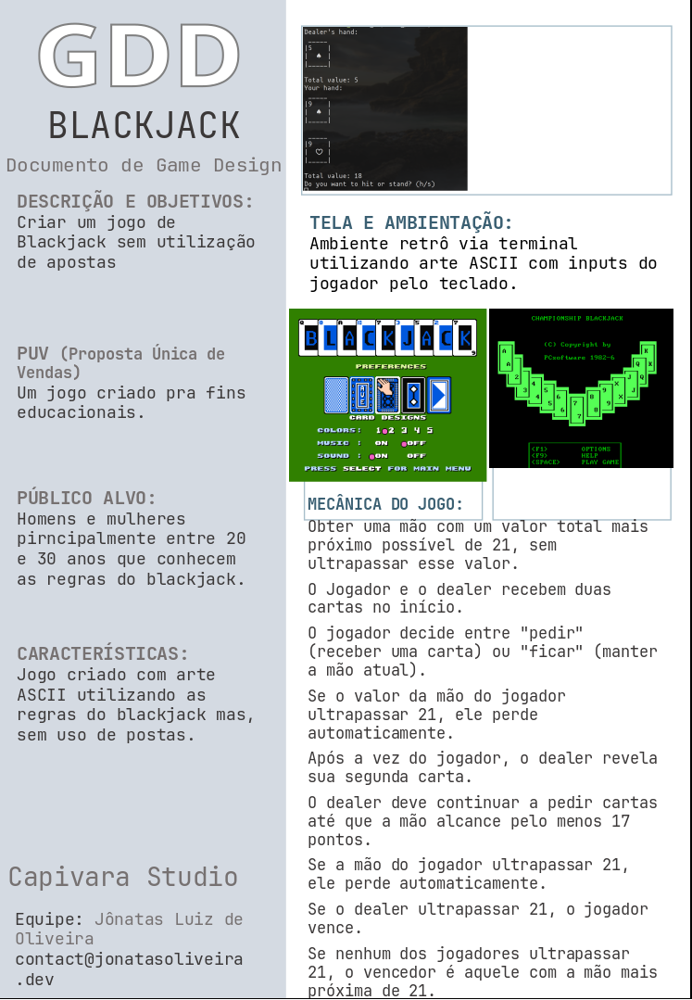
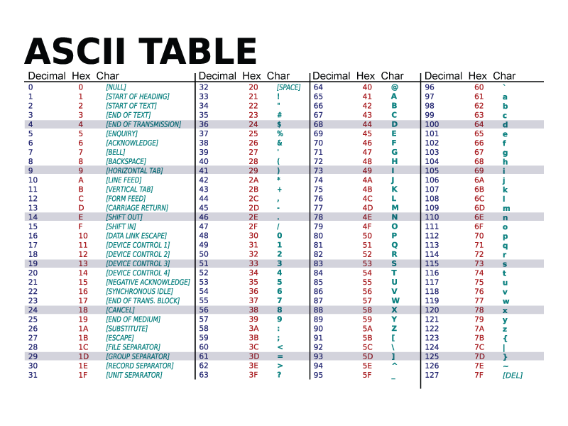
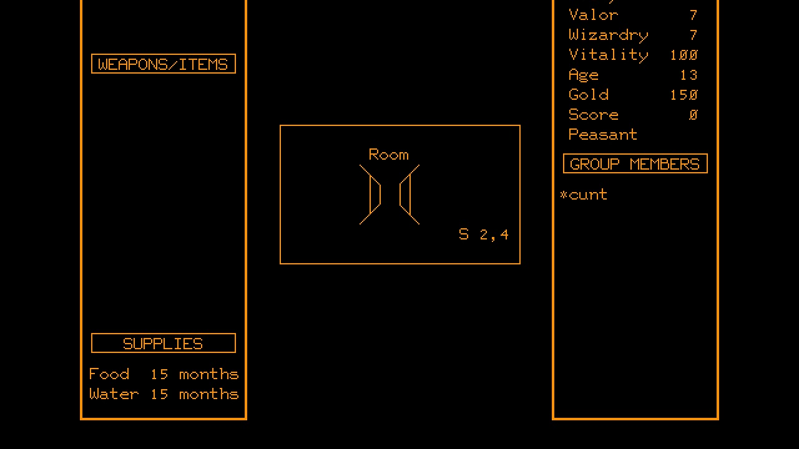
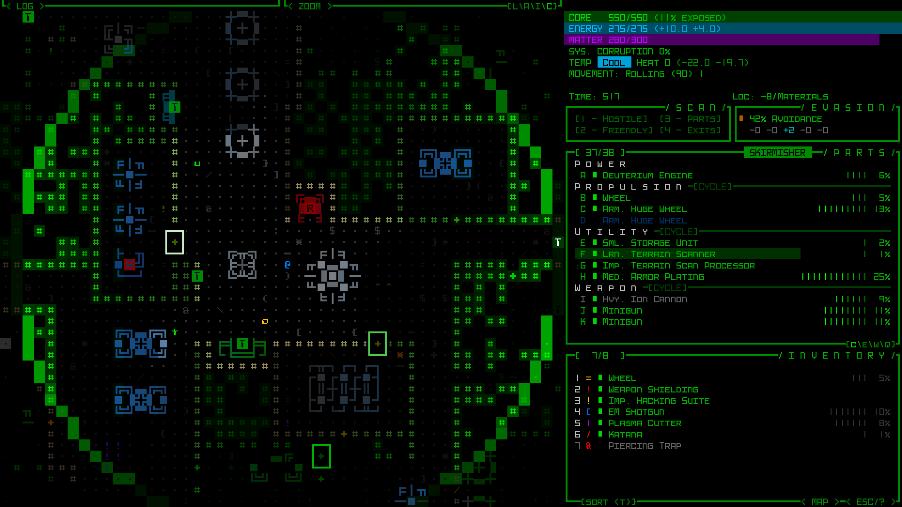

# Blackjack

## Raio X Blackjack


### Mecânicas do jogo:
Obter uma mão com um valor total mais próximo possível de 21, sem ultrapassar esse valor.
O Jogador e o dealer recebem duas cartas no início.
O jogador decide entre "pedir" (receber uma carta) ou "ficar" (manter a mão atual).
Se o valor da mão do jogador ultrapassar 21, ele perde automaticamente.
Após a vez do jogador, o dealer revela sua segunda carta.
O dealer deve continuar a pedir cartas até que a mão alcance pelo menos 17 pontos.
Se a mão do jogador ultrapassar 21, ele perde automaticamente.
Se o dealer ultrapassar 21, o jogador vence.
Se nenhum dos jogadores ultrapassar 21, o vencedor é aquele com a mão mais próxima de 21.


## Atualizando o rust

Bom antes de começarmos nosso jogo vamos fazer novamente a atualização do rust:

```bash
rustup update stable
```
Criando projeto

Bom vamos criar nosso novo projeto em projects:

```bash
cargo new blackjack
cd blackjack
```

Para criar esse projeto vamos entender melhor como vamos estruturar nosso jogo.


## Estruturando o blackjack

Para esse jogo queremos fazer uma mudança em como nosso jogo vai se comportar:
- main.rs vai ter nosso loop básico do jogo e vamos iniciar nossa função game.
- Nossa função game vai ser responsável por administrar todos os elementos do jogo e a
  lógica do jogo em si
- Vamos ter uma função para criar uma carta
- Vamos ter que ter uma estrutura para criar um baralho
- Vamos ter que ter uma estrutura para gerenciar a hierarquias das cartas Ex: Valete, Rainha e Rei valém 10 pontos e às vale 1 ou 11.

Assim para manter o código mais organizado vamos separar algumas responsabilidades em arquivos separados para isso vamos ter que começar a usar módulos.

## Módulos

Módulos são estruturas que usamos para agrupar funções, variáveis, contantes e outras estruturas de dados em um bloco e você deve se perguntar por que deveríamos fazer isso?
Respondendo sua pergunta nós normalmente criamos módulos para:
- Melhorar a organização do nosso código seja por funcionalidades ou pelo fato da base de código ser muito grande.
- Se nossa base de código pode ser reutilizado em outros pontos do seu projeto
- Separar responsabilidade por exemplo podemos criar módulos específicos para testes da nossa base de código.

Para criar um módulo usamos a palavra reservada `mod`

```rust
mod meu_modulo {
    fn imprime_nome(nome: &str) -> String {
        format!("Olá, {}!", name)
    }
}
```

## Visibilidade de código

Quando trabalhamos com código em determinas linguagens podemos atribuir quando determinadas funções e atributos são possíveis ou não de serem lidos, assim como quem pode visualizar. Para facilitar o entendimento vamos fazer uma analogia.

## Casinha

Pense numa casa, ela pode ser uma casinha no interior, ou um casarão numa grande cidade não importa, normalmente uma casa é composta por cômodos umas tem muitos outras tem poucos.

No mundo do código uma biblioteca a qual chamamos de crates, mas também pensando num contexto maior nossa casa pode ser nosso projeto como esse blackjack que estamos desenvolvendo.

Cada cômodo dessa casa será nossos módulos dependendo da biblioteca ou projeto pode ter muitos ou poucos.

Todas as nossas estruturas, variáveis, constantes, funções e etc. Serão os itens que temos no nosso módulo, assim como uma casa comum a cozinha vai ter itens que correspondem a cozinha e no banheiro vão ter itens que correspondem a um banheiro. Nessa mesma linha vamos ter itens no nosso módulo que correspondem ao que aquele módulo representa.

## Acesso a casinha

Pensando em visibilidade você pode ser a única pessoa na casa que tem a chave do banheiro da casa, se por padrão nessa casa quem tem a chave sempre a mantém trancada por padrão, isso quer dizer que ninguém além de você vai ter acesso aquele cômodo. Levando isso pro Rust cada módulo por padrão terá todos os seus itens privados então ninguém de outros cômodos poderá acessar o banheiro. Isso quer dizer que se criarmos um módulo no nosso arquivo `main.rs` quem está dentro do arquivo ainda consegue acessar o módulo pois estão no mesmo "cômodo".

Mas, temos uma pegadinha nesse exemplo, pois mesmo vendo que está dentro do banheiro ele não pode usar! Pense que você tem um amigo que precisa usar o banheiro mas, há um poder maior impedindo seu amigo de usa-lo e caso ele precise fazer o número 2 no assento sanitário e mesmo que ele enxergue o banheiro (módulo) não consegue fazer a ação de usar o assento (função) um cenário terrível não? Mas isso tem solução você pode deixa-lo como público usando a palavra reservada `pub` e assim ele ficará feliz e aliviado.

```rust
//casinha.rs

mod banheiro {
     pub const ROLO_PAPEL_INICIAL: i16 = 5; 
     const MINHA_ESCOVA: String = String::new();

    pub fn usa_assento_sanitario() -> i16 {
        let mut rolo_papel: i16 = ROLO_PAPEL_INICIAL;
        println!("Usando rolo!");
        rolo_papel -= 1;
        rolo_papel
    }


}

fn main() {
    println!("{}", banheiro::ROLO_PAPEL_INICIAL);
    banheiro::usa_assento_sanitario();
}
```

Deixando de lado a inutilidade do código, se seu amigo for a representação da função main, ele consegue ver o rolo de papel e consegue usar o `assento_sanitário`, porém ele não consegue acessar a sua escova de dentes por que ela não é pública.

Mas e se caso eu queira que pessoas de outros cômodos possam usar o banheiro? Fácil só deixar ele aberto, ou seja, deixar o módulo público assim todos podem usa-lo.

```rust

// banheiro.rs

pub mod banheiro {
     pub const ROLO_PAPEL_INICIAL: i16 = 5; 
     const MINHA_ESCOVA: String = String::new();

    pub fn usa_assento_sanitario() -> i16 {
        let mut rolo_papel: i16 = ROLO_PAPEL_INICIAL;
        println!("Usando rolo!");
        rolo_papel -= 1;
        rolo_papel
    }

}

```

Assim se a sala for nosso cômodo principal (main).

```rust
mod banheiro;

fn main() {
    println!("{}", banheiro::banheiro::ROLO_PAPEL_INICIAL);
    banheiro::banheiro::usa_assento_sanitario();
}
```

Importante ressaltar que nesse caso `mod banheiro` eu faço referência ao arquivo `banheiro.rs` assim para acessar o módulo dentro do arquivo (que também é um módulo) preciso chama-lo novamente ou seja `banheiro::banheiro`.
Para facilitar o entendimento vamos pensar que nesse exemplo o assento vai ser um módulo também já o papel vai ser um item que está fora assim para usar o banheiro preciso acessar o papel que está no banheiro e depois acessar o assento e a função dele de usar.

```rust

//banheiro.rs

pub const ROLO_PAPEL_INICIAL: i16 = 5; 
const MINHA_ESCOVA: String = String::new();

pub mod assento_sanitario {

    pub fn usar(rolo_inicial: i16) -> i16 {
        let mut rolo_papel: i16 = rolo_inicial;
        println!("Usando rolo!");
        rolo_papel -= 1;
        rolo_papel
    }

}
```
```rust
//main.rs
mod banheiro;

fn main() {
    println!("{}", banheiro::ROLO_PAPEL_INICIAL);
    banheiro::assento_sanitario::usar(banheiro::ROLO_PAPEL_INICIAL);
}
```

Acredito que agora ficou mais claro, dentro do meu arquivo `banheiro.rs` que é um módulo eu acesso o outro módulo que é o `assento_sanitario`, perceba que nesse exemplo você tem acesso ao módulo banheiro e assento e tem acesso ao rolo de papel mas, ainda não tem acesso a escova pois ela ainda é privada.

Também poderia ter usado a função usar direto no banheiro não preciso forçar a criar um módulo dentro do arquivo, ai vai muito da sua necessidade.

Esse exemplo do banheiro era o melhor? Talvez não, mas acredito que com isso eu consiga te dar uma clareza de como funciona a dinâmica dos módulos dentro do rust. Agora finalmente
podemos continuar nosso jogo.

## Criando o looping principal do jogo

Bom agora vamos criar nossa main para isso vamos criar um loop.

```rust
fn main() {
    loop {
        game::game_start()
    }
}
```

Ainda não temos o nosso módulo game então vamos criar em no nosso diretório `src` o módulo game.

```bash
touch src/game.rs
```

Agora dentro de game vamos criar alguns prints para mostrar o total da mão do jogador e do dealer.

```rust
//game.rust

pub fn game_start() {
    println!("Dealer's hand:");
    println!("Total value: 0");

    println!("Your hand:");
    println!("Total value: 0")

}
```

Ainda precisamos importar o módulo no nosso `main.rs`.

```rust
mod game;

fn main() {
    loop {
        game::game_start()
    }
}
```

Vamos rodar nosso projeto. Percebemos que ele vai rodar infinitamente então vamos aprimorar nosso menu para iniciar um jogo.

```rust
mod game;

fn main() {
    loop {
        println!("Start game? (y)es or (n)o");
        let mut option = String::new();
        std::io::stdin().read_line(&mut option).unwrap();
        match option.trim().to_lowercase().as_str() {
            "y" => {
                game::game_start();
                continue;
            }
            "n" => {
                println!("Thank you playing.");
                break;
            }
            _ => {
                continue;
            }

        }
            
    }
}
```

Certo agora nosso jogo tem um loop básico e toda vez que o nosso jogo acabar `game_start` se encerra e assim votamos ao menu principal do jogo.

## Representando uma carta com naipes e valores

Vamos criar um novo módulo chamado card, esse módulo vai ser responsável em criar uma representação do card no nosso código. Então vamos criar um arquivo chamado `card.rs`.

```bash
touch src/card.rs
```

Dentro do nosso arquivo `card.rs` vamos criar um módulo chamado test.

```rust

#[cfg(test)]
mod test {
    use super::*;

}

```

`#[cfg(test)]` chamamos de anotações (_annotation_) no caso essa em especifico estou especificando para o compilador do rust que esse módulo só precisa ser executado em teste.

Agora dentro do nosso módulo usamos o `use super::*;` que é necessário para pode usar as estruturas dentro do nosso módulo `card.rs`.

Agora vamos criar nosso primeiro teste. Onde vamos passar uma carta e verificar se o valor da carta. Sendo que nossa carta precisa ter seu valor e seu naipe. Onde o valor vamos chamar de _rank_ e o naipe vamos chamar de _suit_. Ou seja nosso card tem 2 valores por hora vamos só anotar aqui.
Um ponto importante é que para realizar o teste vamos criar uma string para corresponder o naipe de "coração" para isso vamos precisar criar uma String `hearts`.
```rust

#[cfg(test)]
mod test {
    use super::*;

    #[test]
    fn test_get_card_rank() {
        let hearts = String::from("Hearts");
        let value = Card {rank: 10, suit: hearts.clone() };

        assert_eq!(value.rank, 10);
        assert_eq!(value.suit, hearts)
    }
}
```

Estou usando em hearts a palavra reservada clone, pois nesse contexto quando crio o `Card` eu preciso usar o `clone`, por que senão eu passo a referência do hearts para o card, então o clone é necessário para poder testarmos abaixo. Agora vamos rodar nosso teste.

```bash
cargo test
```

Nosso resultado mostra que não teve nenhum teste executado, por que isso aconteceu?

Para que nosso teste seja executado precisamos chamar nosso modulo card no main.
```rust
mod game;
mod card;

```

Agora nosso teste roda porém temos o erro abaixo:

```bash
error[E0425]: cannot find function, tuple struct or tuple variant `Card` in this scope
 --> src/card.rs:8:21
  |
8 |         let value = Card { rank: 10, suit: hearts.clone() };
  |                     ^^^^ not found in this scope

For more information about this error, try `rustc --explain E0425`.
```

Card não existe ainda então precisamos criar, e como criar uma estrutura pra representar _rank_ e _suit_ ? Precisamos criar uma `struct`.
## Structs

Anteriormente falamos dos tipos primitivos, caso não se lembre volte na parte de [[tipos primitivos em rust]]. Há formas de criarmos nossos próprios tipos em rust que chamamos de [[tipos customizados - avançados]], porém nesse momento o valor de Card vai ser a composição de 2 tipos primitivos que é o _rank_ que é o valor da carta e o _suit_ que será o naipe da carta.

Se precisarmos de uma variável composta por 2 ou mais valores vamos usar um tipo de dados chamado `_Struct_`.

`**Struct**` ou _structure_ é um tipo de dado customizado onde ele é composto de vários tipos de dados, ou seja é uma representação de agrupamentos de dados.

### Definindo uma `struct`

Para definir uma `struct` precisamos apenas usar a palavra reserva `struct`.

```rust
struct Card;
```

Agora inicialmente vamos colocar os campos `rank` e `suit`.

```rust
struct Card {
    rank: i32,
    suit: String,
}

#[cfg(test)]
mod test {
    use super::*;

    #[test]
    fn test_get_card_rank() {
        let hearts = String::from("Hearts");
        let value = Card { rank: 10, suit: hearts.clone() };

        assert_eq!(value.rank, 10);
        assert_eq!(value.suit, hearts)
    }
}
```

Agora vamos rodar ele.
```bash
➜ cargo test
   Compiling blackjack v0.1.0 (/home/feanor/projects/blackjack)
    Finished `test` profile [unoptimized + debuginfo] target(s) in 0.20s
     Running unittests src/main.rs (target/debug/deps/blackjack-eab3321ecfe99072)

running 1 test
test card::test::test_get_card_rank ... ok

test result: ok. 1 passed; 0 failed; 0 ignored; 0 measured; 0 filtered out; finished in 0.00s
```

Tudo certo agora passou.

### Naipes
Agora vamos mudar um pouco, nosso naipe é uma `String` simples, mas teremos repetidamente os 4 naipes: espadas, ouros, copas e paus.

Então vamos mudar nosso naipe para se tornar um `enum`.

```rust
#[derive(Debug, PartialEq)]
enum Suit {
    Hearts,
    Diamonds,
    Clubs,
    Spades,
}

struct Card {
    rank: i32,
    suit: Suit,
}

#[cfg(test)]
mod test {
    use super::*;

    #[test]
    fn test_get_card_rank_and_suit() {
        let value = Card { rank: 10, suit: Suit::Hearts };

        assert_eq!(value.rank, 10);
        assert_eq!(value.suit, Suit::Hearts )
    }
}
```

Importante como estamos usando uma `Struct`com um  `enum` ele não implementa algumas coisas, por isso inicialmente precisamos usar duas trait a `Debug` e a `PartialEq`.
Isso é necessário para podermos fazer a comparação no nosso teste com a macro `assert_eq!`. Agora temos a representação dos valores do Naipe e do Valor.

## Construindo um baralho

Certo agora que temos como representar o valor e o naipe da nossa carta vamos criar um módulo chamado `Deck` onde vai representar nosso baralho.

```bash
touch deck.rs
```

Agora vamos criar um tipo de variável que ainda não tínhamos usados que é o Vetor `Vec`.

### Tipos básicos de dados
[[tipos primitivos em rust]]

Bom reforçando a parte que falamos de tipos de rust no nosso primeiro jogo, agora vamos aprofundar um pouco mais.
Cada valor em rust tem um tipo especifico, as vezes preciso anotar diretamente, as vezes ele consegue saber o tipo diretamente o que chamamos de inferência.
Mesmo assim, rust é uma linguagem de `tipagem estática` ou seja ele precisa saber todos os tipos em tempo de compilação.

### Tipos escalares

São os tipos que representam um valor único, já falamos sobre eles no primeiro jogo da [[Misterious Forest]] e são eles: inteiros, float, `booleans` e `characteres`.

#### [Integer Types](https://doc.rust-lang.org/book/ch03-02-data-types.html#integer-types)

Um _integer_ a grosso modo é um número sem casas decimais ou seja um numero INTEIRO. Sendo que o tamanho do número que ele comporta varia de acordo com seu tipo e se ele aceita números negativos (**Signed**) conforme a tabela abaixo:

| Length  | Signed  |                                                   range                                                    | Unsigned | range                                                   |
| :-----: | ------- | :--------------------------------------------------------------------------------------------------------: | -------- | ------------------------------------------------------- |
|  8-bit  | `i8`    |                                                 -128 a 127                                                 | `u8`     | 0 a 255                                                 |
| 16-bit  | `i16`   |                                              -32.768 a 32.767                                              | `u16`    | 0 a 65.535                                              |
| 32-bit  | `i32`   |                                       -2.147.483.648 a 2.147.483.647                                       | `u32`    | 0 a 4.294.967.295                                       |
| 64-bit  | `i64`   |                             -9.223.372.036.854.775.808 a 9.223.372.036.775.807                             | `u64`    | 0 a 18.446.744.073.709.551.615                          |
| 128-bit | `i128`  | -170.141.183.460.469.231.731.687.303.715.884.105.728 a 170.141.183.460.469.231.731.687.303.715.884.105.727 | `u128`   | 0 a 340.282.366.920.938.463.463.374.607.431.768.211.455 |
|  arch   | `isize` |                                                     -                                                      | `usize`  | -                                                       |
Reforçando que quando criamos um inteiro com sinal (Signed) ele vai aceitar números negativos e números sem sinal (Unsigned) vai aceitar apenas números positivos, porém poderá representar números maiores.

No caso dos tipos `isize` e `usize` são tipos especiais pois eles vão depender da arquitetura do computador sendo 64 bits se for uma `arch-64` e 32 bits se for uma `arch-32`.

Há outras formas também de escrever inteiros literais. Conforme a tabela abaixo só quero destacar que números muito grandes podemos separar com underscore `_` para facilitar a visualização.

| Number literals  | Example       |
| ---------------- | ------------- |
| Decimal          | `98_222`      |
| Hex              | `0xff`        |
| Octal            | `0o77`        |
| Binary           | `0b1111_0000` |
| Byte (`u8` only) | `b'A'`        |

##### [Integer Overflow](https://doc.rust-lang.org/book/ch03-02-data-types.html#integer-overflow)

Se você criar uma variável do tipo `u8` que tem uma range de 0 a 255 e tentar atribuir a ela o número 256, você terá um integer overflow, o Rust durante a compilação fará a verificação dos tipos e identificará que esse atributo está recebendo um valor não comportado e dará um erro.
No caso de tempo de execução se isso ocorrer ele lançara um erro chamado `panic` do qual veremos com mais detalhe mais a frente.

```rust
fn main() {

    let fuel: i32 = 1_000_000_000;
    let oxygen: u32 = 2_000_000_000;unidades.
    let mut food: i16 = 32_767;
    let auxiliary_ships: u8 = 255;
    let crew_size: isize = 128;
    let galactic_resources: u128 = 10_000_000_000_000_000; 
}
```

#### [Floating-Point Types](https://doc.rust-lang.org/book/ch03-02-data-types.html#floating-point-types)

Como já vimos temos dois primitivos de ponto flutuante o `f32` e o `f64` com 32 bits e 64 bits respectivamente.

Aqui temos um exemplo usando um `f32`:

```rust
// src/main.rs
fn main() {
    let mut distance_to_target: f64 = 0.5;
    let mut speed: f32 = 0.01;
    let gravity: f64 = 3.711;
    let mut fuel: f32 = 100.0;
    let fuel_consumption_rate: f32 = 0.5;
}
```

Números de ponto flutuante seguem o padrão `IEEE-754`. Sendo o `f32` de precisão simples e o `f64` de precisão dupla.

#### [Operações numéricas](https://doc.rust-lang.org/book/ch03-02-data-types.html#numeric-operations)

O Rust suporta todas as operações mais elementares da matemática, além disso podemos atribuir uma variável let com o valor de uma operação matemática.


```rust
// src/main.rs
fn main() {
    // Adição
    let sword_damage = 25;
    let fire_spell_damage = 50;
    let total_damage = sword_damage + fire_spell_damage;
    println!("Dano total causado ao inimigo: {}", total_damage);

    // Subtração
    let player_health = 100.0;
    let enemy_attack_damage = 34.5;
    let remaining_health = player_health - enemy_attack_damage;
    println!("Vida restante do jogador: {:.1}", remaining_health);

    // Multiplicação
    let experience_per_enemy = 200;
    let enemies_defeated = 3;
    let total_experience = experience_per_enemy * enemies_defeated;
    println!("Experiência total obtida: {}", total_experience);

    // Divisão
    let total_gold = 120.0;
    let party_members = 4.0;
    let gold_per_member = total_gold / party_members;
    println!("Cada membro recebeu {:.2} moedas de ouro.", gold_per_member);

    // Módulo
    let potions = 17;
    let potions_per_member = 4;
    let leftover_potions = potions % potions_per_member;
    println!("Poções restantes após a divisão: {}", leftover_potions);
}

```

#### [The Boolean Type](https://doc.rust-lang.org/book/ch03-02-data-types.html#the-boolean-type)

Temos o tipo primitivo boolean que serve para verificarmos se a expressão ou variável é verdadeira ou falsa.

```rust
// src/main.rs
fn main() {

    let is_door_locked: bool = false;
    println!("A porta está trancada? {}", is_door_locked);

    let has_key = true;
    let can_open_door = is_door_locked && has_key;
    
    println!("O jogador pode abrir a porta? {}", can_open_door);
}
```

Booleano são boas escolhas quando queremos validar uma condição de uma estrutura condicional como os `if`e `match`.
#### [Tipo `Charactere`](https://doc.rust-lang.org/book/ch03-02-data-types.html#the-character-type)

O char é o tipo primitivo mais simples para representar um `caracter`  em rust.

```rust
// src/main.rs
fn main() {
    let player_initial = 'A';

    let rare_item: char = '⚔';
    let clan_emblem = '🐉';
    let clan_name = '龍';
    let enemy = '👾';
}

```

Uma coisa importante é que char representamos com aspas simples, sendo aspas duplas para representar um conjunto de caracteres ou strings se preferir.

Em rust um caractere consegue representar um character da tabela Unicode dando muita flexibilidade pois podemos representar caracteres como emojis e caracteres em línguas como o Japonês e o Coreano.

### [Tipos compostos](https://doc.rust-lang.org/book/ch03-02-data-types.html#compound-types)

Tipos compostos podem agrupar um conjunto de elementos de um tipo (ou vários) no caso de rust temos dois primitivos que ainda não vimos que são os arrays e tuplas.

#### [Tipo tupla](https://doc.rust-lang.org/book/ch03-02-data-types.html#the-tuple-type)

A tupla é um agrupamento especial pois uma vez declarada ela não muda seu tamanho ou seus elementos.

Para criar uma tupla nós colocamos valores entre parenteses e separados por virgula.

```rust
// src/main.rs
fn main() {
    let item: (i32, f64, u8) = (500, 6.4, 1);
}
```

A variável `tup` foi declarado os tipos dentro dela, mas a tupla também consegue fazer a inferência do tipo sozinha pois a tupla em si é considerada um elemento já. Se quisermos pegar os valores fora da tupla podemos usar a desestruturação conforme o exemplo abaixo.

```rust
// src/main.rs
fn main() {
    let item: (i32, f64, u8) = (500, 6.4, 1);

    // Desestruturação para obter os valores
    let (price, weight, rarity) = item;
    
	println!("Detalhes do item:");
	println!("Preço: {} moedas", price);
	println!("Peso: {:.1} kg", weight);
	println!("Raridade: {} (quanto menor, mais raro)", rarity);            
}
```

No exemplo acima declaramos nossa tupla `tup` e desestruturamos ela em 3 variáveis para representar os 3 elementos dentro da tupla.

Podemos também acessar diretamente da tupla, passando o índice do elemento que queremos conforme abaixo:

```rust
// src/main.rs
fn main() {
    let item: (i32, f64, u8) = (500, 6.4, 1);

    let (price, weight, rarity) = item;

    println!("Detalhes do item:");
    println!("Preço: {} moedas", price);
    println!("Peso: {:.1} kg", weight);
    println!("Raridade: {} (quanto menor, mais raro)", rarity);

    println!(
        "Resumo: {} moedas, {:.1} kg, raridade {}.",
        item.0, item.1, item.2
    );
}
```

#### [O tipo array](https://doc.rust-lang.org/book/ch03-02-data-types.html#the-array-type)

Outro tipo que podemos ter uma representação de vários elementos é o `array`. Ao contrário da tupla um `array` precisa que todos os elementos sejam do mesmo tipo, e também um array tem um tamanho fixo.

```rust
// src/main.rs
fn main() {
    let recursos_planetas: [i32; 4] = [500, 700, 300, 450];
}

```

Arrays são úteis quando você quer elementos que não vão mudar com o tempo. Por exemplo podemos fazer um array para representar os meses do ano.

```rust
let months = ["January", "February", "March", "April", "May", "June", "July", "August", "September", "October", "November", "December"];
```

Você escreve um array usando colchetes com o tipo do elemento + ponto e virgula + número de elementos.

```rust
let recursos_planetas: [i32; 5] = [500, 700, 300, 450, 900];
```

Aqui representamos um array do tipo `i32` com 5 elementos.

Também podemos inciar um array com um valor inicial como abaixo.

```rust
let energia_inicial = [100; 6];
```

Aqui o array a tem 6 elementos e todos começam com o valor 3 ou seja seria a mesma coisa que fazer `let energia_inicial = [100, 100, 100, 100, 100, 100];` mas, de uma forma mais concisa.
##### [Acessando elementos de um array](https://doc.rust-lang.org/book/ch03-02-data-types.html#accessing-array-elements)

Um array é um elemento que tem seu tamo fixo e conhecido e pode ser alocado na memória stack, podemos acessar um array pelo seu índice entre colchetes como o exemplo abaixo.

```rust
// src/main.rs
fn main() {
    let pontuacoes = [1000, 2000, 1500, 2500];

    let maior_pontuacao = pontuacoes[3];
    let segunda_pontuacao = pontuacoes[1];

    println!("A maior pontuação foi {}!", maior_pontuacao);
}

```

I##### [Tentando acessar um elemento não existente](https://doc.rust-lang.org/book/ch03-02-data-types.html#invalid-array-element-access)

O índice em rust começa com 0 então no exemplo anterior temos um índice que vai de 0 até 4 então se tentarmos acessar o índice 5 ou 10 nesse array vamos ter o erro baixo:

```console
thread 'main' panicked at src/main.rs:19:19:
index out of bounds: the len is 5 but the index is 10
note: run with `RUST_BACKTRACE=1` environment variable to display a backtrace
```

Como falado anteriormente quando acessamos um elemento que não existe o programa vai lançar um `panic` informando o erro.

#### Usando vetores

O primeiro tipo de coleção que vamos explorar é o `Vec<T>`, também conhecido como vetor. Vetores permitem armazenar mais de um valor em uma única estrutura de dados, colocando todos os valores em sequência na memória. Os vetores podem armazenar apenas valores do mesmo tipo, e são úteis quando você tem uma lista de itens, como os pontos de vida de jogadores, armas ou inimigos em um jogo.
Criando um Novo Vetor

Para criar um novo vetor vazio, usamos a função `Vec::new`, como mostrado no exemplo abaixo.

```rust
let v: Vec<i32> = Vec::new();
```

**Exemplo:** Criando um vetor vazio para armazenar valores do tipo `i32`, que podem representar, por exemplo, pontos de vida dos personagens.

Note que adicionamos uma anotação de tipo aqui. Como não estamos inserindo valores no vetor, o Rust não sabe que tipo de elementos pretendemos armazenar. Este é um ponto importante. Vetores são implementados usando generics, e o tipo `**Vec<T>**` pode armazenar qualquer tipo. Neste exemplo, o `**Vec<i32>**` irá armazenar elementos do tipo inteiro `**i32**`.

Na maioria das vezes, você criará um `**Vec<T>**` com valores iniciais, e o Rust pode inferir automaticamente o tipo dos valores que você quer armazenar, então não é necessário fazer a anotação de tipo. O Rust fornece o macro `**vec!**` que cria um vetor com os valores fornecidos. Veja o exemplo abaixo:

```rust
let v = vec![1, 2, 3];  // Criando um novo vetor com os valores 1, 2 e 3
```
Neste caso, como já fornecemos valores iniciais de tipo `i32`, o Rust pode inferir que o tipo do vetor é `Vec<i32>`, e não é necessário adicionar a anotação de tipo.

#### Atualizando um Vetor

Para criar um vetor e adicionar elementos a ele, podemos usar o método push, como mostrado no exemplo abaixo.
```rust
let mut v = Vec::new();  // Vetor mutável

v.push(100);  // Adicionando pontos de vida
v.push(150);  // Adicionando pontos de vida
v.push(200);  // Adicionando pontos de vida

```

Aqui, como o vetor é mutável `mut`, podemos adicionar novos elementos a ele. Se o vetor armazenasse as **vidas de personagens** em um jogo, poderíamos adicionar os pontos de vida de diferentes inimigos ou heróis.

#### Lendo Elementos de um Vetor

Existem duas formas de acessar os valores armazenados em um vetor: via indexação ou utilizando o método get. Vamos ver ambos os métodos de acesso no código abaixo.
```rust
let v = vec![10, 20, 30, 40, 50];

// Usando indexação
let terceiro: &i32 = &v[2];  // Acessando o 3o valor (começando do índice 0)
println!("O terceiro valor é {terceiro}");

// Usando o método get
let terceiro = v.get(2);
match terceiro {
    Some(valor) => println!("O terceiro valor é {valor}"),
    None => println!("Não existe um terceiro valor."),
}

```
Aqui, acessamos o terceiro elemento do vetor **`v`** de duas formas: via **indexação** e pelo método **`get`**. A indexação começa do 0, por isso **`v[2]`** nos dá o terceiro valor (30). Já o método **`get`** retorna um **`Option<&T>`**, permitindo tratar casos em que o índice pode estar fora dos limites.

#### Tentando Acessar um Índice Inexistente
O código abaixo tenta acessar um índice fora dos limites do vetor, o que pode gerar diferentes comportamentos dependendo do método utilizado:
```rust
let v = vec![10, 20, 30, 40, 50];

// Tentando acessar o índice 100
let nao_existe = &v[100];  // Isso vai gerar um "panic!"
let nao_existe = v.get(100);  // Isso retorna "None"
```

Se você usar a indexação **`v[100]`**, o programa irá gerar um **panic** porque o índice 100 está fora dos limites do vetor. No entanto, se usar o método **`get`**, ele retornará **None**, e você pode tratar isso sem que o programa falhe.

#### Iterando sobre os Elementos do Vetor
Para acessar cada elemento do vetor, você pode iterar sobre os valores. Veja um exemplo de como imprimir todos os elementos de um vetor:
```rust
let v = vec![100, 200, 300];
for i in &v {
    println!("{i}");
}

```
Se você quiser modificar os elementos durante a iteração, pode usar referências mutáveis, como no exemplo abaixo:
```rust
let mut v = vec![100, 200, 300];
for i in &mut v {
    *i += 50;  // Aumentando a vida de cada personagem
}
```

#### Usando um Enum para Armazenar Tipos Diferentes em um Vetor
Os vetores em Rust podem armazenar apenas valores do mesmo tipo. No entanto, pode ser necessário armazenar elementos de tipos diferentes, como vidas de inimigos e itens no mesmo vetor. Para isso, podemos usar um `enum`. Por exemplo:

```rust
enum ItemJogo {
    Vida(i32),
    Arma(String),
    Ouro(f64),
}

let itens = vec![
    ItemJogo::Vida(100),
    ItemJogo::Arma(String::from("Espada")),
    ItemJogo::Ouro(500.75),
];

```

Aqui, usamos um `enum` chamado `ItemJogo` para representar diferentes tipos de itens no jogo, como **vida** (um inteiro), **arma** (uma string) e **ouro** (um número decimal). Esse vetor pode agora armazenar diferentes tipos de valores dentro de um mesmo vetor, desde que todos sejam variantes do `enum`.

#### Destruindo um Vetor ao Finalizar o Jogo

Assim como qualquer outro `struct`, um vetor é liberado da memória quando sai de escopo. Isso significa que seus valores também são "destruídos" quando o vetor é descartado.
```rust
{
    let v = vec![10, 20, 30, 40];
    // Ações no jogo com o vetor
} // <- O vetor v sai de escopo aqui e é descartado

```

Quando o vetor sai de escopo, ele libera todos os valores que estava armazenando, permitindo que a memória seja limpa.


Referência:
[Data Types](https://doc.rust-lang.org/book/ch03-02-data-types.html)

### Definindo o baralho

Para criar o baralho precisamos usar um vetor `Vec` de cartas. Para isso precisamos criar uma função que retorne um baralho para o jogo.
Vamos criar um teste que receba um baralho.[]()


```rust
#[cfg(test)]
mod test {
    use super::*;

    #[test]
    fn test_create_deck() {

        // Act
        let mut deck = create_deck();

    }

}

```

Precisamos importar o módulo deck no nosso módulo main.

```rust
mod game;
mod card;
mod deck;

```


Agora rodamos e ter e recebemo o erro abaixo:

```bash
error[E0425]: cannot find function `create_deck` in this scope
 --> src/deck.rs:9:24
  |
9 |         let mut deck = create_deck();
  |                        ^^^^^^^^^^^ not found in this scope

For more information about this error, try `rustc --explain E0425`.

```

Agora vamos criar a função `create_deck`. Nesse momento vamos fazer ela retornar um vetor `Vec` de Strings, não vamos colocar nossa `Struct` por que nosso objetivo é fazer nosso teste passar.

```rust
fn create_deck() -> Vec<String> {
    let mut deck = Vec::new();
    deck
}

```


Agora vamos criar um setup e um assert pro nosso teste funcionar.
```rust
#[cfg(test)]
mod test {
    use super::*;

    #[test]
    fn test_create_deck() {
        // Setup
        let deck_compare: Vec<String> = Vec::new();

        // Act
        let mut deck = create_deck();

        // Assert
        assert_eq!(deck, deck_compare)

    }

}

```

Agora vamos rodar os testes.

```bash
running 2 tests
test card::test::test_get_card_rank_and_suit ... ok
test deck::test::test_create_deck ... ok

test result: ok. 2 passed; 0 failed; 0 ignored; 0 measured; 0 filtered out; finished in 0.00s

```

Certo agora que o teste passou, nós precisamos fazer com que o _deck_ receba todas as cartas e naipes por conta disso vamos precisar voltar no nosso módulo _card_ e criar uma sequência dos valores para facilitar a construção automática do _deck_.
Para isso vamos dar um nome (em inglês) para cada carta e usa-la na nossa `struct`.

```rust
enum Rank {
    Two,
    Three,
    Four,
    Five,
    Six,
    Seven,
    Eight,
    Nine,
    Ten,
    Jack,
    Queen,
    King,
    Ace,
}
```

Vamos adicionar agora Rank na nossa `struct` _Card_.
```rust
struct Card {
    rank: Rank,
    suit: Suit,
}
```

Agora precisamos alterar nosso teste para receber um valor de _Rank_.
```rust
#[cfg(test)]
mod test {
    use super::*;

    #[test]
    fn test_get_card_rank_and_suit() {
        let value = Card { rank: Rank::Ten, suit: Suit::Hearts };

        assert_eq!(value.rank, Rank::Ten);
        assert_eq!(value.suit, Suit::Hearts)
    }
}
```

Agora precisamos adicionar algumas _traits_ no nosso _Rank_ assim como fizemos no _Suit_

```rust
#[derive(Debug, PartialEq)]
enum Rank {
    Two,
    Three,
    Four,
    Five,
    Six,
    Seven,
    Eight,
    Nine,
    Ten,
    Jack,
    Queen,
    King,
    Ace,
}
```

Vamos rodar nosso teste novamente.

```bash
--tests` to apply 2 suggestions)
    Finished `test` profile [unoptimized + debuginfo] target(s) in 0.23s
     Running unittests src/main.rs (target/debug/deps/blackjack-eab3321ecfe99072)

running 2 tests
test card::test::test_get_card_rank_and_suit ... ok
test deck::test::test_create_deck ... ok
```

Certo nossos testes estão rodando e agora temos uma estrutura para representar o valor da carta.

### Adicionando cartas ao deck

Próximo passo agora é adicionarmos as cartas ao baralho. Como revisamos anteriormente os tipos primitivos sabemos que pro baralho tanto a tupla quanto o array não vão ajudar, então vamos usar um novo tipo que é o `Vec`.

#### Usando Vec
O tipo `Vec` em Rust representa um vetor, que é uma estrutura de dados flexível, muito útil no desenvolvimento de jogos para armazenar coleções de elementos de maneira eficiente e ordenada. Em jogos, precisamos frequentemente manipular conjuntos de dados que mudam dinamicamente, como listas de inimigos, projéteis, ou até os elementos de interface gráfica. É aqui que o`Vec` brilha.

O `Vec` não possui tamanho fixo então podemos adicionar, remover e modificar os valores dentro dele, porém ele também só pode receber valores do mesmo tipo, no nosso caso podemos usar nossa `struct` Card como o tipo.

#### Criando o deck
Vamos alterar nosso teste para receber agora um `Vec<Card>`e testar se ele vai ter o tamanho do baralho. Para isso vamos modificar o nosso teste para ao invés de comparar um deck ele compare o tamanho do deck.

```rust
// deck.rs
    #[test]
    fn test_create_deck_length() {
        // Act
        let deck = create_deck();

        // Assert: Verifica se o deck contém exatamente 52 cartas
        assert_eq!(deck.len(), 52, "O deck deve conter 52 cartas");
    }

```

Precisamos fazer algumas modificações, nossa `struct Card` e os `enums` `Rank` e `Suit` precisam ser públicos. Além disso preciso agora dar algumas características para eles então vamos anotar em cada um com `#[derive(Debug, Copy, Clone, PartialEq)]` assim podemos copiar, clonar e comparar esses elementos. Debug estamos colocando para nos ajudar caso precisemos de alguma log.

```rust
//card.rs
#[derive(Debug, Copy, Clone, PartialEq)]
pub enum Rank {
    Two,
...
}
#[derive(Debug, Copy, Clone, PartialEq)]
pub enum Suit {
    Hearts,
..
}
#[derive(Debug, Copy, Clone, PartialEq)]
struct Card {
...
}
```

Outra alteração na `struct Card` é que precisamos deixar seus atributos como públicos também.

```rust
#[derive(Debug, Copy, Clone, PartialEq)]
pub struct Card {
    pub rank: Rank,
    pub suit: Suit,
}
```

Agora precisamos percorrer por todos os naipes e a cada naipe precisamos adicionar todas as cartas do mesmo. Para isso vamos precisar ter 2 laços então vamos percorrer um array de naipes e outro de valores de cartas.
Também precisamos alterar o retorno da nossa função `create_deck` para ser `Vec<Card>` já que criamos agora nossa `struct Card`.

```rust
use crate::card::{Card, Rank, Suit};

fn create_deck() -> Vec<Card> {
    let mut deck = Vec::new();
    for &suit in &[Suit::Hearts, Suit::Diamonds, Suit::Clubs, Suit::Spades] {
        for &rank in &[
            Rank::Two,
            Rank::Three,
            Rank::Four,
            Rank::Five,
            Rank::Six,
            Rank::Seven,
            Rank::Eight,
            Rank::Nine,
            Rank::Ten,
            Rank::Jack,
            Rank::Queen,
            Rank::King,
            Rank::Ace,
        ] {
            deck.push(Card { rank, suit });
        }
    }
    deck
}

```

Com isso também precisamos alterar nosso teste `deck_compare` para usar nossa `struct`.
```rust
//deck.rs
    #[test]
    fn test_create_deck() {
        //Setup
        let deck_compare: Vec<Card> = Vec::new();
        // Act
        let mut deck = create_deck();

        //Assert
        assert_eq!(deck, deck_compare)
    }
```

Esse teste ainda não vai rodar pois agora precisamos implementar a *trait* `Debug` e `PartialEq` em `Card`.
```rust
#[derive(Debug, PartialEq)]
pub struct Card {
    pub rank: Rank,
    pub suit: Suit,
}
```

Agora rodando nosso teste temos:
```bash
✦ ➜ cargo test
failures:
    deck::test::test_create_deck

test result: FAILED. 2 passed; 1 failed; 0 ignored; 0 measured; 0 filtered out; finished in 0.00s

error: test failed, to rerun pass `--bin blackjack`
```

O teste que está falhando é o próprio `test_create_deck` por que agora nós não criamos um `Vec` Vazio. Pra isso por hora vamos fazer a mesma estrutura de repetição da função `create_deck` no nosso teste, não é o ideal, mas por hora vamos fazer essa implementação.

```rust
    #[test]
    fn test_create_deck() {
        //Setup
        let mut deck_compare: Vec<Card> = Vec::new();
        for &suit in &[Suit::Hearts, Suit::Diamonds, Suit::Clubs, Suit::Spades] {
            for &rank in &[
                Rank::Two,
                Rank::Three,
                Rank::Four,
                Rank::Five,
                Rank::Six,
                Rank::Seven,
                Rank::Eight,
                Rank::Nine,
                Rank::Ten,
                Rank::Jack,
                Rank::Queen,
                Rank::King,
                Rank::Ace,
            ] {
                deck_compare.push(Card { rank, suit });
            }
        }
        // Act
        let mut deck = create_deck();

        //Assert
        assert_eq!(deck, deck_compare)
    }
```

Agora vamos rodar nosso teste.

```bash
running 3 tests
test card::test::test_get_card_rank ... ok
test deck::test::test_create_deck ... ok
test deck::test::test_create_deck_length ... ok

test result: ok. 3 passed; 0 failed; 0 ignored; 0 measured; 0 filtered out; finished in 0.00s
```

Certo funcionando! Agora vamos verificar se o nosso deck contem todos os naipes e cartas.  Para isso vamos declarar um *vetor* com os Naipes e outro para o valores das cartas. Então precisamos fazer uma estrutura similar a que usamos para preencher o baralho porém o que queremos fazer é apenas verificar se aquela carta (Naipe, Valor) existe dentro do baralho.

```rust
//deck.rs
    #[test]
    fn test_create_deck_contains_all_suits_and_ranks() {
        // Act
        let deck = create_deck();

        // Define os naipes e valores esperados
        let expected_suits = vec![Suit::Hearts, Suit::Diamonds, Suit::Clubs, Suit::Spades];
        let expected_ranks = vec![
            Rank::Two, Rank::Three, Rank::Four, Rank::Five, Rank::Six, Rank::Seven,
            Rank::Eight, Rank::Nine, Rank::Ten, Rank::Jack, Rank::Queen, Rank::King, Rank::Ace,
        ];

        // Verifica se todas as combinações de naipes e valores estão presentes no deck
        for &suit in &expected_suits {
            for &rank in &expected_ranks {
                let card = Card { suit, rank };
                assert!(
                    deck.contains(&card),
                    "O deck deve conter a carta {:?} de {:?}", rank, suit
                );
            }
        }
    }
```

Rodamos o teste.
```bash
✦ ➜ cargo test
   Compiling blackjack v0.1.0 (/home/feanor/projects/blackjack)
    Finished `test` profile [unoptimized + debuginfo] target(s) in 0.20s
     Running unittests src/main.rs (target/debug/deps/blackjack-eab3321ecfe99072)

running 3 tests
test deck::test::test_create_deck_contains_all_suits_and_ranks ... ok
test card::test::test_get_card_rank_and_suit ... ok
test deck::test::test_create_deck_length ... ok

```

Certo tudo funcionando, poderíamos agora criar outros tipos de teste como ver se não tem duplicadas, mas, pra isso precisaríamos usar um `HashSet` mas, não vamos mexer com isso agora, fica como desafio para você.

## Criando a mão do jogador
Vamos fazer por hora um ajuste no nosso código que na hora de criar nosso baralho ele já seja embaralhado para isso vamos adicionar a biblioteca rand.

```bash
cargo add rand
```

Agora criamos uma variável com o método randômico e chamamos a função `shuffle` que existe dentro do da biblioteca `rand` para ele embaralhar as cartas.

```rust
//deck.rs
use crate::card::{Card, Rank, Suit};
use rand::thread_rng;
use rand::seq::SliceRandom;


pub fn create_deck() -> Vec<Card> {
    let mut deck = Vec::new();
    for &suit in &[Suit::Hearts, Suit::Diamonds, Suit::Clubs, Suit::Spades] {
        for &rank in &[
            Rank::Two,
            Rank::Three,
            Rank::Four,
            Rank::Five,
            Rank::Six,
            Rank::Seven,
            Rank::Eight,
            Rank::Nine,
            Rank::Ten,
            Rank::Jack,
            Rank::Queen,
            Rank::King,
            Rank::Ace,
        ] {
            deck.push(Card { rank, suit });
        }
    }
    let mut rng = thread_rng();
    deck.shuffle(&mut rng);
    deck
}
```

É importante aqui que usemos o import `SliceRandom` por que o método shuffle faz parte da trait `SliceRandom` da biblioteca rand, e esta trait precisa ser importada explicitamente para que o método seja acessível no seu código.

Agora vamos criar outro módulo chamado `hand.rs` para ser a estrutura que vai organizar tanto a mão do jogador quanto a mão do dealer do jogo.

```bash
touch src/hand.rs
```

Agora vamos criar nossa `struct`para representar a mão de cartas.

```rust
#[derive(Debug)]
pub struct Hand {
    cards: Vec<Card>,
}
```

Vamos deixar a `struct Hand` pública para podermos acessa em outros módulos do nosso jogo. Agora precisamos dar mais recursos para nossa `struct` para isso precisamos ter uma forma de quando o nosso jogador criar uma mão sem cartas e uma forma de adicionar uma carta do nosso deck a mão do jogador, para isso vamos aprender a criar métodos a nossa `struct` usando a palavra reservada `impl`.

#### Sintaxe de Método

Métodos são muito parecidos como funções, eles possuem a mesma estrutura, usam a mesma palavra reservada para serem declarados `fn`, podem receber parâmetros e retornar valores. Porém métodos são criados dentro de uma `struct` e pode manipular o comportamento da `struct`.

Métodos podem ser implementados dentro de outras estruturas também os `enums` do qual já vimos por aqui e em `traits` que ainda vamos ver.

A principal vantagem de criarmos métodos para nossa `struct` ao invés de uma função é que podemos alterar seu comportamento diretamente dentro da `struct` isso é útil para centralizarmos tudo que seja relacionado a nossa `struct Hand` fique apenas limitado aos métodos da sua própria `struct` assim além de ajudar nos testes facilita a reutilização desses métodos e também evita ficar emprestando nossas variáveis o tempo todo.

Para criar métodos para uma `struct` precisamos usar a palavra reservada `impl` e o nome da nossa `struct` então no caso do nossa `struct Hand` fica assim:

```rust
impl Hand {

}
```
Com a estrutura acima podemos agora criar nossa "funções" dentro desse bloco de código.

#### Método inicializador
O primeiro método que vamos criar é um método para inicializar nossa mão com um vetor vazio de cartas, então vamos chama-lo  de `new` podemos criar a estrutura conforme abaixo.


```rust
impl Hand {
    fn new() -> Self {
        Hand { cards: Vec::new() }
    }
}
```

Bom agora que você entendeu a dinâmica de um método dentro da `struct` vamos criar um teste para checar que a mão existe. Mas, primeiro vamos importar nosso módulo hand na main para os testes funcionarem.
 ```rust
 //main.rs
mod card;
mod deck;
mod game;
mod hand;
```

Agora criamos o teste.

```rust
#[cfg(test)]
mod test {
    use super::*;

    #[test]
    fn test_hand_should_created() {
        // Setup
        let hand: Hand = Hand::new();


        //Assert /Act

        assert_eq!(hand, Hand::new());
    }
}
```

Vale ressaltar aqui que estamos criando uma variável chamada `hand` ela vai receber uma instância do nosso método `new` que nós criamos, mas me diga que diabos é uma instância?

>[!tip]
>Uma **instância** é uma ocorrência concreta de uma estrutura ou objeto definida por uma `_struct_` (ou classe, em linguagens orientadas a objetos). Em outras palavras, quando você chama um método como `Hand::new()`, você está criando um novo exemplo (ou instância) da estrutura `Hand` com seus valores iniciais definidos. Essa instância contém os dados (neste caso, um vetor vazio de cartas) e pode ser utilizada para acessar métodos e manipular os dados conforme necessário.

Definição da Estrutura: Aqui, Hand é como um molde que define como uma "mão de cartas" deve ser. Ela possui um campo cards que é um vetor de cartas.
Método `new`: O método `new` é um construtor que cria uma nova instância da estrutura Hand com um vetor vazio.

Logo quando fazemos isso
```rust
let hand: Hand = Hand::new();
```

Você está criando uma instância de `Hand`. Essa instância é um objeto real que vive na memória do computador, contendo seus próprios dados (no caso, o vetor vazio de cartas). A partir dessa instância, você pode chamar outros métodos para manipular os dados contidos nela. Mas, nós não criamos eles ainda.

Agora antes de rodar os testes, vamos comentar o shuffle do deck pois, vai quebrar o teste, vamos lidar com isso um pouco mais a frente.

```rust
    //let mut rng = thread_rng();
    //deck.shuffle(&mut rng);
```

Agora executando os teste todos devem continuar passando.

```rust
warning: `blackjack` (bin "blackjack" test) generated 3 warnings (run `cargo fix --bin "blackjack" --tests` to apply 2 suggestions)
    Finished `test` profile [unoptimized + debuginfo] target(s) in 0.17s
     Running unittests src/main.rs (target/debug/deps/blackjack-10500accf0b94805)

running 5 tests
test card::test::test_get_card_rank_and_suit ... ok
test deck::test::test_create_deck ... ok
test deck::test::test_create_deck_contains_all_suits_and_ranks ... ok
test hand::test::test_hand_should_created ... ok
test deck::test::test_create_deck_length ... ok

test result: ok. 5 passed; 0 failed; 0 ignored; 0 measured; 0 filtered out; finished in 0.00s

```

#### Método para adicionar a carta a mão

Certo agora já temos uma representação de uma mão, porém precisamos ter formas de adicionar cartas a essa mão, pra isso precisamos criar um método `add_card`, então primeiro vamos criar um teste que adiciona uma carta a mão.

```rust
    #[test]
    fn test_add_card_in_hand() {
        // Setup
        let mut hand: Hand = Hand::new();
        let card: Card= Card {
            rank: Rank::Two,
            suit: Suit::Diamonds,
        };
        let mut hand_compare: Vec<Card> = Vec::new();
        hand_compare.push(card);

        
        // Act
        hand.add_card(card);

        // Assert
        assert_eq!(hand.cards, hand_compare)
    }
```

Agora vamos rodar nosso teste e vamos receber esse erro:

```bash
error[E0599]: no method named `add_card` found for struct `hand::Hand` in the current scope
  --> src/hand.rs:44:14
   |
4  | pub struct Hand {
   | --------------- method `add_card` not found for this struct
...
44 |         hand.add_card(card);
   |              ^^^^^^^^ method not found in `hand::Hand`
```

O erro é claro não temos um método chamado `add_card` então vamos criado agora:

```rust
    fn add_card(&mut self, card: Card) {
        self.cards.push(card);
    }
```

Agora vamos rodar os testes novamente:

```rust
warning: `blackjack` (bin "blackjack" test) generated 3 warnings (run `cargo fix --bin "blackjack" --tests` to apply 2 suggestions)
    Finished `test` profile [unoptimized + debuginfo] target(s) in 0.17s
     Running unittests src/main.rs (target/debug/deps/blackjack-10500accf0b94805)

running 6 tests
test hand::test::test_hand_should_created ... ok
test card::test::test_get_card_rank_and_suit ... ok
test hand::test::test_add_card_in_hand ... ok
test deck::test::test_create_deck_length ... ok
test deck::test::test_create_deck ... ok
test deck::test::test_create_deck_contains_all_suits_and_ranks ... ok

```

Maravilha tudo funcionando!
#### Criando a mão do jogador
Agora que temos uma forma de ter um baralho e criar uma mão, vamos criar a primeira lógica pro nosso jogo no loop de _gameplay_, dentro do loop vamos criar a mão do jogador usando `player_hand`. 

```rust
//game.rs
pub fn game_start() {
    loop {
        let deck = create_deck();
        let mut player_hand = Hand::new();
        println!("Dealer's hand:");
        println!("Total value: 0");

        println!("Your hand:");
        println!("Total value: 0")

    }
}
```
#### Criando a mão do dealer

Vamos aproveitar e criar a mão do dealer, como vamos só adicionar uma nova variável chamada dealer_hand, vamos também já adicionar mais uma lógica do jogo que é dar as duas primeiras cartas para cada jogador.

```rust
use crate::{deck::create_deck, hand::Hand};

pub fn game_start() {
    loop {
        let deck = create_deck();
        let mut player_hand = Hand::new();
        let mut dealer_hand = Hand::new();

        // Initial deal
        player_hand.add_card(deck.pop().unwrap());
        dealer_hand.add_card(deck.pop().unwrap());
        player_hand.add_card(deck.pop().unwrap());
        dealer_hand.add_card(deck.pop().unwrap());

        println!("Dealer's hand:");
        println!("Total value: 0");

        println!("Your hand:");
        println!("Total value: 0")

    }
}
```

No código, usamos `pop().unwrap()` para retirar a última carta do deck e obter o valor dela. Vamos dividir essa operação em duas partes:

1. **`pop()`**:
    
    - Esse método é chamado em um `Vec<T>` e remove (pop) o último elemento do vetor, retornando-o como um valor do tipo `Option<T>`.
    - Se o vetor não estiver vazio, `pop()` retorna `Some(elemento)`.
    - Se o vetor estiver vazio, ele retorna `None`.
2. **`unwrap()`**:
    
    - Esse método é usado para extrair o valor dentro de um `Option<T>` quando temos certeza de que ele é `Some(valor)`.
    - Se for `Some(valor)`, `unwrap()` retorna o `valor`.
    - Se for `None`, `unwrap()` causará um **panic**, interrompendo a execução do programa.

No contexto do jogo, assumimos que o deck sempre possui cartas suficientes para distribuir (por isso usamos `unwrap()` com confiança). Assim, a chamada:
```rust
player_hand.add_card(deck.pop().unwrap());
```

- **`deck.pop()`** retira a última carta do vetor `deck` e a retorna como `Some(carta)`.
- **`unwrap()`** extrai a carta de dentro do `Some` e a passa para o método `add_card`.

Se, por algum motivo, o deck estiver vazio, `pop()` retornará `None` e o `unwrap()` causará um panic, interrompendo o jogo.

Essa combinação de `pop().unwrap()` é comum em situações onde se tem certeza que a coleção não estará vazia, mas deve ser usada com cuidado para evitar panics inesperados.


Agora vamos fazer alguns ajustes, o primeiro é que nossa variável deck precisar ser mutável.
```rust
pub fn game_start() {
    loop {
        let mut deck = create_deck();
        let mut player_hand = Hand::new();
        let mut dealer_hand = Hand::new();

```

O próximo passo é deixar nossos métodos dentro `Hand` públicos, isso é um ponto de atenção muito importante pra você, pois não basta a `Struct` ser publica, se nossos módulos não forem, eles não funcionarão em outros módulos. Voltando a questão da casa, é como você pudesse entrar no cômodo mas, não pode mexer em nada. Então vamos deixa-los públicos.

```rust
#[derive(Debug, PartialEq)]
pub struct Hand {
    cards: Vec<Card>,
}
impl Hand {
    pub fn new() -> Self {
        Hand { cards: Vec::new() }
    }

    pub fn add_card(&mut self, card: Card) {
        self.cards.push(card);
    }
}
```

Ainda, não criamos nenhum teste no nosso módulo game, mas vamos cria-lo mais adiante, agora vamos testar nosso jogo executando ele.

```bash
ons)
    Finished `dev` profile [unoptimized + debuginfo] target(s) in 0.00s
     Running `target/debug/blackjack`
Start game? (y)es or (n)o
```

Se executarmos vamos ver que ele não vai dar erro, porém está num loop infinito. Bom uma ultima coisa que podemos fazer ainda é mover por hora nosso método de embaralhar o baralho para nossa função `game`, logo mais vamos melhorar essa organização.

```rust
use rand::{seq::SliceRandom, thread_rng};

use crate::{deck::create_deck, hand::Hand};

pub fn game_start() {
    loop {
        let mut deck = create_deck();
        let mut rng = thread_rng();
        deck.shuffle(&mut rng);
        let mut player_hand = Hand::new();
        let mut dealer_hand = Hand::new();

        // Initial deal
        player_hand.add_card(deck.pop().unwrap());
        dealer_hand.add_card(deck.pop().unwrap());
        player_hand.add_card(deck.pop().unwrap());
        dealer_hand.add_card(deck.pop().unwrap());

        println!("Dealer's hand:");
        println!("Total value: 0");

        println!("Your hand:");
        println!("Total value: 0")

    }
}
```

Agora se testarmos vamos ver que continua a mesma coisa, fora o ajuste do loop temos um grande problema que é como vamos representar nossas cartas? Simples vamos começar a trabalhar com a artes `ascii` neles!

## Falando sobre Arte ASCII

Bom vamos falar um pouco sobre a forma de arte que vamos usar nos nossos jogos que é a arte ASCII.

### O que é ASCII?

ASCII (American Standard Code for Information Interchange) é um padrão de codificação de caracteres para comunicação digital. Ele representa texto em computadores, equipamentos de comunicação e outros dispositivos que trabalham com texto.

Em essência, cada letra, número, símbolo de pontuação e outros caracteres (como espaços e novas linhas) recebem um código numérico único. Por exemplo, a letra "A" maiúscula é representada pelo número 65 em ASCII.

### Por que o ASCII é importante?

Permite que diferentes dispositivos e softwares interpretem texto da mesma forma, facilitando a troca de informações.
Base para outras codificações: Muitas codificações modernas, como o UTF-8, são baseadas no ASCII para os caracteres mais comuns.
O conjunto original do ASCII é pequeno e fácil de entender, o que o torna ideal para aplicações básicas de texto.

### Limitações do ASCII:

O ASCII original suporta apenas 128 caracteres, o que é insuficiente para representar todos os caracteres de muitos idiomas, incluindo acentos e símbolos especiais.

### Tabela ASCII



### Um breve histórico

1963: O padrão ASCII (American Standard Code for Information Interchange) é estabelecido, atribuindo códigos numéricos a caracteres alfanuméricos, símbolos de pontuação e caracteres de controle. Essa codificação universal torna-se a base para a comunicação digital de texto.

Década de 1960: Surgem as primeiras manifestações da Arte ASCII, com artistas como [Kenneth Knowlton](http://www.kenknowlton.com/) utilizando impressoras para criar padrões visuais com caracteres. A limitação dos primeiros computadores, com telas de baixa resolução e sem capacidade gráfica avançada, impulsiona a criatividade em ASCII.

Década de 1970: Com o aumento da popularidade dos computadores pessoais, a arte ASCII começou a surgir nos terminais de texto. Artistas usavam os caracteres disponíveis no teclado para criar imagens, logotipos e representações gráficas.

Décadas de 1980: A popularização dos BBS (Bulletin Board Systems) impulsiona a Arte ASCII, com a criação de comunidades online dedicadas à prática e ao compartilhamento de obras. Artistas exploram diferentes técnicas e estilos, desde o minimalismo até a complexidade de detalhes.

Atualmente: A Arte ASCII transcende suas origens e se torna uma forma de expressão artística por direito próprio. Ela influencia a cultura digital, a estética de jogos eletrônicos e até mesmo a comunicação online. A comunidade de entusiastas da Arte ASCII continua ativa, mantendo viva essa forma única de arte digital.

### Exemplos

A arte ASCII pode ser simples:


Como mais complexa:


E aqui um exemplo da arte do Kenneth Knowlton:


## Arte ASCII em jogos

Os primeiros jogos de computador, como "Rogue" (1980) e "Moria" (1975), utilizavam arte ASCII para representar masmorras, monstros e tesouros. A falta de recursos gráficos não impediu a criação de mundos imersivos e aventuras épicas.

A era de ouro dos jogos de texto e aventura viu a arte ASCII florescer. Jogos como "Zork" (1977) e "The Hitchhiker's Guide to the Galaxy" (1984) utilizavam descrições textuais detalhadas e mapas em ASCII para transportar os jogadores para mundos imaginários.

Mesmo com o avanço dos gráficos, a arte ASCII manteve seu espaço. Jogos como "Dwarf Fortress" (2006) e "Linley's Dungeon Crawl" (1997) continuaram a usar a arte ASCII para criar mundos complexos e desafiadores.

Atualmente: A arte ASCII vive um renascimento nos jogos independentes e retrô. Jogos como "Cataclysm: Dark Days Ahead" (2010) e "Cogmind" (2017) celebram a estética clássica da arte ASCII, mostrando que a simplicidade pode ser tão cativante quanto os gráficos modernos.





## Construindo a representação do baralho em ASCII

Para representar nossa carta vamos implementar um método no elementos que precisam ser exibidos na tela, ou seja, vamos criar um método em `CARD`, `RANK` e `Suit`, vamos chamar esse método de `to_asci` seu objetivo será criar uma `String` que representa a carta.

Paus: Club Suit (♣)
Ouros: Diamond Suit (♦)
Copas: Heart Suit (♥)
Espadas: Spade Suit (♠)

Então o primeiro ponto será criar uma `String`que represente nosso naipe. Como temos um `enum` nós podemos implementar um método a ele, assim como fizemos com `struct`. Usando a palavra reservada `impl` e o nome do nosso `enum` que no caso é `Suit`. Nós vamos chamar nosso método de `to_ascii` que precisa ser público:

```rust
pub enum Suit {
	Hearts,
	Diamonds,
	Clubs,
	Spades,
}

impl Suit {
	pub fn to_ascii(&self) {
	
	}
}
```

Então por hora só vamos receber como parâmetro `&self` que é o contexto do nosso objeto. Agora precisamos selecionar o naipe e devolver o simbolo que o representa no caso: ♥ ♦♣♠

Como essa é uma `String` que não vai variar nós podemos retornar no nosso método um `str`.

```rust
impl Suit {
    pub fn to_ascii(&self) -> &'static str {
        match *self {
            Suit::Hearts => "♥",
            Suit::Diamonds => "♦",
            Suit::Clubs => "♣",
            Suit::Spades => "♠",
        }
    }
}
```

Então criamos um `pattern match` pra selecionar qual é o naipe correto e ele já nos retorna o naipe.

Você percebeu que nosso retorno está usando o `str` porém especificamos como `&'static str`, isso nós indicamos um lifetime do nosso retorno que é um `Static Lifetime`, nós não vamos entrar a fundo em `lifetimes`agora mas, para você entender o `lifetime`nós damos uma "sobrevida" aos objetos da função ou seja quando o bloco terminar ele não vai destruir os objetos. Pois se você se lembrar no fim de um bloco de código Rust remove os objetos da memória, assim que ele trabalha fazendo que ele não precise nem gerenciar a memória e nem usar um `Garbage Colector`.
No caso do `lifetime 'static` nós dizemos pro compilador que aquele retorno vai durar até o fim da execução do programa, mas no nosso caso em especial ele está dizendo que o valor que vamos retornar não é um valor que vem do objeto mas, um objeto estático.

Certo agora vamos fazer a mesma coisa para os valores das cartas.

```rust
#[derive(Debug, Copy, Clone, PartialEq)]
enum Rank {
    Two,
    Three,
    Four,
    Five,
    Six,
    Seven,
    Eight,
    Nine,
    Ten,
    Jack,
    Queen,
    King,
    Ace,
}

impl Rank {
    pub fn to_ascii(&self) -> &'static str {
        match *self {
            Rank::Two => "2",
            Rank::Three => "3",
            Rank::Four => "4",
            Rank::Five => "5",
            Rank::Six => "6",
            Rank::Seven => "7",
            Rank::Eight => "8",
            Rank::Nine => "9",
            Rank::Ten => "10",
            Rank::Jack => "J",
            Rank::Queen => "Q",
            Rank::King => "K",
            Rank::Ace => "A",
        }
    }
}

```

Esse método é muito parecido com o anterior com a diferença que precisamos representar o nome das cartas com seus símbolos seja eles um número ou uma letra "J, Q, K  e A".

E agora fazemos a representação da carta para isso vamos desenha usando apenas os símbolos "-" "|" e vamos concatenar as representações de naipes e valores.

Agora vamos trabalhar com uma `String` e vamos esculpir a carta inserindo símbolos e quebras de linhas "\n". Para isso usamos uma função da instância de `String` chamada `push_str`.

Também para concatenar um `str` numa `String` vamos usar a macro `format!` da qual passamos a `String` e dentro das chaves "{}" ele vai inserir a nossa `str`.  Porém a macro vai retornar uma `String`e nós queremos mandar um `str`, podemos usar uma função da instância de `String` que é o `as_str()` isso vai converter uma `S
tring` em `str`. 
Vamos ter algo assim:

```rust
let mut nome: String = String::new();
let jonatas = "Jonatas";

nome.push_str(format!("Meu nome é {}", jonatas).as_str();
```

```rust
impl Card {
    pub fn to_ascii(&self) -> String {
        let mut ascii_card = String::new();
        ascii_card.push_str(" _____\n");
        ascii_card.push_str(format!("|{}    |\n", self.rank.to_ascii()).as_str());
        ascii_card.push_str(format!("|  {}  |\n", self.suit.to_ascii()).as_str());
        ascii_card.push_str("|_____|\n");
        ascii_card
    }
}

```

Agora precisamos fazer um teste com a carta pra isso vamos inserir em `game.rs` a representação da segunda carta do _dealer_.
```rust
...
        println!("Dealer's hand:");
        println!("{}", dealer_hand.cards[1].to_ascii());
...
break;
```

Vamos criar um break no final do nosso loop só pra poder visualizar o teste, agora se rodarmos vamos ter um erro, pois precisamo transformar `cards` em publico na `struct Hand`.

```rust
pub struct Hand {
    pub cards: Vec<Card>,
}

```

Agora se rodarmos vamos ver algo assim no nosso termina:
```bash
Start game? (y)es or (n)o
y
Dealers hand:
 _____
|9    |
|  ♣  |
|_____|

Total value: 0
Your hand:
Total value: 0
Start game? (y)es or (n)o
n
Thank you playing.

```

Agora que funcionou vamos representar tanto as cartas do _dealer_ quanto do _player_.

Para mostrar toda a mão player precisamos fazer um loop, como atributo `cards` em `Hand` é um `Vec` queremos percorrer cada elemento, para isso podemos usar a função `.iter()` que vai nos possibilitar acessar cada elemento do `Vec` dentro do `for`.
```rust
        println!("Dealer's hand:");
        println!("{}", dealer_hand.cards[1].to_ascii());
        println!("Total value: 0");

        println!("Your hand:");
        for card in player_hand.cards.iter() {
            println!("{}", card.to_ascii());
        }
```

Agora ainda vamos testar usando o `break`.

```rust
Start game? (y)es or (n)o
y
Dealer's hand:
 _____
|6    |
|  ♠  |
|_____|

Total value: 0
Your hand:
 _____
|A    |
|  ♦  |
|_____|

 _____
|7    |
|  ♥  |
|_____|

Total value: 0
Start game? (y)es or (n)o
```

Tudo certo, temos a representação da nossa carta.

## Criando um sistema de turnos
No blackjack temos um sistema de turnos no jogo, uma vez o dealer pega uma carta no outro escolhemos se vamos pegar ou não uma carta. Então precisamos simular esse sistema no nosso jogo.
Só que há um detalhe o _dealer_ depois que o jogador para continua pegando cartas até ter um valor maior que o jogador, então precisamos primeiro somar as cartas de cada mão, pra isso vamos ter que criar um método para somar a mão e dar o valor de cada carta.

Primeiro vamos definir o valor de cada carta, usando um `pattern matching` no nosso `enum Rank`.

```rust
    fn value(&self) -> u32 {
        match *self {
            Rank::Two => 2,
            Rank::Three => 3,
            Rank::Four => 4,
            Rank::Five => 5,
            Rank::Six => 6,
            Rank::Seven => 7,
            Rank::Eight => 8,
            Rank::Nine => 9,
            Rank::Ten | Rank::Jack | Rank::Queen | Rank::King => 10,
            Rank::Ace => 11,
        }
    }
```

Dentro do `pattern maching` precisamos usar um _or_ "|" pois o reis, dama e valete possuem valor 10 e o Às pode ser 11 ou 1, por hora vamos deixar ele com o valor 11.

Agora a nossa`struct Card` precisa ter um método para representar o valor da carta, que é simplesmente chamar o método dentro de `Rank`.

```rust
    pub fn value(&self) -> u32 {
        self.rank.value()
    }
```

Agora precisamos somar os valores da mão do _dealer_ e do jogador. Pra isso vamos usar nossa `struct Hand` para somar a sua própria mão.

Para fazermos essa soma vamos entrar em algumas possibilidades que temos quando trabalhamos com `Vec`.

#### Closures
#### Vec - iter, map, filter e sum

Quando trabalhos com algumas estruturas no rust que podem ser iteráveis como o `Vec` podemos usar funções especiais.

`iter` que é um iterador de referências ou seja, dentro de um loop podemos navegar pelos elementos dentro de uma estrutura sem ser necessário consumi-la. Pois se usamos um for precisaríamos consumir o elemento ou ficar usando `copy`ou `clone`. 

`map` é uma função dentro de um `Iterator` que transforma cada elemento em uma `closure`.

`sum` é uma função que consegue acumular valores dentro do `Iterator`.

`filter` basicamente é como o nome já diz é um filtro onde colocamos uma condição da qual queremos, onde também é possível usar uma `closure`.

No nosso caso é um `Vec` por isso precisamos somar cada valor dentro dele sem consumi-lo. Então usando o `map`definimos a `closure` que seria o valor de cada carta e no retorno somamos os elementos que foram iterados.

```rust
let mut total = self.cards.iter().map(|card| card.value()).sum::<u32>();
```

Com isso podemos somar os elementos sem precisar consumir os elementos dentro do `Vec` Outro ponto que é importante reforçar é que no 21 o A vale 11 porém se o valor total for maior que 21 o às muda pra 1, ou seja, se você tirar duas cartas de valor 10 e um às o valor é 21 ou se você parar com um 9 e um às seu valor vai ser 20.

```rust
impl Hand {
    pub fn new() -> Self {
        Hand { cards: Vec::new() }
    }

    pub fn add_card(&mut self, card: Card) {
        self.cards.push(card);
    }

    pub fn value(&self) -> u32 {
        let mut total = self.cards.iter().map(|card| card.value()).sum::<u32>();
        
        let num_aces = self
            .cards
            .iter()
            .filter(|&&card| card.rank == Rank::Ace)
            .count();
        for _ in 0..num_aces {
            if total > 21 {
                total -= 10; // Convert Ace from 11 to 1
            }
        }
        total
    }
}
```

#### Colocando  a dinâmica do jogo

Agora vamos fazer o jogo funcionar dentro dessa lógica para adicionar o valor as cartas.
```rust
        println!("Dealer's hand:");
        println!("{}", dealer_hand.cards[1].to_ascii());
        println!("Total value: {}", dealer_hand.cards[1].value());

        println!("Your hand:");
        for card in player_hand.cards.iter() {
            println!("{}", card.to_ascii());
        }
        println!("Total value: {}", player_hand.value());
        break

```

Agora nosso jogo consegue mostrar os valores da mão.
O próximo passo é preparar nosso ambiente pra ter mais testes.

## Quebrando nosso jogo e funções testáveis

##### Cards

Vamos fazer agora um parenteses e começar a usar novas ferramentas para melhorar nossos testes vamos instalar algumas ferramentas:
   
- **`test_case`** — parametrização simples baseada em atributos: criar vários casos de teste com pouco boilerplate.
    
- **`rstest`** — fixtures reutilizáveis e parametrização avançada (casos com `#[case]`, fixtures com `#[fixture]`).
    
- **`fake`** — geração de dados “realistas” pseudo-aleatórios para testes (útil em simulações e testes de integração).
Vamos instalar e durante o uso vamos aprofundando:

```bash
cargo add rstest test-case --dev && cargo add fake --features derive --dev
```

Tudo bem pra começar vamos executar um teste para verificar o método `suit.to_ascii()` aceita todos os naipes.

```rust
fn test_suit_to_ascii_parametrized(suit: Suit, expected: &str) { 
	assert_eq!(suit.to_ascii(), expected); 
}
```

Agora vamos usar primeiro o [`test_case`](https://crates.io/crates/test-case)

```rust
#[cfg(test)]
mod test {
    use test_case::test_case;
    use super::*;

    #[test_case(Suit::Spades, "♠"; "spades symbol")]
    fn test_suit_to_ascii_parametrized(suit: Suit, expected: &str) {
        assert_eq!(suit.to_ascii(), expected);
    }

```
```bash
running 6 tests
test card::test::test_get_card_rank ... ok
test card::test::test_suit_to_ascii_parametrized::spades_symbol ... ok
test deck::test::test_create_deck ... ok
test deck::test::test_create_deck_contains_all_suits_and_ranks ... ok
test hand::test::test_add_card_in_hand ... ok
test hand::test::test_hand_should_created ... ok

test result: ok. 6 passed; 0 failed; 0 ignored; 0 measured; 0 filtered out; finished in 0.00s

```

Agora o teste passou vamos adicionar outros casos de testes.

```rust
use test_case::test_case;
...
#[test_case(Suit::Hearts, "♥"; "hearts symbol")] 
#[test_case(Suit::Diamonds, "♦"; "diamonds symbol")] 
#[test_case(Suit::Clubs, "♣"; "clubs symbol")] 
#[test_case(Suit::Spades, "♠"; "spades symbol")]
fn test_suit_to_ascii_parametrized(suit: Suit, expected: &str) {
	assert_eq!(suit.to_ascii(), expected); 
}
```

O que o test_case faz? Permite que possamos escrever testes parametrizados com uma sintaxe mais simples. Nesse caso podemos testar todos os naipes.
**Vantagens**

- Sintaxe enxuta e legível.
- Cada caso é mostrado com um nome (útil em relatórios de CI).
- Muito simples de adotar quando você tem pequenas variações de entrada.

**Cuidados**

- Não é para propriedades infinitas — apenas para casos enumeráveis/pequenos.
- Mantém testes rápidos — bom para unit tests.

Vamos agora fazer a mesma coisa pra testar os valores das cartas:

```rust
    #[test_case(Rank::Two, "2", 2; "rank two")]
    #[test_case(Rank::Three, "3", 3; "rank three")]
    #[test_case(Rank::Four, "4", 4; "rank four")]
    #[test_case(Rank::Five, "5", 5; "rank five")]
    #[test_case(Rank::Six, "6", 6; "rank six")]
    #[test_case(Rank::Seven, "7", 7; "rank seven")]
    #[test_case(Rank::Eight, "8", 8; "rank eight")]
    #[test_case(Rank::Nine, "9", 9; "rank nine")]
    #[test_case(Rank::Ten, "10", 10; "rank ten")]
    #[test_case(Rank::Jack, "J", 10; "rank jack")]
    #[test_case(Rank::Queen, "Q", 10; "rank queen")]
    #[test_case(Rank::King, "K", 10; "rank king")]
    #[test_case(Rank::Ace, "A", 11; "rank ace")]
    fn test_rank_ascii_and_value(rank: Rank, expected_ascii: &str, expected_value: u32) {
        assert_eq!(rank.to_ascii(), expected_ascii);
        assert_eq!(rank.value(), expected_value);
    }

```
```rust
    Finished `test` profile [unoptimized + debuginfo] target(s) in 0.17s
     Running unittests src/main.rs (target/debug/deps/blackjack-29f7206e07c21b4b)

running 22 tests
test card::test::test_get_card_rank ... ok
test card::test::test_rank_ascii_and_value::rank_ace ... ok
test card::test::test_rank_ascii_and_value::rank_four ... ok
test card::test::test_rank_ascii_and_value::rank_jack ... ok
test card::test::test_rank_ascii_and_value::rank_eight ... ok
test card::test::test_rank_ascii_and_value::rank_king ... ok
test card::test::test_rank_ascii_and_value::rank_five ... ok
test card::test::test_rank_ascii_and_value::rank_nine ... ok
test card::test::test_rank_ascii_and_value::rank_seven ... ok
test card::test::test_rank_ascii_and_value::rank_six ... ok
test card::test::test_rank_ascii_and_value::rank_ten ... ok
test card::test::test_rank_ascii_and_value::rank_queen ... ok
test card::test::test_rank_ascii_and_value::rank_three ... ok
test card::test::test_rank_ascii_and_value::rank_two ... ok
test card::test::test_suit_to_ascii_parametrized::diamonds_symbol ... ok
test card::test::test_suit_to_ascii_parametrized::hearts_symbol ... ok
test card::test::test_suit_to_ascii_parametrized::clubs_symbol ... ok
test card::test::test_suit_to_ascii_parametrized::spades_symbol ... ok
test deck::test::test_create_deck ... ok
test deck::test::test_create_deck_contains_all_suits_and_ranks ... ok
test hand::test::test_add_card_in_hand ... ok
test hand::test::test_hand_should_created ... ok

test result: ok. 22 passed; 0 failed; 0 ignored; 0 measured; 0 filtered out; finished in 0.00s

```

Agora vamos testar as propriedades para algumas cartas como o às e reis individualmente, pra isso vamos criar uma configuração padrão usando a lib do [rtest](https://crates.io/crates/rstest).

Antes de montar as fixture vamos criar  um método new nosso `struct Card`.

```rust
impl Card {

    pub fn new(rank: Rank, suit: Suit) -> Self {
        Card { rank, suit }
    }

```

Agora vamos montar as fixtures, que nada mais são um objeto pré pronto para usarmos no nosso teste:

```rust
#[cfg(test)]
mod test {
    use test_case::test_case;
	use rstest::*;
    use super::*;

    #[fixture]
    fn ace_of_spades() -> Card {
        Card::new(Rank::Ace, Suit::Spades)
    }

    #[fixture]
    fn king_of_hearts() -> Card {
        Card::new(Rank::King, Suit::Hearts)
    }
```

Agora vamos criar os testes:
```rust
    #[rstest]
    fn test_ace_properties(ace_of_spades: Card) {
        assert_eq!(ace_of_spades.rank, Rank::Ace);
        assert_eq!(ace_of_spades.suit, Suit::Spades);
        assert_eq!(ace_of_spades.value(), 11);
    }

    #[rstest]
    fn test_king_properties(king_of_hearts: Card) {
        assert_eq!(king_of_hearts.rank, Rank::King);
        assert_eq!(king_of_hearts.suit, Suit::Hearts);
        assert_eq!(king_of_hearts.value(), 10);
    }

```
 ```bash
 test result: ok. 24 passed; 0 failed; 0 ignored; 0 measured; 0 filtered out; finished in 0.00s

```

Falando um pouco mais do [rtest](https://crates.io/crates/rstest) ele nos dá a trait `#[fixture]` e  `#[case]`
Ele é bom usar quando:

- Várias funções de teste precisam de _setup_ semelhante (ex.: montar um deck padrão). 
- Quer parametrizar com casos e ainda reutilizar fixtures.

**Vantagens**

- Reduz duplicação de setup em muitos testes.
- Combina bem com `#[case]` para cenários complexos (por exemplo: testar várias combinações de rank/suit com diferentes fixtures).
- Aumenta legibilidade (nome do fixture / caso no teste).

**Cuidados**

- É uma dependência extra — evite mixar _tudo_ sem necessidade.
- Para testes simples `test_case` às vezes é mais direto.

Agora vamos criar uma nova fixture que gera um deck padrão pra nós, e gerar um teste, pra isso vamos fazer mais um refactor  no nosso módulo e gerar um método que já nos dê todos os suit e todos os rank:

```rust
impl Suit {
    pub fn all() -> Vec<Suit> {
        vec![Suit::Hearts, Suit::Diamonds, Suit::Clubs, Suit::Spades]
    }

    pub fn to_ascii(&self) -> &'static str {
        match *self {
            Suit::Hearts => "♥",
            Suit::Diamonds => "♦",
            Suit::Clubs => "♣",
            Suit::Spades => "♠",
        }
    }
}

#[derive(Debug, Copy, Clone, PartialEq)]
pub enum Rank {
    Two,
    Three,
    Four,
    Five,
    Six,
    Seven,
    Eight,
    Nine,
    Ten,
    Jack,
    Queen,
    King,
    Ace,
}
impl Rank {

	...
	
    pub fn all() -> Vec<Rank> {
        vec![
            Rank::Two,
            Rank::Three,
            Rank::Four,
            Rank::Five,
            Rank::Six,
            Rank::Seven,
            Rank::Eight,
            Rank::Nine,
            Rank::Ten,
            Rank::Jack,
            Rank::Queen,
            Rank::King,
            Rank::Ace,
        ]
    }
}

```

Agora geramos a fixture  e o teste.

```rust
    #[fixture]
    fn standard_deck() -> Vec<Card> {
        let mut deck = Vec::new();
        for suit in Suit::all() {
            for rank in Rank::all() {
                deck.push(Card::new(rank, suit));
            }
        }
        deck
    }
    
    #[rstest]
    fn test_standard_deck_size(standard_deck: Vec<Card>) {
        assert_eq!(standard_deck.len(), 52);
    }

```
```bash
test result: ok. 25 passed; 0 failed; 0 ignored; 0 measured; 0 filtered out; finished in 0.00s
```

Vamos agora usar a trait `case` do `rstest` para gerar cartas especificas, essa trait é interessante sempre que precisamos criar um cenário especifico. No nosso caso vamos especificar alguns naipes e testar algumas cartas e também testar as cartas que possuem valor 10.

```rust
    #[rstest]
    #[case(Rank::Two, Suit::Hearts)]
    #[case(Rank::Ace, Suit::Spades)]
    #[case(Rank::King, Suit::Diamonds)]
    #[case(Rank::Ten, Suit::Clubs)]
    fn test_card_creation_with_cases(#[case] rank: Rank, #[case] suit: Suit) {
        let card = Card::new(rank, suit);
        assert_eq!(card.rank, rank);
        assert_eq!(card.suit, suit);
    }

    #[rstest]
    #[case(Rank::Jack, 10)]
    #[case(Rank::Queen, 10)]
    #[case(Rank::King, 10)]
    #[case(Rank::Ten, 10)]
    fn test_face_cards_value_10(#[case] rank: Rank, #[case] expected_value: u32) {
        assert_eq!(rank.value(), expected_value);
    }
```

```bash
test result: ok. 33 passed; 0 failed; 0 ignored; 0 measured; 0 filtered out; finished in 0.00s
```

E se eu quiser fazer testes com casos aleatórios? Pra isso vamos usar agora o `fake` e gerar alguns casos mais realistas.
Vamos tentar gerar alguns dados e vamos precisar gerar dados pseudo-realistas (strings, números, índices) de forma simples. Ex.: `(0..13).fake()`  para gerar um número aleatório no intervalo. Pode ajudar a simular embaralhamento/inputs variados sem construir estratégias do zero.

**No seu código:** você usou `fake` para:

- criar índices aleatórios de rank/suit em testes de “embaralhamento simulado”.
- gerar múltiplos decks aleatórios para validar invariantes.
    

**Vantagens**

- Fácil de usar: sintaxe curta para gerar valores.
- Útil em testes de integração/simulação quando não precisa do poder do `proptest`.
- Mais “realístico” pra testes que querem variação simples, não necessariamente exaustiva.

**Cuidados**

- É pseudo-aleatório: se precisar reproduzir uma falha, capture a seed ou imprima os inputs.
- Não substitui proptest para encontrar casos limite.

```rust
#[cfg(test)]
mod test {
    use test_case::test_case;
    use rstest::*;
    use fake::{Fake, Faker};
    use super::*;

 ...
    
    #[test]
    fn test_card_ascii_with_fake_data() {
        for _ in 0..10 {
            // Setup
            let rank_index: usize = (0..13).fake();
            let suit_index: usize = (0..4).fake();
            
            let rank = Rank::all()[rank_index];
            let suit = Suit::all()[suit_index];
            
            // Act
            let card = Card::new(rank, suit);
            let ascii = card.to_ascii();
            
            // Assert
            assert!(ascii.contains(" _____"));
            assert!(ascii.contains("|_____|"));
            assert!(ascii.contains(rank.to_ascii()));
            assert!(ascii.contains(suit.to_ascii()));
        }
    }

}

```

Agora vamos remover o primeiro teste que já temos outros testes que cobrem melhor nosso módulo e falta mais um teste que é verificar  a quebra de linha da nossa carta ASCII.

```rust
    #[test]
    fn test_ascii_line_endings_consistent() {
        // Setup
        let card = Card::new(Rank::King, Suit::Hearts);

        //Act
        let ascii = card.to_ascii();
        
        // Assert
        let lines: Vec<&str> = ascii.split('\n').collect();
        assert_eq!(lines.len(), 5);
        assert_eq!(lines[4], "");
    }
```

Aqui verificamos em lines se todas as linhas exceto a ultima terminam com "\n" depois verificamos se temos 4 linhas + 1 string vazia após o último "\n" e por ultimo se a ultima linha está vazia.

Rodando nossos testes vemos que tudo passou:
```bash
test result: ok. 34 passed; 0 failed; 0 ignored; 0 measured; 0 filtered out; finished in 0.00s

```

##### Melhorando o deck.rs
Agora vamos melhorar nosso `deck.rs` primeira coisa que vamos fazer é  voltar o deck pra uma função em deck e criar os testes. Também vamos criar um método que já crie e embaralhe o nosso deck sua função vai ser apenas agregar as duas funções e usar apenas uma função no nosso game.

```rust
pub fn shuffle_deck(deck: &mut Vec<Card>) {
    let mut rng = thread_rng();
    deck.shuffle(&mut rng);
}

pub fn create_and_shuffle_deck() -> Vec<Card> {
    let mut deck = create_deck();
    shuffle_deck(&mut deck);
    deck
}
```

Agora vamos criar uma fixture pra representar o deck para usarmos em nossos testes:

```rust
#[cfg(test)]
mod test {
    use super::*;
    use rstest::*;

    #[fixture]
    fn full_deck() -> Vec<Card> {
        create_deck()
    }
```

O primeiro teste que vamos fazer é verificar se em nosso deck depois de embaralhar se ele mantem o mesmo tamanho e rodamos nosso teste:

```deck
    #[rstest]
    fn test_shuffle_deck_preserves_size(mut full_deck: Vec<Card>) {
        // Setup
        let original_size = full_deck.len();

        // Act
        shuffle_deck(&mut full_deck);

        // Assert
        assert_eq!(full_deck.len(), original_size);
    }

```

O próximo vai ser se depois de embaralhar o deck ainda temos todas as caras ou seja se nenhuma foi duplicada e rodar os testes.

```rust
    #[rstest]
    fn test_shuffle_deck_preserves_all_cards(mut full_deck: Vec<Card>) {
        // Setup
        let original_deck = full_deck.clone();

        // Act
        shuffle_deck(&mut full_deck);

        // Assert
        for card in &original_deck {
            assert!(full_deck.contains(card), "Card {:?} should still be in shuffled deck", card);
        }

        // Assert
        for card in &full_deck {
            assert!(original_deck.contains(card), "Shuffled deck should not contain new cards");
        }
    }
```

Precisamos garantir que se as cartas forem embaralhadas mais de uma vez que a ordem mude então vamos criar mais um teste pra garantir isso.
```rust
    #[test]
    fn test_multiple_shuffles_produce_different_results() {
        // Setup - Create multiple shuffled decks
        let mut shuffled_decks = Vec::new();
        for _ in 0..5 {
            let mut deck = create_deck();
            shuffle_deck(&mut deck);
            shuffled_decks.push(deck);
        }

        // Assert - Very unlikely that any two shuffles are identical
        for i in 0..shuffled_decks.len() {
            for j in i + 1..shuffled_decks.len() {
                assert_ne!(shuffled_decks[i], shuffled_decks[j], 
                    "Two different shuffles should not produce identical results");
            }
        }
    }

```

Pra finalizar a bateria de testes das nossas novas funções vamos testar se o nossa função que cria e embaralha um deck e também uma condição em que foi tentado criar um embaralhamento de um deck vazio.
```rust
    #[rstest]
    fn test_create_and_shuffle_deck_function() {
        // Act
        let shuffled_deck = create_and_shuffle_deck();

        // Assert
        assert_eq!(shuffled_deck.len(), 52);

        // Verify all cards are present
        for suit in Suit::all() {
            for rank in Rank::all() {
                let card = Card::new(rank, suit);
                assert!(shuffled_deck.contains(&card), "Shuffled deck should contain {:?} of {:?}", rank, suit);
            }
        }
    }

    #[test]
    fn test_shuffle_empty_deck() {
        // Setup
        let mut empty_deck: Vec<Card> = Vec::new();

        // Act - Should not panic
        shuffle_deck(&mut empty_deck);

        // Assert
        assert!(empty_deck.is_empty());
    }

```
```rust
test result: ok. 40 passed; 0 failed; 0 ignored; 0 measured; 0 filtered out; finished in 0.00s
```

Vamos melhorar agora nosso teste que analisa todos os naipes e valores pra isso vamos criar fixtures para validar.

```rust
    #[fixture]
    fn expected_suits() -> Vec<Suit> {
        Suit::all()
    }

    #[fixture]
    fn expected_ranks() -> Vec<Rank> {
        Rank::all()
    }
```

Agora vamos refatorar nosso teste com o `rstest` e as `fixtures`.

```rust
#[cfg(test)]
mod test {
    use super::*;
    use rstest::*;
...

    #[rstest]
    fn test_create_deck_contains_all_suits_and_ranks(
        full_deck: Vec<Card>,
        expected_suits: Vec<Suit>,
        expected_ranks: Vec<Rank>
    ) {
        for &suit in &expected_suits {
            for &rank in &expected_ranks {
                let card = Card { suit, rank };
                assert!(
                    full_deck.contains(&card),
                    "O deck deve conter a carta {:?} de {:?}",
                    rank,
                    suit
                );
            }
        }
    }

```

No `test_create_deck` podemos remover por que ele está dentro da nossa fixture. E podemos agora criar um deck para verificar see temos o total correto de cartas que no caso a soma de todas as cartas deve dar 380.

```rust
    #[rstest]
    fn test_total_deck_value(full_deck: Vec<Card>) {
        // Setup & Act
        let total_value: u32 = full_deck.iter().map(|card| card.value()).sum();
        
        // Assert
        // Expected: 4 suits × (2+3+4+5+6+7+8+9+10+10+10+10+11) = 4 × 95 = 380
        assert_eq!(total_value, 380);
    }

```

Poderíamos criar mais casos de teste mas, vamos por hora modificar nosso `game.rs` para continuar funcionando agora com nossa função.

```rust
use crate::{deck::create_deck, hand::Hand};

pub fn game_start() {
    loop {
        let mut deck = create_and_shuffle_deck();

```

##### Melhorando o hand.rs

No nosso módulo `hand.rs` vamos criar mais alguns testes, primeiro vamos fazer um teste para calcular os valores de uma mão, pra isso vamos criar algumas features para alguns casos de teste depois rodamos os testes.

```rust
#[cfg(test)]
mod test {
    use crate::card::{Rank, Suit};
    use test_case::test_case;
    use rstest::*;

    use super::*;


    #[fixture]
    fn empty_hand() -> Hand {
        Hand::new()
    }

    #[test_case(vec![], 0; "empty hand")]
    #[test_case(vec![Card::new(Rank::Five, Suit::Hearts)], 5; "single card")]
    #[test_case(vec![Card::new(Rank::King, Suit::Hearts), Card::new(Rank::Five, Suit::Spades)], 15; "king and five")]
    #[test_case(vec![Card::new(Rank::Ace, Suit::Hearts), Card::new(Rank::Nine, Suit::Spades)], 20; "ace and nine")]
    #[test_case(vec![Card::new(Rank::Ace, Suit::Hearts), Card::new(Rank::King, Suit::Spades)], 21; "blackjack")]
    fn test_hand_value_calculation(cards: Vec<Card>, expected_value: u32) {
        // Setup
        let mut hand = Hand::new();
        for card in cards {
            hand.add_card(card);
        }

        // Assert
        assert_eq!(hand.value(), expected_value);
    }
```

Vamos agora criar um testes para testar as condições onde o às muda de valor.

 ```rust
     #[test_case(vec![], 0; "empty hand")]
    #[test_case(vec![Card::new(Rank::Five, Suit::Hearts)], 5; "single card")]
    #[test_case(vec![Card::new(Rank::King, Suit::Hearts), Card::new(Rank::Five, Suit::Spades)], 15; "king and five")]
    #[test_case(vec![Card::new(Rank::Ace, Suit::Hearts), Card::new(Rank::Nine, Suit::Spades)], 20; "ace and nine")]
    #[test_case(vec![Card::new(Rank::Ace, Suit::Hearts), Card::new(Rank::King, Suit::Spades)], 21; "blackjack")]
    fn test_hand_value_calculation(cards: Vec<Card>, expected_value: u32) {
        // Setup
        let mut hand = Hand::new();
        for card in cards {
            hand.add_card(card);
        }

        // Assert
        assert_eq!(hand.value(), expected_value);
    }

```

Agora vamos refatorar nosso teste `test_hand_should_created` para verificar se uma mão vazia permanece com o valor 0 e vamos também usar o `rstest` nesse caso pra usar nossa feature `hand_empty`.

```rust
    #[rstest]
    fn test_hand_should_created(empty_hand: Hand) {
        // Assert
        assert_eq!(empty_hand, Hand::new());
        assert_eq!(empty_hand.cards.len(), 0);
        assert!(empty_hand.cards.is_empty());
        assert_eq!(empty_hand.value(), 0);
    }

```

Agora vamos refatorar nosso teste  de adicionar uma carta na mão usando o `rstest` e nossa fixture.

```rust
    #[rstest]
    fn test_add_card_in_hand(mut empty_hand: Hand) {
        // Setup
        let card = Card::new(Rank::Two, Suit::Diamonds);

        // Act
        empty_hand.add_card(card);

        // Assert
        assert_eq!(empty_hand.cards.len(), 1);
        assert!(!empty_hand.cards.is_empty());
        assert!(empty_hand.cards.contains(&card));
        assert_eq!(empty_hand.value(), 2);
    }
```

Agora vamos rodar nossos testes mais uma vez:

```bash
test result: ok. 45 passed; 0 failed; 0 ignored; 0 measured; 0 filtered out; finished in 0.00s

```
Com nossos testes rodando podemos trabalhar na nossa condição de vitória e derrota.

## Condição de derrota

Para a condição de derrota vamos criar duas variáveis que vão ser o score do nosso dealer e do jogador, eles vão ser o retorno do nosso método `value` da nossa hand.

```rust
	println!("Total value: {}", player_hand.value());

    // Determine winner
    let player_score = player_hand.value();
    let dealer_score = dealer_hand.value();

```

Agora vamos fazer um `condicional` com as nossas condições de derrota onde nós estouramos o valor da nossa mão ou seja ela foi maior que 21 ou a mão do dealer é maior que a nossa.

```rust
        if player_score > 21 {
            println!("Bust! You lose.");
        } else if player_score < dealer_score {
            println!("Dealer wins.");
        } else {
            println!("It's a tie.");
        }
```

O nosso ultimo else é apenas para analisarmos durante o jogo se houve algum problema a frase "It's a tie" é um status http que é uma piada mas, está dentro da documentação oficial, então não leve a sério, poderíamos lançar um erro, mas nesse projeto vamos seguir assim mesmo.

Agora precisamos fazer um refactor no nosso jogo o dealer e o jogador vão receber cartas até o jogador parar ou o valor for maior que 21. 

```rust
        while player_hand.value() < 21 {
	}
```

Agora precisamos capturar uma opção do nosso jogador se ele quer mais uma carta _hit_ ou se quer parar _stand_.

```rust
        while player_hand.value() < 21 {
            println!("Do you want to hit or stand? (h/s)");
            let mut input = String::new();
            std::io::stdin().read_line(&mut input).unwrap();
}
```

Com isso agora devemos caso o nosso jogador de um _hit_ que uma carta seja retirada do baralho e colocada na mão do nosso jogador.

Caso o jogador peça _stand_ nos apenas vamos parar o loop com um  _break_.

```rust
        while player_hand.value() < 21 {
            println!("Do you want to hit or stand? (h/s)");
            let mut input = String::new();
            std::io::stdin().read_line(&mut input).unwrap();
            let input = input.trim();
            if input == "h" {
                player_hand.add_card(deck.pop().unwrap());
                println!("Your hand:");
                for card in player_hand.cards.iter() {
                    println!("{}", card.to_ascii());
                }
                println!("Total value: {}", player_hand.value());
            } else if input == "s" {
                break;
            }
        }
```

Agora o próximo passo é definir os turnos do dealer, nossa regra vai ser que se o dealer tiver menos de 17 pontos ele vai continuar pegando cartas.

```rust
        // Dealer's turn
        while dealer_hand.value() < 17 {
            dealer_hand.add_card(deck.pop().unwrap());
        }

        println!("Dealer's hand:");
        for card in dealer_hand.cards.iter() {
            println!("{}", card.to_ascii());
        }
        println!("Total value: {}", dealer_hand.value());
```

Agora se jogador nosso jogo vemos que somos derrotados sempre, porém as vezes o dealer perdeu e mesmo assim perdemos, então agora vamos criar nossa condição de vitória.

## Condição de vitória

Bom a condição de vitória é bem simples nós vamos colocar uma condição onde já foi verificado que temos um valor menor ou igual a 21 e nossa mão é maior que a do dealer ou que a mão do dealer é menor que a nossa.

Outro ponto é que no blackjack o empate ninguém perde e nosso else vai servir pra esse propósito também.

```rust
        if player_score > 21 {
            println!("Bust! You lose.");
        } else if dealer_score > 21 || player_score > dealer_score {
            println!("You win!");
        } else if player_score < dealer_score {
            println!("Dealer wins.");
        } else {
            println!("It's a tie.");
        }

```

Agora quando o jogo terminar vamos verificar se o jogador quer jogar novamente. Pra isso vamos capturar um se o usuário quer ou não continuar se não continuar nós damos o break e se quiser continuar só seguimos o jogo.

Mais um refactor que vamos fazer agora é tirar o loop do nosso game já que o loop está só quando estamos tirando cartas.

```rust
pub fn game_start() {
    let mut deck = create_deck();

    let mut rng = thread_rng();
    deck.shuffle(&mut rng);

    let mut player_hand = Hand::new();
    let mut dealer_hand = Hand::new();

    // Initial deal
    player_hand.add_card(deck.pop().unwrap());
    dealer_hand.add_card(deck.pop().unwrap());
    player_hand.add_card(deck.pop().unwrap());
    dealer_hand.add_card(deck.pop().unwrap());

    println!("Dealer's hand:");
    println!("{}", dealer_hand.cards[1].to_ascii());
    println!("Total value: {}", dealer_hand.cards[1].value());

    println!("Your hand:");
    for card in player_hand.cards.iter() {
        println!("{}", card.to_ascii());
    }
    println!("Total value: {}", player_hand.value());

    // Player Turn
    while player_hand.value() <= 21 {
        println!("Do you want to hit or stand? (h/s)");
        let mut input = String::new();
        std::io::stdin().read_line(&mut input).unwrap();
        let input = input.trim();
        if input == "h" {
            player_hand.add_card(deck.pop().unwrap());
            println!("Your hand:");
            for card in player_hand.cards.iter() {
                println!("{}", card.to_ascii());
            }
            println!("Total value: {}", player_hand.value());
        } else if input == "s" {
            break;
        }
    }

    // Dealer's turn
    while dealer_hand.value() < 17 {
        dealer_hand.add_card(deck.pop().unwrap());
    }

    println!("Dealer's hand:");
    for card in dealer_hand.cards.iter() {
        println!("{}", card.to_ascii());
    }
    println!("Total value: {}", dealer_hand.value());

    // Determine winner
    let player_score = player_hand.value();
    let dealer_score = dealer_hand.value();


    // Determine winner
    let player_score = player_hand.value();
    let dealer_score = dealer_hand.value();
    if player_score > 21 {
        println!("Bust! You lose.");
    } else if dealer_score > 21 || player_score > dealer_score {
        println!("You win!");
    } else if player_score < dealer_score {
        println!("Dealer wins.");
    } else {
        println!("It's a tie.");
    }

}
```

Agora indo para o nosso `main.rs` vamos melhorar um pouco ele.

O nosso jogo vai ficar embolado se não limparmos a tela então agora vamos limpar a tela do  toda vez que iniciamos ele.
Pra isso vamos instalar uma nova biblioteca no nosso jogo chamada `crossterm`.

```bash
cargo add crossterm
```

Então vamos criar uma função chamada `clear_terminal`.  Chamando uma macro do `crossterm` chamada `execute!` que vai executar comandos no terminal. Essa recebe dois parâmetros a primeira é a saída que no nosso caso é a saída padrão e a segunda é o comando que no caso do `crossterm` usamos o  comando  `Clear`.

```rust
//main.rs
use crossterm::execute;
use crossterm::terminal::{Clear, ClearType};
use std::io;
...

fn clear_terminal() -> io::Result<()> {
    execute!(io::stdout(), Clear(ClearType::All))?;
    Ok(())
}
```

Observamos que para apontar a saída usamos `io::stdout()` que é a saída padrão do nosso terminal e dentro do comando clear usamos o parâmetro `ClearType::All)` para dizer que queremos limpar todo o terminal.

No final colocamos um `?` é uma forma de dizermos que se essa macro der um erro ele já vai lançar o erro imediatamente.

Por conta disso agora quando formos colocar essa função na condição de reinicio de jogo vamos colocar um `expected` com uma mensagem de erro em caso de falha.

```rust
fn main() {
    loop {
        println!("Start game? (y)es or (n)o");
        let mut option = String::new();
        std::io::stdin().read_line(&mut option).unwrap();
        match option.trim().to_lowercase().as_str() {
            "y" => {
                clear_terminal().expect("Failed to clear terminal");
                game_start();
            }
            "n" => {
                println!("Thank you playing.");
                break;
            }
            _ => {
                continue;
            }
        }
    }
}

```

Agora se testarmos nosso jogo no terminal temos um jogo totalmente funcional.

#### Testes do game.rs

Para começar queremos fazer um teste com todas as condições de vitória e derrota do nosso jogo isso é um cenário perfeito para criarmos fixtures com cada condição e usar o `test-case` para testa-los. Só que nossa função game_start tem muitas responsabilidades, então quando estivemos criando os testes vamos pensar que esse teste vai verificar uma função e ela vai retornar a condição de vitória ou derrota.
Outro ponto tanto no nosso jogo quanto pro teste seria melhor termos um `enum` com todas as condições possíveis sendo que agora podemos colocar nossa condição `draw`.

Vamos criar agora o nosso `enum` e a função vazia.
```rust
#[derive(Debug, PartialEq)]
pub enum GameResult {
    PlayerWins,
    DealerWins,
    Draw,
    Tie,
    PlayerBust,
}

pub fn determine_winner(player_score: u32, dealer_score: u32) -> GameResult {
}
```

Vamos manter o Tie por hora como uma condição adversa do nosso jogo.  E criamos o teste com todas as condições que esperamos no jogo.

```rust
#[cfg(test)]
mod tests {
    use super::*;
    use test_case::test_case;
 
    #[test_case(20, 19, GameResult::PlayerWins; "player wins with higher score")]
    #[test_case(18, 20, GameResult::DealerWins; "dealer wins with higher score")]
    #[test_case(19, 19, GameResult::Draw; "tie with same score")]
    #[test_case(22, 20, GameResult::PlayerBust; "player busts")]
    #[test_case(20, 22, GameResult::PlayerWins; "dealer busts")]
    #[test_case(21, 21, GameResult::Draw; "blackjack tie")]
    #[test_case(15, 25, GameResult::PlayerWins; "dealer busts with high score")]
    fn test_determine_winner(player_score: u32, dealer_score: u32, exp
    ected: GameResult) {
        // Act
        let result = determine_winner(player_score, dealer_score);

        // Assert
        assert_eq!(result, expected);
    }
}
```

Agora precisamos extrair a função que determina o vencedor pra função `determine_winner`. Além disso vamos retornar o `GameResult`.

```rust

pub fn determine_winner(player_score: u32, dealer_score: u32) -> GameResult {
    if player_score > 21 {
        println!("Bust! You lose.");
        GameResult::PlayerBust
    } else if dealer_score > 21 || player_score > dealer_score {
        println!("You win!");
        GameResult::PlayerWins
    } else if player_score < dealer_score {
        println!("Dealer wins.");
        GameResult::DealerWins
    } else if player_score == dealer_score {
        println!("This game draw!");
        GameResult::Draw
    } else {
        println!("It's a tie.");
        GameResult::Tie
    }
}

pub fn game_start() {
...
    // Determine winner
    let player_score = player_hand.value();
    let dealer_score = dealer_hand.value();
    determine_winner(player_score, dealer_score);
}
```

Vamos deixar o `Tie` ele vai ser nossa condição não esperada pro jogo. Agora se rodarmos os testes tudo continuar funcionando.

```bash
test result: ok. 52 passed; 0 failed; 0 ignored; 0 measured; 0 filtered out; finished in 0.00s

```

Outro trecho que é facilmente testável é a mão inicial, vamos extrair ele pra uma função.

```rust

pub fn initial_deal(deck: &mut Vec<Card>) -> (Hand, Hand) {
    let mut player_hand = Hand::new();
    let mut dealer_hand = Hand::new();

    player_hand.add_card(deck.pop().unwrap());
    dealer_hand.add_card(deck.pop().unwrap());
    player_hand.add_card(deck.pop().unwrap());
    dealer_hand.add_card(deck.pop().unwrap());

    (player_hand, dealer_hand)
}
```

Agora criamos o teste que verifique que o player e o dealer tem duas cartas e também que o nosso baralho agora tem 48 cartas, pra isso precisamos criar um fixture:

```rust
    #[fixture]
    fn sample_deck() -> Vec<Card> {
        create_deck()
    }

```

E agora criamos o teste: 

```rust
#[cfg(test)]
mod tests {
    use super::*;
    use rstest::*;

    #[rstest]
    fn test_initial_deal_creates_hands_with_two_cards(mut sample_deck: Vec<Card>) {
        // Act
        let (player_hand, dealer_hand) = initial_deal(&mut sample_deck);

        // Assert
        assert_eq!(player_hand.cards.len(), 2);
        assert_eq!(dealer_hand.cards.len(), 2);
        assert_eq!(sample_deck.len(), 48); // 52 - 4 cards dealt
    }

}
```

Aqui vamos fazer uma modificação vamos iniciar a mão na função e por conta disso na função principal vamos precisar criar duas variáveis mutáveis.

```rust
pub fn game_start() {
    let mut deck = create_deck();

    let mut rng = thread_rng();
    deck.shuffle(&mut rng);

    let (mut player_hand, mut dealer_hand) = initial_deal(&mut deck);
```

Não tínhamos ainda criado uma função assim, mas nela nós retornamos na função (initial_deal) uma tupla com duas mãos, na nossa função game nós recebemos a tupla no formato de desestruturação onde cada elemento da tupla é uma variável mutável.

O próximo passo que podemos fazer é testar  se  removidas do nosso baralho, pra isso vamos também extrair nossa mão inicial.

Agora rodando nossos testes está tudo perfeito.

```rust
test result: ok. 54 passed; 0 failed; 0 ignored; 0 measured; 0 filtered out; finished in 0.00s

```

## Conclusão
Com esse jogo vimos como criar uma módulos em rust, criar testes para essa função usando a suite nativa de testes do rust e também acrescentando novas bibliotecas de testes,  revemos os tipos básicos de rust e vimos alguns tipos mais complexos como o vetor.

Poderíamos agora melhorar ainda mais nossa cobertura de testes extraindo o sistema de retirar as cartas da mão do dealer e do jogador e também  criar testes de integração no`game_start` mas, deixaremos isso para os nossos próximos jogos. Porém nesse momento você pode criar esses testes de forma de desafio.

Também nosso jogo não tem o sistema de apostas mas, isso vai ficar como exercício sugerido.

## Exercicíos sugeridos

1 - Você está desenvolvendo um RPG de texto onde o jogador digita comandos como "atacar goblin", "pegar espada", "ir norte". Implemente um parser que processe esses comandos.

```rust
#[derive(Debug, PartialEq)]
pub enum GameCommand {
    Attack(String),      // "atacar goblin"
    Take(String),        // "pegar espada"
    Go(Direction),       // "ir norte"
    Look,               // "olhar"
    Inventory,          // "inventario"
    Invalid(String),    // comando inválido
}

#[derive(Debug, PartialEq)]
pub enum Direction {
    North, South, East, West
}


// Converte input do usuário em comando
pub fn parse_command(input: &str) -> GameCommand {}

// Limpa e normaliza string (remove acentos, espaços extras, etc.)
pub fn normalize_input(input: &str) -> String {}

// Valida se palavra é uma direção válida
pub fn parse_direction(word: &str) -> Option<Direction> {}

// Gera mensagem de ajuda com comandos disponíveis
pub fn help_message() -> String {}

// Converte comando de volta para string amigável
pub fn command_to_string(cmd: &GameCommand) -> string {}

//exemplos de testes

assert_eq!(parse_command("atacar dragão"), GameCommand::Attack("dragão".to_string()));
assert_eq!(parse_command("IR NORTE"), GameCommand::Go(Direction::North));
assert_eq!(parse_command("  olhar  "), GameCommand::Look);
assert_eq!(parse_command("xyz123"), GameCommand::Invalid("xyz123".to_string()));
```

2 - Criar um sistema de inventário para RPG usando módulos organizados. Aqui não precisa criar um jogo inteiro só chamar criar as estruturas e chamar na main.

```bash
src/
├── item.rs          // Definições de itens
├── inventory.rs     // Sistema de inventário  
├── equipment.rs     // Sistema de equipamentos
└── main.rs
``` 

No main.rs chamar uma função `create_item`, `create_inventory`, `create_equipament`. Pode ser apenas um println! simples, o objetivo é usar os módulos no nosso main.

3 - Criar um jogo de puzzle onde o jogador decifra 4 segredos codificados em diferentes formatos (char, ASCII, bytes), usando dicas em Unicode e um sistema de pontuação. Você descobriu um **manuscrito antigo** com 4 segredos codificados. Cada segredo está representado de forma diferente e você pode pedir dicas, mas cada dica custa 100 pontos. Comece com 1000 pontos e tente descobrir todos os segredos!

Estrutura base

```rust

#[derive(Debug, Clone)]
pub struct Secret {
    pub id: u8,
    pub encoded_data: EncodedData,
    pub answer: String,
    pub hints: Vec<String>,
    pub description: String,
}

#[derive(Debug, Clone)]
pub enum EncodedData {
    Chars(Vec<char>),           // ['H', 'e', 'l', 'l', 'o']
    Ascii(Vec<u8>),             // [72, 101, 108, 108, 111]
    Bytes(Vec<u8>),             // Dados em bytes brutos
}

#[derive(Debug)]
pub struct GameState {
    pub secrets: Vec<Secret>,
    pub current_secret: usize,
    pub score: i32,
    pub hints_used: u32,
    pub attempts: u32,
    pub solved_secrets: Vec<bool>,
}

```

Funções básicas de conversão de formatos:

 ```rust
 /// Converte string para array de caracteres
pub fn string_to_chars(text: &str) -> Vec<char> {
    // TODO: Converter string em Vec<char>
    // "Hello" -> ['H', 'e', 'l', 'l', 'o']
}

/// Converte string para valores ASCII
pub fn string_to_ascii(text: &str) -> Vec<u8> {
    // TODO: Converter cada char para seu valor ASCII
    // "Hi" -> [72, 105]
}

/// Converte string para bytes UTF-8
pub fn string_to_bytes(text: &str) -> Vec<u8> {
    // TODO: Converter string para bytes
    // Use .as_bytes() ou .bytes()
}

/// Converte array de chars de volta para string
pub fn chars_to_string(chars: &[char]) -> String {
    // TODO: Reunir chars em string
    // ['H', 'i'] -> "Hi"
}

/// Converte valores ASCII de volta para string
pub fn ascii_to_string(ascii_values: &[u8]) -> Result<String, String> {
    // TODO: Converter ASCII para string
    // Verificar se todos os valores são ASCII válidos (0-127)
    // [72, 105] -> "Hi"
}

/// Converte bytes de volta para string UTF-8
pub fn bytes_to_string(bytes: &[u8]) -> Result<String, String> {
    // TODO: Converter bytes para string UTF-8
    // Usar String::from_utf8() e tratar erros
}

// Testes:
assert_eq!(string_to_chars("ABC"), vec!['A', 'B', 'C']);
assert_eq!(string_to_ascii("Hi"), vec![72, 105]);
assert_eq!(chars_to_string(&['A', 'B']), "AB");
assert_eq!(ascii_to_string(&[72, 105]).unwrap(), "Hi");
```

Funções básicas de condificação:

 ```
 /// Gera dica formatada com caracteres Unicode especiais
pub fn format_hint(hint_text: &str, hint_number: u32) -> String {
    // TODO: Formatar dica com emojis e Unicode
    // "💡 Dica #1: [HINT_TEXT] 🔍"
    // Usar caracteres Unicode: 💡 🔍 🎯 ⭐ 🌟 📝 🔮
}

/// Insere símbolos Unicode em string baseado na posição
pub fn insert_unicode_clues(base_text: &str, positions: &[usize], symbols: &[char]) -> String {
    // TODO: Inserir símbolos Unicode em posições específicas
    // "hello" + posições [1,3] + símbolos ['★','♦'] -> "h★el♦lo"
}

/// Remove ou substitui caracteres não-ASCII para normalização
pub fn normalize_answer(answer: &str) -> String {
    // TODO: 
    // 1. Converter para lowercase
    // 2. Remover espaços extras (trim + múltiplos espaços)
    // 3. Remover acentos: ç->c, á->a, ê->e, etc.
    // 4. Manter apenas letras e espaços únicos
}

/// Trunca dica se muito longa e adiciona "..."
pub fn truncate_hint(hint: &mut String, max_length: usize) {
    // TODO: 
    // 1. Se hint.len() > max_length, truncar
    // 2. Adicionar "..." no final se truncado
    // 3. Usar String::truncate()
}

// Testes:
assert_eq!(format_hint("Pense em animais", 1), "💡 Dica #1: Pense em animais 🔍");
assert_eq!(normalize_answer("  Gato Preto  "), "gato preto");
```

Loop principal
```rust
/// Função principal do jogo
pub fn play_puzzle_game() {
    println!("🔍 BEM-VINDO AO JOGO DE DECIFRAGEM DE SEGREDOS! 🔍");
    println!("📜 Você encontrou um manuscrito com 4 segredos antigos...");
    println!("💰 Você tem 1000 pontos. Cada dica custa 100 pontos!");
    
    let mut game = GameState::new();
    
    // TODO: Implementar loop principal do jogo:
    // 1. Exibir segredo atual
    // 2. Mostrar menu de opções
    // 3. Processar input do jogador
    // 4. Executar ação (dica, tentativa, status)
    // 5. Verificar se jogo terminou
    // 6. Mostrar pontuação final
}

/// Exibe segredo atual formatado
pub fn display_current_secret(game: &GameState) {
    let secret = &game.secrets[game.current_secret];
    
    println!("\n🗝️ SEGREDO #{}", secret.id);
    println!("📝 {}", secret.description);
    println!("🔢 Dados codificados: {}", format_encoded_display(&secret.encoded_data));
    println!("🎯 Análise: {}", analyze_encoded_data(&secret.encoded_data));
    println!("{}", format_progress_report(game));
}

/// Exibe resultado final do jogo
pub fn display_final_results(final_score: &FinalScore) {
    // TODO: Criar tela final bonita com:
    // - Pontuação total
    // - Segredos resolvidos
    // - Rating de eficiência
    // - Mensagem de parabéns/encorajamento
}

/// Demonstra todas as conversões de formato
pub fn demo_format_conversions() {
    let test_word = "Hi! 👋";
    
    println!("🔍 DEMONSTRAÇÃO DE CONVERSÕES:");
    println!("Texto original: '{}'", test_word);
    
    // TODO: Mostrar todas as conversões:
    // - Para chars
    // - Para ASCII (se possível)
    // - Para bytes
    // - De volta para string
    // - Análise completa
}
```


Dicas:

SEGREDO #1
 - Um animal doméstico felino
 -  Dados codificados: Chars: ['G', 'A', 'T', 'O']
 -  Análise: 4 caracteres ASCII que formam uma palavra

SEGREDO #2
 - A estrela do nosso sistema solar
 - Dados codificados: ASCII: [83, 79, 76]
 - Análise: 3 valores ASCII (S=83, O=79, L=76)

4 - Implementar um sistema de apostas completo no jogo de Blackjack existente, onde o jogador gerencia suas fichas e tenta duplicar seu dinheiro.

## * Regras do Sistema:**

- **Fichas iniciais**: 1000 fichas
- **Condição de vitória**: Atingir 2000 fichas
- **Condição de derrota**: Ficar com 0 fichas
- **Valores de aposta disponíveis**: 5, 10, 15, 30, 50, 100, 250, 500 fichas

## * Regras de Pagamento:**

- **Blackjack**: Paga 3:1 (Ex: aposta 100 → ganha 300)
- **Vitória normal**: Paga 3:2 (Ex: aposta 100 → ganha 150)
- **Empate**: Devolve a aposta
- **Derrota**: Perde a aposta

