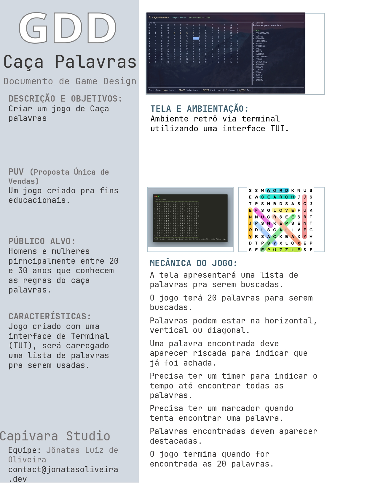
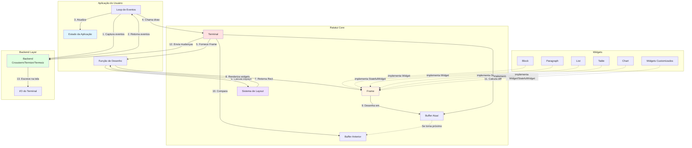
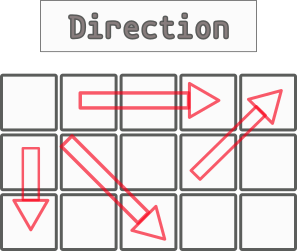
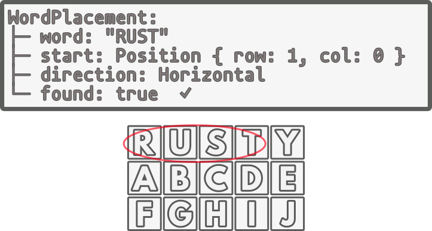

# Caça palavras - WIP

## Raio X


### Mecânicas do Jogo:

A tela apresentará uma lista de palavras pra serem buscadas.
O jogo terá 20 palavras para serem buscadas.
Palavras podem estar na horizontal, vertical ou diagonal.
Uma palavra encontrada deve aparecer riscada para indicar que já foi achada.
Precisa ter um timer para indicar o tempo até encontrar todas as palavras.
Precisa ter um marcador quando tenta encontrar uma palavra.
Palavras encontradas devem aparecer destacadas.O jogo termina quando forem encontradas as 20 palavras.

## TUI
Tui é *Terminal User Interface* e é usado amplamente na computação tanto corporativa quanto pessoal, é basicamente uma forma de termos um programa com uma interface com botões, menus e etc só que rodando no terminal é bem útil em várias situações e podemos fazer várias coisas com esse tipo de interface.

## Ratatui
Ratatui é uma biblioteca para criação de interfaces de usuário baseadas em texto (TUI) na linguagem de programação Rust. Ela é uma versão aprimorada e mantida da biblioteca TUI-rs, com o objetivo de fornecer uma maneira eficiente e fácil de construir TUIs no terminal.
Principais Recursos:
    Flexibilidade e Composição:
        O Ratatui oferece layout flexível e ferramentas para organizar componentes como painéis, caixas de texto, tabelas, gráficos, e barras de progresso, com base nas suas necessidades.
        Ele usa um sistema de layouts declarativos, permitindo que você divida sua interface em blocos reutilizáveis e bem organizados.
    Estilização e Temas:
        A biblioteca suporta estilos customizáveis para textos e widgets, permitindo a aplicação de cores, modificadores como negrito, sublinhado e itálico, além de temas personalizados.
        Com isso, você pode criar interfaces que se adaptam à estética desejada para a aplicação no terminal.
    Performance:
        Escrito em Rust, o Ratatui é muito eficiente em termos de uso de memória e processamento, o que o torna adequado para aplicações de linha de comando rápidas e reativas.
    Integração com Crossterm:
        O Ratatui funciona em conjunto com o Crossterm, uma biblioteca que oferece controle sobre o terminal (como captura de eventos de teclado e controle de entrada/saída de terminal) de maneira cross-platform (suporta Windows, Linux e macOS).
    Suporte a Eventos:
        Além do controle de layout e estilo, o Ratatui permite a captura de eventos de teclado e mouse, tornando possível a criação de interfaces interativas, como editores de texto, navegadores de arquivos, e clientes de chat.


O diagrama acima ilustra como os componentes do Ratatui se conectam e como a informação flui pelo sistema. Vou destacar alguns pontos importantes que você vê no diagrama:

O **ciclo numerado** (1-13) mostra o fluxo completo de uma iteração do loop de renderização. Você pode ver como começa com a captura de eventos do teclado, passa pela atualização do estado, depois pela renderização dos widgets, e finalmente termina com a escrita eficiente no terminal usando o sistema de diff.

As **linhas sólidas** representam o fluxo principal de dados e controle, enquanto as **linhas pontilhadas** mostram as relações de implementação entre os widgets e o sistema de renderização.

O **sistema de buffer duplo** é especialmente importante para performance: ao manter dois buffers e comparar apenas as diferenças, o Ratatui evita redesenhar toda a tela a cada frame, resultando em interfaces muito mais fluidas e responsivas.

## Atualizando o rust

Bom antes de começarmos nosso jogo vamos fazer novamente a atualização do rust:

```bash
rustup update stable
```
Criando projeto

Bom vamos criar nosso novo projeto em projects:

```bash
cargo new wordsearch
cd wordsearch
```

Para criar esse projeto vamos entender melhor como vamos estruturar nosso jogo.
## Iniciando o nosso projeto

Vamos agora adicionar algumas bibliotecas no nosso projeto.

```bash
cargo add ratatui crossterm color-eyre
```

Explicando as libs com o `ratatui` que é nossa lib base e o `crossterm` que como usamos no jogo anterior ele vai executar comandos no nosso terminal e finalmente o `color-eyre` que é apenas para colorir nossa saída do terminal quando houver erro no nosso programa.

Agora vamos colar o exemplo do site do [ratatui](https://ratatui.rs/tutorials/hello-ratatui/)

```rust
use color_eyre::Result;
use crossterm::event::{self, Event};
use ratatui::{DefaultTerminal, Frame};

fn main() -> Result<()> {
    color_eyre::install()?;
    let terminal = ratatui::init();
    let result = run(terminal);
    ratatui::restore();
    result
}

fn run(mut terminal: DefaultTerminal) -> Result<()> {
    loop {
        terminal.draw(render)?;
        if matches!(event::read()?, Event::Key(_)) {
            break Ok(());
        }
    }
}

fn render(frame: &mut Frame) {
    frame.render_widget("hello world", frame.area());
}
```

Explicando pontualmente para usar o _ratatui_ na nossa main através do `ratatui::init();`que basicamente inicializa um terminal, isso quer dizer que esse objeto é responsável para desenhar dentro do terminal.

Agora temos duas funções que serão muito importantes:
```rust
fn run(mut terminal: DefaultTerminal) -> Result<()> {
```

Essa função vai ser responsável para chamar nossa função de desenho que chamamos  aqui de render e também ali vamos fazer as iterações com teclado ou mouse pro nosso jogo.
Deixamos um loop infinito ali onde nesse caso clicando qualquer tecla damos um `break` e saímos do programa.

E na função:
```rust
fn render(frame: &mut Frame) {
```

é nossa função pra desenhar nossa tela, podemos ter mais funções de render se tivermos muitas telas pra desenhar, mas basicamente aqui nos vamos clicar nossos widgets.

Um ponto importante aqui conheço já o nosso método `frame.area())` onde ele marca o tamanho do terminal como um todo.

## Conceito do grid

Agora quero falar um pouco de como podemos desenhar as telas da nossa TUI, no caso do `ratatui` temos um conceito de _chunks_ ou seja, são pedaços do nosso _layout_ com eles podemos definir sessões pro nosso jogo. 

Veja na imagem abaixo vamos separar nosso layout do jogo em 3 partes ou 3 _chunks_ uma pro header, outra pro footer e finalmente o meio pro Grid.


Com isso podemos criar na nossa função render nosso layout padrão.

```rust
    let size = frame.area();

    // Layout principal
    let chunks = Layout::default()
        .direction(Direction::Vertical)
        .constraints([
            Constraint::Length(3), // Header
            Constraint::Min(0),    // Game area
            Constraint::Length(3), // Footer
        ])
        .split(size);
```
Aqui vamos definir que o _size_ do nosso projeto vai ser toda a área do frame, com isso podemos definir nossos _chunks_. Pra iniciar nosso layout nós passamos o `Layout::default()` que fica responsável por iniciar nosso layout.

Em `direction(Direction::Vertical)` nós passamos como vamos dividir os _chunks_ que nesse caso será vertical. Em `constraints` nós definimos os pedaços e pro nosso footer e header vamos passar o valor _3_ que nesse caso vai ser interpretado como linhas e a área do jogo colocamos como `Min(0)` que dentro da biblioteca vai ocupar todo o espaço disponível no layout.

Finalmente usamos o `.split(size)` que aqui tem como objetivo pegar a area da nossa tela e fazer o split conforme capturamos.

Com isso ainda não vamos ter nada por que não renderizamos a tela mas, podemos começar a desenha nossa tela.

Pra saber mais dessa parte pode ver aqui.

[Layout do ratatui](https://ratatui.rs/tutorials/json-editor/ui/)
[Proporções](https://ratatui.rs/examples/layout/layout/#_top)

## Arquitetando nosso jogo

Vamos agora criar dois arquivos pro nosso jogo, o primeiro vai ser o módulo pro
nosso jogo vamos chamar de `ui.rs`.

```bash
touch src/ui.rs
```
Esse módulo vamos concentrar tudo relacionado ao desenho da tela do nosso jogo, agora vamos
mudar a forma que trabalhamos com nossos testes, vamos criar um diretório dedicado pros testes e também um arquivo chamado `test_ui.rs`.

```bash
mkdir -p tests
touch tests/tests_ui.rs
```

Agora vamos criar no nosso `src` um arquivo chamado `lib.rs` e agora ao invés de exportar nossos módulos no nosso `main.rs` vamos exportar diretamente no nosso `lib.rs`.

### Por que no lib e não direto no main?
Primeiro quando exportamos para `lib.rs` estamos deixando nossos módulos como APIs públicas e eles podem ser reutilizados por outros binários se houvesse no nosso código, mas também pro nosso caso vai facilitar pra testarmos nosso código através de um diretório externo que é o caso do nosso diretório `tests`.

Com isso agora vamos fazer uma pequena revisão sobre `clousures`.

## Closures

**Closures** (ou funções anônimas) são funções que podem processar elementos do ambiente onde foram definidas. Diferente de funções regulares criadas com `fn`, closures são anônimas (não precisam de nome) e têm a capacidade especial de "lembrar" e usar variáveis do escopo onde foram criadas. Em Rust, o compilador analisa como cada variável é capturada e escolhe automaticamente a melhor estratégia de implementação.

A sintaxe básica de uma closure é simples: `|parâmetros| expressão`. Por exemplo, `|x| x + 1` é uma closure que recebe um valor e retorna esse valor incrementado. Closures podem ser armazenadas em variáveis e passadas como argumentos para outras funções, tornando-as perfeitas para callbacks, iteradores e programação funcional.

```rust
// Closure simples que captura uma variável do ambiente
let multiplicador = 5;
let multiplicar = |x| x * multiplicador; // Captura 'multiplicador'

println!("10 * {} = {}", multiplicador, multiplicar(10)); // 50
```

Rust possui três traits principais para closures, que determinam como elas capturam e usam variáveis:
- **`Fn`**: captura por referência imutável (`&T`) - pode ser chamada múltiplas vezes sem modificar o ambiente
- **`FnMut`**: captura por referência mutável (`&mut T`) - pode modificar o ambiente, mas pode ser chamada múltiplas vezes
- **`FnOnce`**: captura por valor (toma posse, move) - consome o ambiente, só pode ser chamada uma vez

```rust
// Exemplo dos três tipos de closures
let mut contador = 0;

// Fn - apenas lê, não modifica
let ler = || println!("Contador: {}", contador);
ler();
ler(); // Pode chamar múltiplas vezes

// FnMut - modifica o ambiente
let mut incrementar = || {
    contador += 1;
    contador
};
println!("Novo valor: {}", incrementar()); // 1
println!("Novo valor: {}", incrementar()); // 2

// FnOnce - consome o valor (move)
let mensagem = String::from("Sistema ativado!");
let consumir = || {
    println!("{}", mensagem);
    mensagem // move mensagem pra fora
};
consumir(); // OK
// consumir(); // ERRO! Não pode chamar de novo
```

### Por que Closures são Importantes?

Closures são fundamentais em Rust porque permitem:
1. **Callbacks e Event Handlers**: responder a eventos com lógica customizada
2. **Iteradores**: transformar e filtrar coleções de forma elegante com `map`, `filter`, `for_each`
3. **Programação Funcional**: compor operações complexas de forma declarativa
4. **Lazy Evaluation**: adiar computações até que sejam realmente necessárias
5. **Threads**: passar código com contexto para execução paralela

Com isso podemos começar a desenhar nosso header.

## Criando um render pro nosso header

Primeiro vamos criar um teste para verificar se nossa função `draw_header` existe. Nesse momento não vamos usar o `rstest` pra criar uma `fixture` mas, vamos criar uma função auxiliar.

Pra isso vamos importar a `struct` `TestBackend` que já vem com o `ratatui`,  com ele podemos criar uma terminal de teste e usar no nosso código.

```rust
use ratatui::backend::{backend::TestBackend, Terminal};

fn setup_terminal() -> Terminal<TestBackend> {
    let backend = TestBackend::new(80, 24);
    Terminal::new(backend).unwrap()
}
```

Então a função `setup_terminal` vai retornar um terminal pra nós e assim podemos usar o método `new` pra gerar nosso backend, depois usando a `struct` `Terminal` criamos o terminal em si.

Com isso podemos criar um teste pra apenas verificar se vai ser chamada a nossa função `draw_header` que vamos implementar.

Nossa função `draw_header` vamos criar um terminal e chamar seu método `draw` e no método vamos passar o retorno da nossa função `draw_header` e assim podemos passar o retorno da nossa função `draw_header` como uma `clousure`. Finalmente podemos encadear um `expect` depois do `draw` para lançar um erro caso aconteça algum problema.

```rust
use ratatui::{backend::TestBackend, layout::Rect, Terminal};

#[test]
fn test_draw_header_renders_successfully() {
    // Setup
    let mut terminal = setup_terminal();
    let area = Rect::new(0, 0, 80, 3);

    // Act - Assert
    terminal
        .draw(|f| draw_header(f, area))
        .expect("draw_header should render");
}
```

Aqui nosso teste não tem um assert por que só o fato de renderizar já é considerado um sucesso, então vamos rodar assim o nosso código e vamos ter o erro abaixo:

```bash
error[E0425]: cannot find function `draw_header` in this scope
  --> tests/tests_ui.rs:34:19
   |
34 |         .draw(|f| draw_header(f, area))
   |                   ^^^^^^^^^^^ not found in this scope
```
Bom como sabemos esse erro é por que não temos o draw_header criado, vamos cria-lo na nosso módulo ui.

```rust
pub fn draw_header(f: &mut Frame, area: Rect) {

}
```
Agora é importante ressaltar que todas as funções que vamos testar serão publicas nesse projeto, no futuro nos próximos projetos vamos delimitar aspectos que precisam ser públicos e os aspectos privados, manejando os testes corretamente. Mas, nesse projeto eu quero que você se acostume a criar os testes de forma pública já que anteriormente só criamos testes no próprio
módulo.

Agora precisamos importar o `draw_header` no `tests_ui.rs` e depois rodar os testes:

```rust
// tests_ui.rs
use wordsearch::ui::draw_header;

```
```bash
    Finished `test` profile [unoptimized + debuginfo] target(s) in 0.20s
     Running unittests src/lib.rs (target/debug/deps/wordsearch-b906015e74c9ad81)

running 0 tests

test result: ok. 0 passed; 0 failed; 0 ignored; 0 measured; 0 filtered out; finished in 0.00s

     Running unittests src/main.rs (target/debug/deps/wordsearch-ca09197567fe797a)

running 0 tests

test result: ok. 0 passed; 0 failed; 0 ignored; 0 measured; 0 filtered out; finished in 0.00s

     Running tests/tests_ui.rs (target/debug/deps/tests_ui-547972e55c75e006)

running 1 test
test test_draw_header_renders_successfully ... ok

test result: ok. 1 passed; 0 failed; 0 ignored; 0 measured; 0 filtered out; finished in 0.00s

   Doc-tests wordsearch

running 0 tests

test result: ok. 0 passed; 0 failed; 0 ignored; 0 measured; 0 filtered out; finished in 0.00s
```
Sucesso! Agora começamos a construir o primeiro elemento da nossa ui.

## Entendo como capturar os elementos do nosso render

Agora nosso teste já passou, queremos que nosso header tenha um label com o tempo que decorrido durante o jogo e o título do jogo que vai ser `_Wordsearch_`.

Pra isso vamos ter que criar no nosso teste uma nova função auxiliar, nela vamos acessar nosso terminal de teste, ai vamos precisar navegar por alguns métodos, vamos acessar o método `backend` nele vamos acessar o método `buffer` que representa os elementos que foram renderizados. 

Então vamos criar uma função chamada `get_buffer_content`.

```rust
fn get_buffer_content(terminal: &Terminal<TestBackend>) {
    terminal
        .backend()
        .buffer()
}

```

Uma vez com isso ainda precisamos acessar o método `content` pra pegar o conteúdo gerado para o buffer. O `content` vai retornar um tipo especial o `&[Cell]` que é uma coleção e por usa vez tem implementado `iterator` pois ele é uma sequência de elementos.

```rust
fn get_buffer_content(terminal: &Terminal<TestBackend>){
    terminal
        .backend()
        .buffer()
        .content()
        .iter()
}
```

Como nós queremos um conteúdo especifico do `&Cell` que foi gerado pelo nosso `iterator` vamos selecionado. No caso precisamo do campo `symbols` então vamos mapear todos os `symbols` dos elementos dentro do content e pra isso vamos criar uma `clousure` dedicada a capturar esse campo dos elementos de `content` e finalmente damos um `collect` no final.

O `collect` é um método especial que ainda não vimos mas, seu objetivo é transformar um
`iterator` em uma coleção, no nosso caso `symbols` é um item do tipo `&str` então o collect vai
transformar o retorno numa coleção de `String` então vamos indicar que o retorno dessa função é
uma `String`.

```rust
fn get_buffer_content(terminal: &Terminal<TestBackend>) -> String {
    terminal
        .backend()
        .buffer()
        .content()
        .iter()
        .map(|c| c.symbol())
        .collect()
}
```

Pra saber mais sobre os detalhes de cada método e seu retorno você pode [consultar a
documentação do `ratatui`](https://docs.rs/ratatui/latest/ratatui/buffer/struct.Buffer.html#structfield.content).

## Preenchendo o header

Ainda não vamos desenhar a tela mas, vamos primeiro criar um teste nele vamos checar se dentro do conteúdo do nosso header há uma string chamada tempo, uma string chamada _Found_ que representa as palavras encontradas e outra chamada `_Wordsearch_`.

Com isso em mente vamos criar um teste chamado `test_draw_header_contains_required_elements` vamos passar como setup um terminal e uma area aqui vamos criar um retângulo simples.

```rust
#[test]
fn test_draw_header_contains_required_elements() {
    // Setup
    let mut terminal = setup_terminal();
    let area = Rect::new(0, 0, 80, 3);

}

```

Agora vamos simplesmente chamar a função `terminal.draw` precisamos fazer um desempacotamento
do método pois ele retorna um result.

```rust
#[test]
fn test_draw_header_contains_required_elements() {
    // Setup
    let mut terminal = setup_terminal();
    let area = Rect::new(0, 0, 80, 3);
    terminal.draw(|f| draw_header(f, area)).unwrap();

}

```
Agora vamos criar nosso _Act_ recebendo o conteúdo do nosso terminal gerado, pra isso vamos
usar a função auxiliar `get_buffer_content` que criamos

```rust
#[test]
fn test_draw_header_contains_required_elements() {
    // Setup
    let mut terminal = setup_terminal();
    let area = Rect::new(0, 0, 80, 3);
    terminal.draw(|f| draw_header(f, area)).unwrap();

    // Act
    let content = get_buffer_content(&terminal);

}
```
Finalmente vamos agora verificar se contem nele existem as strings que precisamos, pra isso
vamos usar a macro `assert!` e pra verificar vamos usar o próprio método contains que existe
dentro da `struct String`.

```rust
#[test]
fn test_draw_header_contains_required_elements() {
    //Assert
    let mut terminal = setup_terminal();
    let area = Rect::new(0, 0, 80, 3);
    terminal.draw(|f| draw_header(f, area)).unwrap();

    // Act
    let content = get_buffer_content(&terminal);

    // Assert
    assert!(
        content.contains("Wordsearch"), "Should have a title"
    );
    assert!(content.contains("Time:"), "Should have a label Time");
    assert!(
        content.contains("Found:"),
        "Should have a label Found"
    );
}
```

Agora vamos rodar nosso teste e devemos receber a falha abaixo:

```bash
failures:

---- test_draw_header_contains_required_elements stdout ----

thread 'test_draw_header_contains_required_elements' panicked at tests/tests_ui.rs:49:5:
Should have a title
note: run with `RUST_BACKTRACE=1` environment variable to display a backtrace

```
Agora precisamos desenhar em si nosso header. Vamos criar uma `String`
para exibir o tempo.

```rust
pub fn draw_header(f: &mut Frame, area: Rect) {
    let time_str = String::from("Time: ");

```
Agora vamos pra um tópico novo dentro do `ratatui`, vamos trabalhar com a `struct Span`  para
criar nossos textos e para formata-los vamos chamar o método `styled`. Dentro de `styled` vamos
usar a `struct Style` para aplicar as formatações, e sempre vamos chamar seu construtor
`default` para já nos entregar os atributos mínimos preenchidos para facilitar nossa vida.

Essa é uma forma parecida com uma formatação `html`, assim podemos aplicar formatação de texto
de forma mais conhecida para saber mais sobre as nossas opções de estilos você pode [ver na
documentação](https://docs.rs/ratatui/latest/ratatui/text/struct.Span.html).

Para criar nosso título vamos criar um vetor chamado `header_text` e ele vai receber um vetor
de [Line](https://docs.rs/ratatui/latest/ratatui/text/struct.Line.html) que basicamente
consiste em um ou mais spans. Então vamos adicionar um span para a palavra `Wordsearch` um para
`Found` e vamos criar um espaçamento entre essas palavras usando `Span::raw` já que vai ser um texto
vazio apenas.

Vamos também por um ícone de lupa no nosso `header` pra isso vamos copiar o emoji através do
site do [`emojipedia`](https://emojipedia.org/).


```rust
pub fn draw_header(f: &mut Frame, area: Rect) {
    let time_str = String::new("Time: ");

    let header_text = vec![Line::from(vec![
        Span::styled(
            "🔍 Wordsearch",
            Style::default()
                .fg(Color::Yellow.into())
                .add_modifier(Modifier::BOLD),
        ),
        Span::raw("  "),
        Span::styled(time_str, Style::default().fg(Color::Cyan.into())),
        Span::raw("  "),
        Span::styled(format!("Found: ",), Style::default().fg(Color::Green.into())),
    ])];
```
Finalmente podemos fazer o render em si, agora precisamos para isso criar uma variável `header`
com ela vamos construir um [`Paragraph`](https://docs.rs/ratatui/latest/ratatui/widgets/struct.Paragraph.html) que é um widget que mostra um texto.

Ainda não falei dos _widgets_ mas, basicamente um _widget_ é um trecho de código reutilizável para renderizar algum elemento da tela, pense como um pedaço do _layout_ da sua tela, eles são uteis pois são elementos que podemos reutilizar e representam algum aspecto da nossa tela, seja um texto, um botão ou qualquer outro
elemento visual que precisamos.

Além do `Paragraph` nós queremos que nosso header tenha uma borda, no `ratatui` precisamos
nesse caso criar uma [`Block`](https://docs.rs/ratatui/latest/ratatui/widgets/struct.Paragraph.html#method.block) e também vamos chamar o método `default()` para preencher com os valores mínimos.

E pra finalizar nossa formatação vamos usar uma [`struct Wrap`](https://docs.rs/ratatui/latest/ratatui/widgets/struct.Wrap.html) para configurar a quebra de linha e a opção `trim` que é para ajustar os espaços, assim nossos textos não vão ficar cortados e vão se ajustar ao tamanho da tela de exibição, então se você não estiver usando o terminal como eu em tela cheia vai perceber que ele vai ajustar o texto com o tamanho da sua tela de terminal e não vai cortar o texto.

```rust
pub fn draw_header(f: &mut Frame, area: Rect) {
    let time_str = String::new("Time: ");

    let header_text = vec![Line::from(vec![
        Span::styled(
            "🔍 Wordsearch",
            Style::default()
                .fg(Color::Yellow.into())
                .add_modifier(Modifier::BOLD),
        ),
        Span::raw("  "),
        Span::styled(time_str, Style::default().fg(Color::Cyan.into())),
        Span::raw("  "),
        Span::styled(format!("Found: ",), Style::default().fg(Color::Green.into())),
    ])];

    let header = Paragraph::new(header_text)
        .block(Block::default().borders(Borders::ALL))
        .wrap(Wrap { trim: true });

    f.render_widget(header, area);
}

```

Agora podemos rodar os testes novamente:

```bash
cargo test
running 2 tests
test test_draw_header_contains_required_elements ... ok
test test_draw_header_renders_successfully ... ok

test result: ok. 2 passed; 0 failed; 0 ignored; 0 measured; 0 filtered out; finished in 0.00s

   Doc-tests wordsearch

running 0 tests

test result: ok. 0 passed; 0 failed; 0 ignored; 0 measured; 0 filtered out; finished in 0.00s
```

Com o nosso teste funcionando vamos adicionar agora no nosso main dentro do nosso render. Vamos
passar a posição 0 do nosso _chunks_ que é a parte do _layout_ do `header`.

```rust
fn render(frame: &mut Frame) {
    let size = frame.area();

    // Layout principal
    let chunks = Layout::default()
        .direction(Direction::Vertical)
        .constraints([
            Constraint::Length(3), // Header
            Constraint::Min(0),    // Game area
            Constraint::Length(3), // Footer
        ])
        .split(size);

    // Header com informações do jogo
    draw_header(frame, chunks[0]);

```

## Option, Result, Wrap, Unwrap e Expect

Bom agora chegou a hora de falarmos de algumas coisas que estamos usando a algum tempo e até
agora você sabia que existia e não entramos muito a fundo e agora chegou a hora.

### Wrap
Antes de falar sobre desembrulhar (unwrap), precisamos entender como embrulhar valores em Rust. Pense nisso como colocar um presente em uma caixa:
Nesse presente temos o conteúdo que queremos dar e ele pode vir com um valor que queremos, ou
vazio ou ainda com uma mensagem do por que não pode entregar o conteúdo. Em rust por _default_
vai querer embrulhar sua resposta no método `main` que é o nosso `Result` mas, também durante
esse curso algumas vezes embrulhamos nossos valores usando um `Option`.

### Option<T>

[Option<T>](https://doc.rust-lang.org/std/option/enum.Option.html) é um `enum` (tipo enumerado) que representa a possibilidade de ter um valor ou não ter nada. Ele tem dois possíveis estados:

Some(valor): O valor existe e pode ser acessado
None: Não há valor — represente o "vazio" com segurança

```rust
fn recuperar_munição_do_arsenal(tipo: &str) -> Option<i32> {
    match tipo {
        "míssil" => Some(5),        // Temos 5 mísseis
        "laser" => Some(999),       // Energia infinita de laser
        "plasma" => None,           // Não temos plasma, estamos sem ele
        _ => None,                  // Tipo desconhecido = nada
    }
}

fn equipar_arma() {
    let munição = recuperar_munição_do_arsenal("míssil");
    
    match munição {
        Some(qtd) => println!("Equipado! Temos {} mísseis!", qtd),
        None => println!("Arsenal vazio! Sem munição desse tipo."),
    }
}
```

Você usa Option quando uma operação pode não retornar nada, mas não há um "erro" em sentido técnico. Por exemplo: buscar o primeiro soldado em uma lista (pode não haver nenhum), procurar um item em um mapa (pode não ter sido guardado lá), ou verificar se um inimigo foi detectado pelo radar (o sensor pode estar desligado ou não ter alvos). O Rust força você a lidar com ambos os casos, eliminando bugs silenciosos onde você acessa null por acidente.

Essa é a forma dele tratar o famoso _null pointer_ assim ao invés de checar se o valor é nulo
nós verificamos se há algo ali.

#### Métodos úteis
```rust
let valor = Some(42);

// unwrap_or: se Some, retorna; se None, retorna padrão
let resultado = valor.unwrap_or(0);  // 42

// map: transforma o valor se existir
let dobrado = valor.map(|x| x * 2);  // Some(84)

// is_some / is_none: verificações simples
if valor.is_some() {
    println!("Tem valor!");
}
```

### Result<T>

Agora vamos para algo que usamos muito no nosso dia-a-dia com rust, o [Result<T, E>](https://doc.rust-lang.org/std/result/enum.Result.html) é um `enum` com dois possíveis estados que representa o resultado de uma operação que pode falhar:

Ok(valor): A operação funcionou e retorna um valor do tipo T
Err(erro): A operação falhou e retorna informações sobre o erro do tipo E


```rust
fn conectar_ao_servidor_central(endereço: &str) -> Result<String, String> {
    // Simulando tentativa de conexão
    if endereço.contains("válido") {
        Ok("Conexão estabelecida com sucesso!".to_string())
    } else {
        Err("Erro: Endereço do servidor inválido".to_string())
    }
}

// Usando o resultado
fn sincronizar_dados() {
    let resultado = conectar_ao_servidor_central("servidor-válido.com");
    
    match resultado {
        Ok(mensagem) => println!("✓ {}", mensagem),
        Err(erro) => println!("✗ Falha: {}", erro),
    }
}
```

Você usa Result quando uma operação pode ter sucesso ou falha com uma razão específica. Por exemplo: conectar ao servidor central (pode falhar por rede), ler dados do sensores (pode haver interferência), ou disparar a arma principal (pode travar). A diferença crucial: com Result, você sabe por que algo falhou, não só que falhou.

### Métodos úteis
```rust
let resultado = Ok::<i32, String>(50);

// unwrap_or: se Ok, retorna; se Err, retorna padrão
let valor = resultado.unwrap_or(0);  // 50

// map: transforma o Ok se existir
let dobrado = resultado.map(|x| x * 2);  // Ok(100)

// ? (operador try): retorna Err imediatamente (aprenderemos depois!)
fn operacao() -> Result<i32, String> {
    let x = disparar_arma_principal(100)?;  // Se falhar, retorna o erro
    Ok(42)
}
```

### unwrap - expect

Em Rust, tanto Option<T> quanto Result<T, E> encapsulam valores que podem ou não estar presentes. Às vezes, porém, você está absolutamente certo de que o valor existe (ou aceita que o programa falhe se não existir). É aí que unwrap() e expect() entram em cena.
O que fazem esses métodos?
unwrap() extrai o valor interno de um Option ou Result. Se for Some(valor) ou Ok(valor), você recebe valor. Se for None ou Err(e), o programa entra em pânico (panic) e termina com uma mensagem genérica:

```rust
fn main() {
    let combustivel: Option<u32> = Some(100);
    let quantidade = combustivel.unwrap(); // 100 — tudo certo!

    let vazio: Option<u32> = None;
    // let falha = vazio.unwrap(); // ⚠️ PANIC: "called `Option::unwrap()` on a `None` value"

}
```
### Expect
expect(mensagem) faz o mesmo que unwrap(), mas permite que você forneça uma mensagem personalizada de erro. Isso torna o pânico mais informativo durante a depuração:

```rust
let resultado: Result<String, &str> = Err("falha no reator");
// let comando = resultado.expect("Sistema de propulsão falhou!"); 
// ⚠️ PANIC: "Sistema de propulsão falhou!: falha no reator"
```
Quando usar unwrap/expect?

 - Em testes unitários: onde você quer que o teste falhe imediatamente se algo inesperado acontecer.
 - Em protótipos: para desenvolvimento rápido antes de adicionar tratamento de erros robusto.
 - Quando há garantia lógica: por exemplo, depois de verificar explicitamente com is_some() ou is_ok()
 - Em código de exemplo: para manter a clareza sem distrair com tratamento de erros

### Boas práticas
Em código de produção, prefira métodos que não causam pânico:

```rust
// ❌ Perigoso em produção
let valor = opcao.unwrap();

// ✅ Tratamento seguro com match
let valor = match opcao {
    Some(v) => v,
    None => return Err("Valor ausente"),
};

// ✅ Valor padrão com unwrap_or
let valor = opcao.unwrap_or(0);

// ✅ Computação lazy com unwrap_or_else  
let valor = opcao.unwrap_or_else(|| calcular_padrao());

// ✅ Propagação de erros com ?
let valor = resultado?;
```

### Operador ?

O operador ? é uma forma elegante e segura de desembrulhar valores, mas ao invés de causar pânico, ele propaga o erro para quem chamou a função. É como dizer: "Se der erro aqui, eu não posso resolver, então passo o problema para cima".

```rust
// ❌ Sem o operador ? (verbose)
fn processar_dados() -> Result<String, String> {
    let dado1 = match obter_dado1() {
        Ok(d) => d,
        Err(e) => return Err(e),  // Propagar erro manualmente
    };
    
    let dado2 = match obter_dado2() {
        Ok(d) => d,
        Err(e) => return Err(e),  // Propagar erro manualmente
    };
    
    Ok(format!("{} {}", dado1, dado2))
}

// ✅ Com o operador ? (limpo e conciso)
fn processar_dados() -> Result<String, String> {
    let dado1 = obter_dado1()?;  // Se Err, retorna automaticamente
    let dado2 = obter_dado2()?;  // Se Err, retorna automaticamente
    
    Ok(format!("{} {}", dado1, dado2))
}
```
O operador ? faz três coisas:

Se Ok/Some: Desembrulha o valor e continua
Se Err/None: Converte e retorna o erro imediatamente
Conversão automática: Converte tipos de erro compatíveis

✅ USE quando:

A função já retorna Result ou Option
Você quer propagar erros para o chamador
Não precisa fazer tratamento local do erro
Quer código limpo e conciso

❌ NÃO use quando:

Precisa tratar o erro localmente
Quer fornecer valor padrão (use unwrap_or etc.)
Os tipos de erro não são compatíveis

Diferença entre ?, unwrap e match:
```rust
// Operador ? - Propaga erro (seguro, requer Result/Option)
let valor = funcao_que_pode_falhar()?;

// unwrap - Causa pânico (perigoso)
let valor = funcao_que_pode_falhar().unwrap();

// match - Tratamento explícito (verboso mas claro)
let valor = match funcao_que_pode_falhar() {
    Ok(v) => v,
    Err(e) => return Err(e),
};
```

Exemplo prático em um sistema de mecha:
```rust
use std::collections::HashMap;

struct SistemaMecha {
    energia: HashMap<String, u32>,
}

impl SistemaMecha {
    fn obter_energia(&self, sistema: &str) -> Option<u32> {
        self.energia.get(sistema).copied()
    }
    
    // ❌ Versão perigosa - pode causar panic
    fn ativar_arma_inseguro(&self) {
        let energia = self.obter_energia("arma").unwrap();
        println!("Arma ativada com {} unidades", energia);
    }
    
    // ✅ Versão segura - retorna Result
    fn ativar_arma_seguro(&self) -> Result<(), String> {
        let energia = self.obter_energia("arma")
            .ok_or_else(|| "Sistema de arma sem energia!".to_string())?;
        
        if energia < 10 {
            return Err("Energia insuficiente para disparo!".to_string());
        }
        
        println!("Arma ativada com {} unidades", energia);
        Ok(())
    }
}
```

Lembre-se quando usamos unwrap() é como um botão de ejeção, use apenas quando estiver preparado para as consequências ou quando tiver certeza absoluta de que é seguro.

## Macros

Existem dois tipos principais de macros em Rust: macros declarativas (definidas com [macro_rules!]https://doc.rust-lang.org/rust-by-example/macros.html) e macros procedurais (que são funções especiais anotadas com atributos). As macros declarativas funcionam através de pattern matching, você define padrões de sintaxe que a macro deve reconhecer e especifica o código que deve ser gerado quando esse padrão é encontrado. Elas são como um match expression super-poderoso que trabalha com tokens de código ao invés de valores. As macros procedurais, por outro lado, são mais flexíveis e podem manipular o AST (Abstract Syntax Tree) diretamente, mas também são mais complexas e requerem uma crate separada.

Exemplo Básico: Macro declarativa

```rust
macro_rules! log_status {
    ($msg:expr) => {
        println!("[STATUS] {}", $msg);
    };
    
    ($level:expr, $msg:expr) => {
        println!("[{}] {}", $level, $msg);
    };
}

fn main() {
    log_status!("Sistema inicializado");
    log_status!("INFO", "Todos os sistemas operacionais");
    
    // println!("[STATUS] {}", "Sistema inicializado");
    // println!("[{}] {}", "INFO", "Todos os sistemas operacionais");
}
```

Fragmentos de Sintaxe (Fragment Specifiers)
Macros podem capturar diferentes tipos de elementos sintáticos:

expr - expressões (como 2 + 2, minha_funcao())
ident - identificadores (nomes de variáveis, funções)
ty - tipos (i32, Vec<String>)
stmt - statements (declarações)
block - blocos de código ({ ... })
tt - token tree (qualquer token)
literal - literais (42, "texto")

```rust
macro_rules! comando_mecha {
    // Captura um identificador (nome da ação)
    ($acao:ident) => {
        println!("Executando comando: {}", stringify!($acao));
    };
    
    // Captura um identificador e uma expressão (com parâmetro)
    ($acao:ident, $param:expr) => {
        println!("Executando {}: com parâmetro {}", 
                 stringify!($acao), $param);
    };
}

fn main() {
    comando_mecha!(avançar);           // Identifica a ação
    comando_mecha!(girar, 90);         // Ação com parâmetro
}
```

Por que usar Macros?

Evitar repetição de código (DRY - Don't Repeat Yourself): quando você tem um padrão que se repete mas não pode ser abstraído com funções
Criar DSLs (Domain-Specific Languages): criar sintaxe customizada para seu domínio
Interfaces variáveis: aceitar número variável de argumentos (como println!, vec!)
Geração de código em tempo de compilação: zero overhead em runtime
Capturar informações do contexto: como file!(), line!(), column!() que funções não conseguem

## Trabalhando com o footer

Agora vamos começar a desenhar nosso footer, primeiro vamos criar um teste parecido com o header pra ver se ele consegue chamar a função `draw_footer`.

```rust
#[test]
fn test_draw_footer_renders_successfully() {
    // Setup
    let mut terminal = setup_terminal();
    let area = Rect::new(0, 0, 80, 4);

    // Act - Assert
    terminal
        .draw(|f| draw_footer(f, area))
        .expect("draw_footer should render");
}
```
Agora vamos rodar o nosso teste:

```bash
❯ cargo test
   Compiling wordsearch v0.1.0 (/home/feanor/projects/wordsearch)
error[E0425]: cannot find function `draw_footer` in this scope
   --> tests/tests_ui.rs:108:19
    |
108 |         .draw(|f| draw_footer(f, area))
    |                   ^^^^^^^^^^^ not found in this scope

For more information about this error, try `rustc --explain E0425`.
error: could not compile `wordsearch` (test "tests_ui") due to 1 previous error
```

Certo isso acontece por que não temos uma função `draw_footer` ainda. Então vamos cria-la e ele
vai seguir a mesma assinatura do nosso `draw_header` pois eles possuem a mesma função.
```rust
//ui.rs
pub fn draw_footer(f: &mut Frame, area: Rect) {
}
```

Agora importamos ele no teste e vamos executar novamente.
```rust
running 3 tests
test test_draw_header_renders_successfully ... ok
test test_draw_footer_renders_successfully ... ok
test test_draw_header_contains_required_elements ... ok

```
Para o footer vamos precisar colocar os comandos do jogo pra auxiliar nosso jogador e pra isso
vamos criar um teste que verifique se o footer tem os comandos. Pra isso vamos criar um vetor
que vai armazenar uma tupla com duas `&str`.

```rust
#[test]
fn test_draw_footer_contains_all_controls() {
    // Setup
    let mut terminal = setup_terminal();
    let area = Rect::new(0, 0, 80, 4);
    terminal.draw(|f| draw_footer(f, area)).unwrap();
    let controls = vec![
        ("Move", "movement in grid"),
        ("Select", "selection letter"),
        ("Confirm", "confirmation"),
        ("Clean", "clean selection"),
        ("Close", "close game"),
    ];

    // Act
    let content = get_buffer_content(&terminal);
}
```
Agora pra testarmos a função vamos criar um _loop_ onde vamos comparar se na nossa variável
content há as strings que estão em _controls_ e pra isso vamos criar um  _for_ que vai percorrer o vetor de _controls_ e desestruturar a tupla em duas variáveis pra percorrermos
durante o nosso loop e comparar com o conteúdo de _content_.

```rust
#[test]
fn test_draw_footer_contains_all_controls() {
    // Setup
    let mut terminal = setup_terminal();
    let area = Rect::new(0, 0, 80, 4);
    terminal.draw(|f| draw_footer(f, area)).unwrap();
    let controls = vec![
        ("Move", "movement in grid"),
        ("Select", "selection letter"),
        ("Confirm", "confirmation"),
        ("Clean", "clean selection"),
        ("Close", "close game"),
    ];

    // Act
    let content = get_buffer_content(&terminal);

    // Assert
    for (action, description) in controls {
        assert!(
            content.contains(action),
            "Should control for {}: '{}'",
            description,
            action
        );
    }
}
```
Agora rodando vamos ter a falha que vai ser o texto dentro do nosso _assert_.

```bash

failures:

---- test_draw_footer_contains_all_controls stdout ----

thread 'test_draw_footer_contains_all_controls' panicked at tests/tests_ui.rs:95:9:
Should control for movement in grid: 'move'
note: run with `RUST_BACKTRACE=1` environment variable to display a backtrace
```

Certo agora vamos implementar nossa função passando todos os controles que queremos.

```rust
fn draw_footer(f: &mut Frame, area: Rect) {
    let footer_text = vec![
        Line::from(vec![
            Span::raw("Controls: "),
            Span::styled("↑↓←→", Style::default().fg(Color::Yellow)),
            Span::raw(" Move | "),
            Span::styled("SPACE", Style::default().fg(Color::Yellow)),
            Span::raw(" Select | "),
            Span::styled("ENTER", Style::default().fg(Color::Yellow)),
            Span::raw(" Confirm | "),
            Span::styled("c", Style::default().fg(Color::Yellow)),
            Span::raw(" Clean | "),
            Span::styled("q/ESC", Style::default().fg(Color::Yellow)),
            Span::raw(" Close"),
        ]),
        Line::from(vec![
            Span::styled("Status: ", Style::default().fg(Color::Cyan)),
            Span::raw(" "),
        ]),
    ];

    let footer = Paragraph::new(footer_text)
        .block(Block::default().borders(Borders::ALL))
        .wrap(Wrap { trim: true });

    f.render_widget(footer, area);
}

```
Agora rodamos os testes e vemos que tudo está funcionando:

```bash
running 4 tests
test test_draw_header_renders_successfully ... ok
test test_draw_header_contains_required_elements ... ok
test test_draw_footer_renders_successfully ... ok
test test_draw_footer_contains_all_controls ... ok
```

Agora precisamos colocar nossa função footer no `main.rs`


```rust
fn main() {
    //código

    // Header
    draw_header(frame, chunks[0]);
    // Footer
    draw_footer(frame, chunks[2]);

}
```

Importante reforçar que o footer como é a ultima parte do nosso layout ele vai pro `chunks[2]` e podemos ver ele funcionando.

Vamos criar agora mais um teste para complementar o anterior e verificar se todos os comandos foram inseridos. Isso é importante pra termos certeza que todas as opções estão a vista do jogador.


```rust
#[test]
fn test_draw_footer_shows_control_keys() {
    // Setup
    let mut terminal = setup_terminal();
    let area = Rect::new(0, 0, 80, 4);
    terminal.draw(|f| draw_footer(f, area)).unwrap();

    // Act
    let content = get_buffer_content(&terminal);
    let has_arrow_keys = content.contains("↑") || content.contains("↓");
    let has_space = content.contains("SPACE");
    let has_enter = content.contains("ENTER");
    let has_clear = content.contains("c");
    let has_quit = content.contains("q") || content.contains("ESC");

    // Assert
    assert!(has_arrow_keys, "Should have the movement keys");
    assert!(has_space, "Should show key space");
    assert!(has_enter, "Should show key enter");
    assert!(has_clear, "Should show key c");
    assert!(has_quit, "Should show quit keys");
}
```
Agora verificando os testes:

```bash
test test_draw_header_renders_successfully ... ok
test test_draw_header_contains_required_elements ... ok
test test_draw_footer_shows_control_keys ... ok
test test_draw_footer_renders_successfully ... ok
test test_draw_footer_contains_all_controls ... ok
```
Perfeito tudo funcionando! Agora podemos ir desenhar nosso grid.

## Desenhando o grid

O grid será necessário dividir em partes, nesse primeiro momento só vamos desenha-lo. Mas,
ainda não vamos por as palavras.

Para iniciar vamos fazer aquele teste básico de ver se nosso _layout_ de _grid_ vai renderizar corretamente.

```rust
#[test]
fn test_draw_grid_renders_successfully() {
    // Setup
    let mut terminal = setup_terminal();
    let area = Rect::new(0, 0, 80, 20);

    // Act - Assert
    terminal
        .draw(|f| draw_grid(f, area))
        .expect("draw_grid deve renderizar sem erros");
}
```

Agora temos o erro que ele não está no escopo:

```bash
error[E0425]: cannot find function `draw_grid` in this scope
   --> tests/tests_ui.rs:136:19
    |
136 |         .draw(|f| draw_grid(f, area))
    |                   ^^^^^^^^^ not found in this scope
```

Como as funções anteriores, vamos criar nossa função `draw_grid` e também vamos importar no
nosso teste.

```rust
pub fn draw_grid(f: &mut Frame, area: Rect) {
}
```

Agora se rodarmos os testes vamos ver que está tudo funcionando:

```rust
running 6 tests
test test_draw_footer_shows_control_keys ... ok
test test_draw_grid_renders_successfully ... ok
test test_draw_footer_contains_all_controls ... ok
test test_draw_header_renders_successfully ... ok
test test_draw_footer_renders_successfully ... ok
test test_draw_header_contains_required_elements ... ok
```

Vamos criar um título na parte do _grid_ mas, antes vamos criar um teste para verificar se nosso _grid_ tem o título _Grade_.

```rust
#[test]
fn test_draw_grid_has_title() {
    // Setup
    let mut terminal = setup_terminal();
    let area = Rect::new(0, 0, 80, 20);
    terminal.draw(|f| draw_grid(f, area)).unwrap();

    // Act
    let content = get_buffer_content(&terminal);

    // Assert
    assert!(
        content.contains("Grade"),
        "Should a title 'Grade'"
    );
}
```

Certo o teste agora falhou:

```bash
failures:

---- test_draw_grid_has_title stdout ----

thread 'test_draw_grid_has_title' panicked at tests/tests_ui.rs:151:5:
Should a title 'Grade'
note: run with `RUST_BACKTRACE=1` environment variable to display a backtrace
```

Vamos criar um título no nosso _grid layout_. Nesse caso vamos criar um bloco e além de criar
as bordas vamos dar a esse bloco o título _Grade_ que queremos.

```rust
pub fn draw_grid(f: &mut Frame, area: Rect) {
    let block = Block::default().title("Grade").borders(Borders::ALL);

    f.render_widget(block, area);
}
```

Rodamos os testes:

```bash
running 7 tests
test test_draw_grid_has_title ... ok
test test_draw_footer_renders_successfully ... ok
test test_draw_header_renders_successfully ... ok
test test_draw_grid_renders_successfully ... ok
test test_draw_header_contains_required_elements ... ok
test test_draw_footer_shows_control_keys ... ok
test test_draw_footer_contains_all_controls ... ok
```
Agora vamos adicionar ao nosso grid a nosso render.

```rust
fn render(frame: &mut Frame) {
    // Header
    draw_header(frame, chunks[0]);
    // Grid
    draw_grid(frame, chunks[1]);
    // Footer
    draw_footer(frame, chunks[2]);
}

```

Rodamos o nosso projeto e vemos que agora temos todos os elementos da nossa tela desenhados.

## Arquitetando nosso _grid system_

Vamos começar a trabalhar no nosso sistema que vai carregar as palavras e exibir na tela. Pra isso vamos começar vamos criar um novo módulo para ser responsável por todas as regras que são relativas ao jogo em si, vamos chama-la de `game`, também vamos criar um módulo que representa o nosso _grid_ e chama-lo de `grid.rs`.

```bash
touch src/game.rs
touch src/grid.rs
```

Vamos deixar esse módulo publico dentro do nosso `lib.rs`

```rust
pub mod ui;
pub mod game;
pub mod grid;

```
Para começar nosso desenvolvimento vamos ter que criar uma representação do nosso _grid_.

## Fundamentos do nosso grid.

Agora preciso lhe explicar como vai funcionar nosso sistema de grid, primeiro teremos 4
estruturas distintas.

### Grid
Ele será uma matriz de células onde cada célula vai ter uma letra.

Grid (10x10)
┌─────────────────────────────────────┐
│  P  A  L  A  V  R  A  S  X  Z       │  ← Linha 0
│  R  U  S  T  O  M  N  Q  W  Y       │  ← Linha 1
│  O  K  L  E  T  R  A  S  D  F       │  ← Linha 2
│  G  H  J  K  L  M  N  O  P  Q       │
│  R  S  T  U  V  W  X  Y  Z  A       │
│  A  B  C  D  E  F  G  H  I  J       │
│  M  N  O  P  Q  R  S  T  U  V       │
│  A  W  X  Y  Z  A  B  C  D  E       │
│  R  F  G  H  I  J  K  L  M  N       │
│  Z  O  P  Q  R  S  T  U  V  W       │
└─────────────────────────────────────┘

Ai como vamos distribuir nossas palavras dentro dessa matriz?

### Position

Vamos precisar de uma `struct Position` nela vamos conseguir definir a posição que vai ficar a
primeira letra da nossa palavra.


### Direction

Vamos precisar também de uma `struct Direction` nela vamos definir se a palavra vai seguir na
horizontal, vertical ou diagonal.



### `Wordplacement`

Também precisamos de uma `struct Wordplacement` sua função vai ser a representação da nossa
palavra, com ele vamos ter a palavra em si, sua posição, sua direção e também um marcador pra
indicar se ela foi encontrada ou não.



Agora vamos construir cada estrutura. Primeiro vamos criar nossa _Position_ e ela vai ter um número de coluna e linha, vamos cria-lo como um `usize`. Vamos adicionar as `traits` `Debug` e `Clone`.

```rust
//grid.rs
#[derive(Debug, Clone)]
pub struct Position {
    pub row: usize,
    pub col: usize,
}
```

A nossa _Direction_ vai ser um `enum` com o nome das posições. Vamos adicionar nele as `traits` `Debug`, `Clone` e `PartialEq`

```rust
//grid.rs

#[derive(Debug, Clone, PartialEq)]
pub enum Direction {
    Horizontal,
    Vertical,
    DiagonalDown,
    DiagonalUp,
}
```
O `Wordplacement` vai agregar como falamos anteriormente a palavra, posição, direção e se ela foi encontrada ou não.

```rust
//grid.rs
pub struct WordPlacement {
    pub word: String,
    pub start: Position,
    pub direction: Direction,
    pub found: bool,
}
```

Finalmente vamos criar nosso `Grid` onde ele vai ser uma `struct` com suas células que será um vetor de caracteres, as palavras a serem encontradas que serão um vetor de `WordPlacement` e seu tamanho que será do tipo `usize`.

```rust
pub struct Grid {
    cells: Vec<Vec<char>>,
    pub size: usize,
    pub words: Vec<WordPlacement>,
}
```

Com isso já podemos começar a trabalhar com a lógica do nosso jogo.

## Manipulando arquivos em Rust

Para o nosso jogo vamos criar um arquivo de texto simples para armazenar as palavras que
queremos que nosso jogador procure então agora vamos precisar trabalhar com leitura e escrita de arquivos em rust pra isso vamos trabalhar com a biblioteca `fs` que já vem por padrão.

A biblioteca padrão [`std::fs`](https://doc.rust-lang.org/std/fs/) fornece pra nós as funcionalidades para manipulação de arquivos e diretórios do sistema de arquivos.

Para começarmos a trabalhar com a leitura de arquivos vamos no nosso módulo `game` e criar uma nova `struct` que será chamada de `GameState` onde ela vai controlar os estados do nosso jogo.

```rust
//game.rs
use crate::grid::Grid;

pub struct GameState {
    pub grid: Grid,
}
```
Agora queremos que nosso `GameState` com a responsabilidade de ler o arquivo pra isso queremos criar uma função `load_words_from_file` nele para que ele leia o conteúdo do arquivo e transforme pra nós como um vetor de `String`. Mas, primeiro vamos criar um teste que já verifique isso então vamos criar um novo arquivo de teste e criar duas funções auxiliares uma pra criar um arquivo e outra pra deletar um arquivo.

```bash
touch /tests/tests_game.rs
```
```rust
use std::fs;
use std::io;

// Helper: cria arquivo temporário para testes
fn create_test_file(filename: &str, content: &str) {
    fs::write(filename, content).expect("Error to create test file");
}

// Helper: limpa arquivo de teste
fn cleanup_test_file(filename: &str) {
    fs::remove_file(filename).ok();
}
```
Com a função [`fs::write`](https://doc.rust-lang.org/std/fs/fn.write.html) podemos passar o nome do arquivo e um conteúdo que se o arquivo não existir ele vai cria-lo.

Já a função [`fs::remove_file`](https://doc.rust-lang.org/std/fs/fn.remove_file.html) podemos passar um nome de arquivo e remove-lo.

Com isso já podemos criar nosso primeiro teste para validar um arquivo.

## Lendo nosso arquivo de palavras

A primeira coisa que vamos fazer é criar um teste pra verificar pra isso vamos criar um arquivo com as palavras "rust", "python" e "java". E vamos chamar nosso método `load_words_from_file` e verificar se o tamanho e as palavras batem.

No final do teste vamos chamar a função `cleanup_test_file` e ele vai ser nosso `Tear Down` que é basicamente uma função que limpa nosso teste para que ele não afete os próximos testes.

```rust
//tests_game.rs
#[test]
fn test_load_words_from_valid_file() {
    // Setup
    let filename = "test_words_valid.txt";
    create_test_file(filename, "rust\npython\njava\n");

    // Act
    let words = GameState::load_words_from_file(filename).unwrap();

    // Assert
    assert_eq!(words.len(), 3, "Expected 3 words");
    assert_eq!(words, vec!["rust", "python", "java"]);

    // Tear down
    cleanup_test_file(filename);
}
```
Vamos adiantar e já criar o método antes de rodar o teste. Vamos fazer ele receber um `&str` chamado filename e vamos retornar um `Result` que vai ser um vetor de `String` e por ser um result vamos por que o retorno com erro vai ser um `io::Error`.

```rust
impl GameState {

    pub fn load_words_from_file(filename: &str) -> Result<Vec<String>, io::Error> {
    }
}
```
```bash
error[E0308]: mismatched types
  --> src/game.rs:12:52
   |
12 |     pub fn load_words_from_file(filename: &str) -> Result<Vec<String>, io::Error> {
   |            --------------------                    ^^^^^^^^^^^^^^^^^^^^^^^^^^^^^^ expected `Result<Vec<String>, Error>`, found `()`
   |            |
   |            implicitly returns `()` as its body has no tail or `return` expression
   |
   = note:   expected enum `Result<Vec<String>, std::io::Error>`
           found unit type `()`
```
A falha que deu agora, acontece por que definimos que ele vai retornar um result então
precisamos pelo menos empacotar um vetor de `String`, pra isso vamos usar a função
[`read_to_string`](https://doc.rust-lang.org/std/fs/fn.read_to_string.html) para ler nosso arquivo e salva-lo como um vetor.

```rust

impl GameState {

    pub fn load_words_from_file(filename: &str) -> Result<Vec<String>, io::Error> {
        let content = fs::read_to_string(filename)?;
        let words: Vec<String> = content
            .lines()
            .map(|line| line.to_string())
            .collect();
        Ok(words)
    }
}
```

Agora rodando os testes vão passar. E agora estamos lendo com sucesso nosso arquivo gerado.

```bash
running 1 test
test test_load_words_from_valid_file ... ok
```
Vamos fazer algumas modificações eu quero primeiro que nossas palavras sejam todas em caixa alta para isso vamos criar um teste que valide que as palavras são todas em caixa alta.

```rust
#[test]
fn test_convert_all_words_to_uppercase() {
    // Setup
    let filename = "test_mixed_case.txt";
    create_test_file(filename, "rust\nPython\nJaVa\nGO");

    // Act
    let words = GameState::load_words_from_file(filename).unwrap();

    // Assert
    assert!(words.iter().all(|w| w.chars().all(|c| c.is_uppercase())),
        "Should all words is uppercase, found: {:?}", words);
    
    cleanup_test_file(filename);
}
```
```bash
running 2 tests
test should_convert_all_words_to_uppercase ... FAILED
test test_load_words_from_valid_file ... ok

failures:

---- should_convert_all_words_to_uppercase stdout ----

thread 'should_convert_all_words_to_uppercase' panicked at tests/tests_game.rs:40:5:
Should all words is uppercase, found: ["rust", "Python", "JaVa", "GO"]
note: run with `RUST_BACKTRACE=1` environment variable to display a backtrace
```

Vamos refatorar nossa função e ao invés de usar o `to_string` vamos usar direto o método `to_uppercase` para deixar todos os caracteres em caixa alta.

```rust
    pub fn load_words_from_file(filename: &str) -> Result<Vec<String>, io::Error> {
        let content = fs::read_to_string(filename)?;
        let words: Vec<String> = content
            .lines()
            .map(|line| line.to_uppercase())
            .collect();

        Ok(words)
    }
```
```bash
running 2 tests
test test_convert_all_words_to_uppercase ... ok
test test_load_words_from_valid_file ... FAILED

failures:

---- test_load_words_from_valid_file stdout ----

thread 'test_load_words_from_valid_file' panicked at tests/tests_game.rs:24:5:
assertion `left == right` failed
  left: ["RUST", "PYTHON", "JAVA"]
 right: ["rust", "python", "java"]
note: run with `RUST_BACKTRACE=1` environment variable to display a backtrace
```

Agora nosso teste anterior começou a falhar, isso por que o teste era em caixa baixa, então vamos mudar o teste para tanto o setup quando o assert sejam em caixa alta.

```rust
#[test]
fn test_load_words_from_valid_file() {
    // Setup
    let filename = "test_words_valid.txt";
    create_test_file(filename, "RUST\nPYTHON\nJAVA\n");

    // Act
    let words = GameState::load_words_from_file(filename).unwrap();

    // Assert
    assert_eq!(words.len(), 3, "Expected 3 words");
    assert_eq!(words, vec!["RUST", "PYTHON", "JAVA"]);

    // Tear down
    cleanup_test_file(filename);
}
```
```bash
running 2 tests
test test_load_words_from_valid_file ... ok
test test_convert_all_words_to_uppercase ... ok
```
Temos que verificar agora se nosso texto quando tiver algumas sujeiras nas palavras como espaço ou tabs eles precisam ser removidos.

```rust
#[test]
fn test_trim_whitespace_from_words() {
    // Setup
    let filename = "test_trim.txt";
    create_test_file(
        filename,
        "  rust  \n\tpython\t\n   java  "
    );

    // Act
    let words = GameState::load_words_from_file(filename).unwrap();

    // Assert
    assert_eq!(words, vec!["RUST", "PYTHON", "JAVA"]);
    assert!(words.iter().all(|w| !w.starts_with(' ') && !w.ends_with(' ')),
        "Words should'nt space or tabs");
    
    // Tear Down
    cleanup_test_file(filename);
}
```
```bash
---- test_trim_whitespace_from_words stdout ----

thread 'test_trim_whitespace_from_words' panicked at tests/tests_game.rs:59:5:
assertion `left == right` failed
  left: ["  RUST  ", "\tPYTHON\t", "   JAVA  "]
 right: ["RUST", "PYTHON", "JAVA"]
note: run with `RUST_BACKTRACE=1` environment variable to display a backtrace


failures:
    test_trim_whitespace_from_words
```
Agora vamos precisar adicionar o método `trim` antes do `to_uppercase`.

```rust
    pub fn load_words_from_file(filename: &str) -> Result<Vec<String>, io::Error> {
        let content = fs::read_to_string(filename)?;
        let words: Vec<String> = content
            .lines()
            .map(|line| line.trim().to_uppercase())
            .collect();

        Ok(words)
    }
}
```
```bash
running 3 tests
test test_convert_all_words_to_uppercase ... ok
test test_load_words_from_valid_file ... ok
test test_trim_whitespace_from_words ... ok
```

Agora já conseguimos garantir que nosso arquivo do jogo vai gerar as palavras da forma que queremos.

## Analisando os casos excepcionais

O que vai acontecer se nosso arquivo com as palavras tiver vazio ou ainda ele não existir?
Normalmente vamos ter um arquivo lá, mas caso não tenha sabemos como nosso sistema vai se
comportar? Chamamos isso de casos excepcionais ou casos de borda ou ainda _edge cases_ que são comportamentos que só vão acontecer em casos muito particulares.
Vamos tentar fazer um teste para verificar.


```rust
#[test]
fn test_return_error_when_file_does_not_exist() {
    // Setup
    let filename = "file_not_found.txt";

    // Act
    let result = GameState::load_words_from_file(filename);

    // Assert
    assert!(result.is_err(), 
        "Should raise a error if file not exist");
}
```
```bash
running 4 tests
test test_return_error_when_file_does_not_exist ... ok
test test_convert_all_words_to_uppercase ... ok
test test_load_words_from_valid_file ... ok
test test_trim_whitespace_from_words ... ok
```
Muito bom o teste passou e agora se o arquivo for vazio, ele vai lançar um erro? Vamos
verificar se ele não vai retornar o método `is_empty` como verdadeiro.

```rust
#[test]
fn test_empty_file_should_raise_error() {
    // Setup
    let filename = "test_empty.txt";
    create_test_file(
        filename,
        ""
    );

    // Act
    let words = GameState::load_words_from_file(filename).unwrap();

    // Assert
    assert!(!words.is_empty(), 
        "Should raise a error if file is empty");
    
    // Tear Down
    cleanup_test_file(filename);
}
```
```bash
running 5 tests
test test_return_error_when_file_does_not_exist ... ok
test test_empty_file_should_raise_error ... FAILED
test test_convert_all_words_to_uppercase ... ok
test test_load_words_from_valid_file ... ok
test test_trim_whitespace_from_words ... ok

failures:

---- test_empty_file_should_raise_error stdout ----

thread 'test_empty_file_should_raise_error' panicked at tests/tests_game.rs:93:5:
Should raise a error if file is empty
note: run with `RUST_BACKTRACE=1` environment variable to display a backtrace
```
Aqui o teste trouxe um erro pois não tratamos esse caso ainda de não ter nenhuma palavra, então agora precisamos trabalhar para gerar um módulo de erros pro nosso jogo.

## Iniciando nosso módulo de erros

Pra iniciar vamos criar um novo módulo `error` e colocado no nosso `lib.rs`.

```bash
touch src/error.rs
```
```rust
//lib.rs
pub mod ui;
pub mod game;
pub mod grid;
pub mod error;
```
Agora queremos criar um `enum` com nossos erros, vamos criar um `IoError` pra usar no nosso result e outro `NoWordsProvided` para lançar quando o arquivo estiver vazio. Também vamos criar um comentário com 3 barras "///" para servir como documentação.

```rust
#[derive(Debug)]
pub enum WordSearchError {
    /// Error by I/O (file not found, permissions, etc.)
    IoError(std::io::Error),
    /// Any word found
    NoWordsProvided,
}

```

Agora precisamo adicionar um novo `impl` para indicar para o nosso compilador que nosso `WordSearchError` faz parte de `Error`.
 ```
impl std::error::Error for WordSearchError {}
```
Aqui basicamente dizemos que o tipo `WordSearchError` implementa o `trait std::error::Error`.
Se você já tem um conhecimento de _estrutura de dados_ aqui não é uma herança mas sim uma
composição.

Aqui no caso o `for` não é um `loop` nesse contexto ele quer falar que "Eu sei transformar `std::error::Error` em `WordsearchError`"

Por que o bloco está vazio {}?
O trait `std::error::Error` já vem com implementações padrão (`default impls`) para a maioria dos seus métodos. Então aqui só precisamos realmente criar a implementação vazia.

Outro ponto importante é que para cada `struct` ou `enum` que criamos podemos ter quantos `impl` quisermos.

Agora precisamos colocar mais um `impl` para que nosso `WordsearchError` faça o tratamento do `ioError` internamente. Toda vez que ele receber o `ioError` ele vai trata-lo e devolver um erro customizado do tipo `WordsearchError` para isso precisamos implementar a [`trait From`](https://doc.rust-lang.org/std/convert/trait.From.html).

Ao implementar a trait `From`, definimos o método `from`, que recebe como parâmetro o tipo de origem (no caso, `std::io::Error`) e ele retorna `Self`, ou seja, o tipo que está recebendo a implementação o `WordSearchError`.
Dentro do método, criamos e retornamos a variante correspondente do nosso tipo de erro `WordSearchError::IoError(error)`.

```rust
//error.rs

impl From<std::io::Error> for WordSearchError {
    fn from(error: std::io::Error) -> Self {
        WordSearchError::IoError(error)
    }
}
```

Com isso podemos apenas trabalhar como nosso erro customizado no nosso código. 

## Customizando nossas mensagens de erro

Agora vamos implementar a trait Display para trazer uma melhor visualização pro nosso erro. Nela precisamos criar uma função `fmt` para que possamos criar uma mensagem customizada da forma que queremos.
Nesse caso também vamos usar um `impl` só que para `fmt::Display` que é a nossa trait e vamos fazer um match para verificar qual variante do nosso `enum` está sendo usada e formatar a mensagem de erro apropriada.
Também nesse caso vamos usar a macro `write!` ao invés do `println!` pois o `println!` sempre imprime diretamente no console (`stdout`), mas no nosso caso a `trait Display` está preparando a representação textual do erro para ser usada em diferentes contextos. O `write!` é mais flexível porque ele escreve no `formatter` (`buffer`) que foi passado como parâmetro, permitindo que essa representação seja usada com outras macros como `format!`, `println!`, salvamento em arquivos, etc.
Nós teremos então na função `fmt` os parâmetros `&self` pois vamos usar o próprio contexto do `enum` e também como disse
anteriormente o `formatter` que vai ser do tipo `fmt::Formatter<'_>` e vamos retornar um `fmt::Result`.
```rust
impl fmt::Display for WordSearchError {
    fn fmt(&self, f: &mut fmt::Formatter<'_>) -> fmt::Result {
        match self {
            WordSearchError::IoError(e) => write!(f, "IO Error: {}", e),
            WordSearchError::NoWordsProvided => write!(f, "No words provided"),
        }
    }
}
```
Novamente tivemos que recorrer a um `lifetime` no caso em `fmt::Formatter<'_>` porque o `Formatter` mantém uma referência ao buffer onde o texto será escrito, e essa referência precisa ter um tempo de vida válido. O `'_` indica que estamos deixando o Rust inferir automaticamente qual é o lifetime correto.

Pense assim: quando você formata o erro de um jogo, é como preparar uma mensagem em um quadro-negro antes de mostrá-la ao jogador. O `Formatter` é como uma seta apontando para esse quadro-negro, e o lifetime garante que o quadro não seja apagado enquanto você ainda está escrevendo nele. O `'_` diz ao Rust: "você sabe quanto tempo isso precisa durar, não preciso especificar".

Voltando ao `game.rs` vamos implementar uma condição parecida com o nosso _assert_  vamos verificar se _words_ é vazio e se
sim vamos lançar o erro do tipo `NoWordsProvided` nele.

```rust
    pub fn load_words_from_file(filename: &str) -> Result<Vec<String>, io::Error> {
        let content = fs::read_to_string(filename)?;
        let words: Vec<String> = content
            .lines()
            .map(|line| line.trim().to_uppercase())
            .collect();

        if words.is_empty() {
            return Err(WordSearchError::NoWordsProvided);
        }

        Ok(words)
    }
```

Vamos mudar o tipo de erro da saída do nosso `Result` da função pra `WordSearchError` também.
```rust
    pub fn load_words_from_file(filename: &str) -> Result<Vec<String>, WordSearchError> {
```

Nos testes precisamos agora parar de desempacotar nossa string e ver se há um erro usando o método `is_err`.

```rust
#[test]
fn test_empty_file_should_raise_error() {
    // Setup
    let filename = "test_empty.txt";
    create_test_file(
        filename,
        ""
    );

    // Act
    let words = GameState::load_words_from_file(filename);

    // Assert
    assert!(words.is_err(), "Should raise an error if file is empty");
    
    // Tear Down
    cleanup_test_file(filename);
}
```
```bash
test result: ok. 0 passed; 0 failed; 0 ignored; 0 measured; 0 filtered out; finished in 0.00s

     Running tests/tests_game.rs (target/debug/deps/tests_game-48a4cab4eebeef08)

running 5 tests
test test_return_error_when_file_does_not_exist ... ok
test test_empty_file_should_raise_error ... ok
test test_trim_whitespace_from_words ... ok
test test_convert_all_words_to_uppercase ... ok
test test_load_words_from_valid_file ... ok

test result: ok. 5 passed; 0 failed; 0 ignored; 0 measured; 0 filtered out; finished in 0.00s

     Running tests/tests_ui.rs (target/debug/deps/tests_ui-16d9dc32c61ca57b)
```
Agora já temos um módulo de erros funcional vamos fazer um último teste pra verificar se estamos lidando bem com apenas uma palavra.

```rust
#[test]
fn should_work_with_single_word() {
    // Setup
    let filename = "test_single.txt";
    create_test_file(filename, "rust");

    // Act
    let words = GameState::load_words_from_file(filename).unwrap();

    // Assert
    assert_eq!(words.len(), 1);
    assert_eq!(words[0], "RUST");
    
    // Tear Down
    cleanup_test_file(filename);
}
```
```bash
running 6 tests
test test_return_error_when_file_does_not_exist ... ok
test test_empty_file_should_raise_error ... ok
test test_load_words_from_valid_file ... ok
test test_convert_all_words_to_uppercase ... ok
test should_work_with_single_word ... ok
test test_trim_whitespace_from_words ... ok

test result: ok. 6 passed; 0 failed; 0 ignored; 0 measured; 0 filtered out; finished in 0.00s
```

Agora temos algumas boas garantias que nosso sistema de arquivos vai funcionar.

## Criando um alias pra um tipo

Agora eu quero fazer uma mudança ao invés de deixar o retorno do nosso método `load_words_from_file` como `Result<Vec<String>, WordSearchError>` quero deixa-lo apenas como `Result<(T)>` pra isso podemos criar um [`type`](https://doc.rust-lang.org/reference/types.html) que é um _alias_ ou um atalho ou ainda representar algo extenso com algo menor.

Então vamos criar esse `type` no final do nosso módulo.

```rust
// error.rs
pub type Result<T> = std::result::Result<T, WordSearchError>;
```

Com isso a agora podemos alterar o retorno da nossa função, e aqui estamos criando um alias pro Result da biblioteca  `std` com o nosso tipo de erro já declarado e chamando de result, por conta disso no nosso game vamos precisar importar explicitamente o result sendo ele o que está na nossa biblioteca error.

Além disso como retornamos uma `Vec<String>` nosso alias precisa ainda receber o tipo `T` do retorno.


```rust
use std::fs;

use crate::{error::{Result, WordSearchError}, grid::Grid};


pub struct GameState {
    pub grid: Grid,

}
impl GameState {

    pub fn load_words_from_file(filename: &str) -> Result<Vec<String>> {
        let content = fs::read_to_string(filename)?;
        let words: Vec<String> = content
            .lines()
            .map(|line| line.trim().to_uppercase())
            .collect();

        if words.is_empty() {
            return Err(WordSearchError::NoWordsProvided);
        }

        Ok(words)
    }
}
```
```bash
-> cargo test
running 6 tests
test test_return_error_when_file_does_not_exist ... ok
test test_convert_all_words_to_uppercase ... ok
test test_empty_file_should_raise_error ... ok
test should_work_with_single_word ... ok
test test_load_words_from_valid_file ... ok
test test_trim_whitespace_from_words ... ok

test result: ok. 6 passed; 0 failed; 0 ignored; 0 measured; 0 filtered out; finished in 0.00s
```

Com isso podemos centralizar todos os erros em `WordSearchError` e só passar o tipo do nosso retorno, isso que chamamos de "açucar sintático".


## Lifetimes

**Lifetimes** são anotações que dizem ao compilador por quanto tempo uma referência é válida. Em C/C++, usar referências para dados já desalocados causa bugs terríveis. Em Rust, o compilador simplesmente não permite.

**Pense assim:** Lifetimes são como etiquetas de validade em alimentos. O compilador verifica se você não está usando algo "vencido". A maioria das vezes o compilador infere automaticamente, mas às vezes precisamos ajudá-lo com anotações explícitas.

Normalmente precisamos anotar o lifetime quando em casos específicos e sempre anotar os parâmetros que recebemos emprestados `&` pois ele mantem-se marcando o tempo de vida dos parâmetros.

O código abaixo vai dar erro porque o compilador não sabe qual lifetime o retorno deve ter quando a função recebe múltiplas referências.
```rust
fn escolher_arma(arma1: &str, arma2: &str, usar_primeira: bool) -> &str {
    if usar_primeira { arma1 } else { arma2 }
}
let rifle = String::from("Rifle de Plasma");
let espada = String::from("Espada Laser");
let arma = escolher_arma(&rifle, &espada, true); // Erro
println!("Arma: {}", arma);
```
O erro ocorre por que arma depende da variável rifle ou espada, mas o compilador não sabe como retornar.
- Posso retornar arma1... mas qual é o lifetime dela?
- Posso retornar arma2... mas qual é o lifetime dela?
- São diferentes? São iguais?
- NÃO SEI! ERRO!

Isso acontece porque `arma1` e `arma2` podem ter lifetimes diferentes. O compilador não consegue garantir qual será retornado (arma1 ou arma2?) sem que você especifique explicitamente que ambos devem ter o mesmo lifetime.

Podemos resolver usando uma anotação `<'a>`, assim dizemos que eles duram o tempo `a`.

```rust
fn escolher_arma<'a>(arma1: &'a str, arma2: &'a str, usar_primeira: bool) -> &'a str {
    if usar_primeira { arma1 } else { arma2 }
}

let rifle = String::from("Rifle de Plasma");
let espada = String::from("Espada Laser");
let arma = escolher_arma(&rifle, &espada, true);
println!("Arma: {}", arma); // "Rifle de Plasma"
```

**O que `<'a>` significa?**
- `'a` é um nome de lifetime (pode ser `'b`, `'vida`, qualquer nome), todas essas referências vivem **pelo menos** durante o tempo `'a` e também vive durante `'a`

Podemos também usar dois lifetimes independentes e combinar esses dados.

```rust 
fn combinar_dados<'a, 'b>(
    piloto: &'a str,
    missao: &'b str,
) -> (&'a str, &'b str) {
    (piloto, missao)
}

let piloto = String::from("Elena");
let resultado = {
    let missao = String::from("Reconhecimento");
    combinar_dados(&piloto, &missao)
}; // ❌ ERRO
```

**Por quê?** `'a` e `'b` são independentes. Se `missao` vive menos, não podemos usar `resultado.1` depois. Então se mantermos
as variáveis no mesmo contexto ele é funcional.

```rust 
fn combinar_dados<'a, 'b>(
    piloto: &'a str,
    missao: &'b str,
) -> (&'a str, &'b str) {
    (piloto, missao)
}

let piloto = String::from("Elena");
let missao = String::from("Reconhecimento");
let resultado = combinar_dados(&piloto, &missao);
```

Se sua função pode retornar o valor de um parâmetro ou outro podemos anotar o mesmo lifetime pra vários parâmetros.

```rust
fn maior_nome<'a>(nome1: &'a str, nome2: &'a str) -> &'a str {
    if nome1.len() > nome2.len() { nome1 } else { nome2 }
}

let n1 = String::from("Gundam");
let n2 = String::from("Valkyrie");
println!("Maior: {}", maior_nome(&n1, &n2)); // "Valkyrie"
```

Agora tivemos casos que recebemos algum parâmetro mas, vamos devolver um `static`, pra isso podemos usar o lifetime `static`.
```rust
fn obter_status(codigo: u32) -> &'static str {
    match codigo {
        200 => "Sistema Operacional",
        404 => "Sensor Não Encontrado",
        500 => "Erro Crítico",
        _ => "Status Desconhecido",
    }
}

let status = obter_status(404);
println!("{}", status); // "Sensor Não Encontrado"
```
String literals são `'static`, não dependem do parâmetro `codigo`. Ou seja esse lifetime está indicando que vamos retornar um
`static` e não alguma transformação do parâmetro.

Podemos também usar lifetimes para `Struct` e métodos, no caso de métodos o retorno vive enquanto `self` for válido.

```rust
struct Mecha<'a> {
    nome: &'a str,
    energia: u32,
}

impl<'a> Mecha<'a> {
    fn nome(&self) -> &str {
        self.nome
    }
    
    fn energia(&self) -> u32 {
        self.energia
    }
}
let nome = String::from("Valkyrie");
let mecha = Mecha { nome: &nome, energia: 100 };
println!("{} - {}%", mecha.nome(), mecha.energia());
```


## Construindo o grid

Precisamos criar um método também que vai gerar nosso grid recebendo um tamanho e a mesma string de palavras.


```rust
impl Grid {
    pub fn new(size: usize, words: Vec<String>) -> Result<Self> {
    }
}
```
Vamos criar agora uma inicialização onde vamos preencher nossa `struct Grid` e retorna-la.
```rust
    pub fn new(size: usize, words: Vec<String>) -> Result<Self> {
        let mut grid = Grid {
            cells: vec![vec![' '; size]; size],
            size,
            words: Vec::new(),
        };
        Ok(grid)
    }

```
Vamos preencher inicialmente o grid com as palavras do nosso arquivo, para isso precisamos de uma função que coloque as palavras que vão vir do nosso arquivo no grid então, na nossa `struct Grid` vamos criar um método chamado `place_words` que vai receber a própria `struct` e um vetor de `String` e como retorno vamos retornar apenas um Result então no final da nossa função vamos retornar um `Ok(())`.

```rust
    fn place_words(&mut self, words: Vec<String>) -> Result<()> {
        Ok(())
    }

```
Precisamos inicialmente agora criar um novo arquivo de teste para testar nosso grid e depois criar um teste para validar que `Grid` retorna _OK_ se for adicionado parâmetros válidos.

```bash
touch tests/tests_grid.rs
```
```rust
#[test]
fn test_grid_new_with_valid_parameters() {
    // Setup
    let words = vec![
        "RUST".to_string(),
        "CODE".to_string(),
        "TEST".to_string(),
    ];
    let size = 10;

    // Act
    let result = Grid::new(size, words);
    
    // Assert
    assert!(result.is_ok(), "Grid creation should succeed with valid parameters");
}
```
```bash
running 1 test
test test_grid_new_with_valid_parameters ... ok
```

Agora vamos criar um teste para validar se adicionarmos um size de valor 0 lançará um erro. Para isso vamos criar um erro do
tipo `InvalidGridSize` ele vai ser responsável por tratar o erro quando nosso `grid` for menor que 0, vamos fazer que ele
receba um parâmetro.

```rust
//error.rs
use std::fmt;

#[derive(Debug)]
pub enum WordSearchError {
    /// Error by I/O (file not found, permissions, etc.)
    IoError(std::io::Error),
    /// Any word found
    NoWordsProvided,
    /// Grid size not valid
    InvalidGridSize(usize),
}

impl fmt::Display for WordSearchError {
    fn fmt(&self, f: &mut fmt::Formatter<'_>) -> fmt::Result {
        match self {
            WordSearchError::IoError(e) => write!(f, "IO Error: {}", e),
            WordSearchError::NoWordsProvided => write!(f, "No words provided"),
            WordSearchError::InvalidGridSize(size) => {
                write!(f, "Invalid grid size: {}. Size must be greater than 2", size)
        }
    }
}
```
```rust
#[test]
fn test_grid_new_with_zero_size() {
    // Setup
    let words = vec!["RUST".to_string()];
    let size = 0;

    // Act
    let result = Grid::new(size, words);
    
    // Assert
    assert!(result.is_err(), "Grid creation should fail with size 0");
    if let Err(e) = result {
        match e {
            Error::InvalidGridSize(s) => assert_eq!(s, 0),
            _ => panic!("Expected InvalidGridSize error"),
        }
    }
}
```

Agora como vamos validar o nosso construtor? Poderíamos colocar apenas uma verificação do nosso `new` mas, poderíamos usar um
`design partner` nesse caso que é o padrão `build`.

O que é o Builder Pattern?
O Builder Pattern é um padrão de projeto criacional que permite construir objetos complexos passo a passo. Ele é especialmente útil quando:

- Um objeto tem muitos parâmetros opcionais
- A validação precisa ser feita durante a construção
- Você quer tornar a criação de objetos mais legível

Assim como quando estamos trabalhando com o arquivo que damos um `lines()`, `map()` e `collect()`, vamos criar nossos métodos
para encadear durante a construção do nosso grid. Mas, pra isso vamos precisar criar um `GridBuilder` e a função dele vai ser
especificamente trabalhar com a validação de `size` e `words` e a parte das células vai ficar responsável no nosso grid já
criado.

Se fosse um projeto real eu acredito que a melhor abordagem seria criar um método que valide o size é mais simples, porém
aqui vamos complicar um pouquinho apenas pra você ter uma visão das possibilidades na hora de construir um objeto.

Nessa construção vamos criar uma `struct GridBuilder` nela vamos ter `size` e `words` seu principal objetivo vai ser validar
esses dois atributos e construir o `grid`. Então primeiros vamos criar a  `struct` e validar se size for menor ou igual a 0
vamos lançar um erro `InvalidGridSize`.

```rust
pub struct GridBuilder {
    size: Option<usize>,
    words: Option<Vec<String>>,
}

impl GridBuilder {
    pub fn new() -> Self {
        Self {
            size: None,
            words: None,
        }
    }

    pub fn with_size(mut self, size: usize) -> Result<Self> {
        if size == 0 {
            return Err(WordSearchError::InvalidGridSize(size));
        }
        self.size = Some(size);
        Ok(self)
    }
```

Como estamos criando um builder vamos criar um método chamado `build` ele vai criar o grid.

```rust
pub struct GridBuilder {
    size: Option<usize>,
    words: Option<Vec<String>>,
}

impl GridBuilder {
    pub fn new() -> Self {
        Self {
            size: None,
            words: None,
        }
    }

    pub fn with_size(mut self, size: usize) -> Result<Self> {
        if size == 0 {
            return Err(WordSearchError::InvalidGridSize(size));
        }
        self.size = Some(size);
        Ok(self)
    }

    pub fn build(self) -> Grid {
        let size = self.size.expect("Size must be set");

        Grid {
            size,
            cells: vec![vec![' '; size]; size],
            words: vec![],
        }
    }
}
```

Agora podemos construir ele no nosso `struct Grid` e podemos encadear nosso método `new` com a validação de `with_size` e
usar o operador "?" para propagar o erro depois só devolvemos o `grid` do nosso construtor.

```rust
impl Grid {
    pub fn new(size: usize, words: Vec<String>) -> Result<Self> {
        let grid = GridBuilder::new()
            .with_size(size)?
            .build();
        Ok(grid)
    }

}
```
```bash
running
2 tests
test test_grid_new_with_zero_size ... ok
test test_grid_new_with_valid_parameters ... ok
```

## Validando nosso vetor de palavras

Primeiro vamos ajustar nosso método new em `grid.rs` para receber `WordPlacement` ao invés de uma string. E vamos aplicar a
`trait Debug` tanto em `Grid` quanto em `WordPlacement`

```rust
#[derive(Debug)]
pub struct WordPlacement {
    pub word: String,
    pub start: Position,
    pub direction: Direction,
    pub found: bool,
}

#[derive(Debug)]
pub struct Grid {
    cells: Vec<Vec<char>>,
    pub size: usize,
    pub words: Vec<WordPlacement>,
}

impl Grid {
    pub fn new(size: usize, words: Vec<WordPlacement>) -> Result<Self> {
        let grid = GridBuilder::new()
            .with_size(size)?
            .build();
        Ok(grid)
    }

}

```

Agora precisamos validar as palavras do nosso jogo, pra isso vamos criar um teste que quando for tentado construir o grid sem
palavras ele de um erro do tipo `NoWordsProvided` e no nosso grid vamos receber o parâmetro de palavras.


```rust
// tests_grid.rs
#[test]
fn test_grid_new_with_empty_words() {
    let words = Vec::new();
    let size = 10;

    let result = Grid::new(size, words);
    
    assert!(result.is_err(), "Grid creation should fail with empty word list");
    if let Err(e) = result {
        match e {
            Error::EmptyWordList => {},
            _ => panic!("Expected EmptyWordList error"),
        }
    }
}
```
```rust
//grid.rs
pub struct Grid {
    cells: Vec<Vec<char>>,
    pub size: usize,
    pub words: Vec<WordPlacement>,
}

impl Grid {
    pub fn new(size: usize, words: Vec<String>) -> Result<Self> {
        let grid = GridBuilder::new()
            .with_size(size)?
            .with_words(words)?
            .build();
        Ok(grid)
    }

}

pub struct GridBuilder {
    size: Option<usize>,
    words: Option<Vec<String>>,
}

impl GridBuilder {
    pub fn new() -> Self {
        Self {
            size: None,
            words: None,
        }
    }

    pub fn with_size(mut self, size: usize) -> Result<Self> {
        if size == 0 {
            return Err(WordSearchError::InvalidGridSize(size));
        }
        self.size = Some(size);
        Ok(self)
    }

    fn with_words(mut self, words: Vec<String>) -> Result<Self> {
        self.words = Some(words);
        Ok(self)
    }

    pub fn build(self) -> Grid {
        let size = self.size.expect("Size must be set");

        Grid {
            size,
            cells: vec![vec![' '; size]; size],
            words: vec![],
        }
    }
}
```
```bash
running 3 tests
test test_grid_new_with_valid_parameters ... ok
test test_grid_new_with_zero_size ... ok
test test_grid_new_with_empty_words ... FAILED

failures:

---- test_grid_new_with_empty_words stdout ----

thread 'test_grid_new_with_empty_words' panicked at tests/test_grid.rs:44:5:
Grid creation should fail with empty word list
```

O que precisamos fazer agora é criar uma validação se o `words` for um vetor vazio ele deve lançar um erro. Por isso vamos
modificar nosso `with_words` para fazer essa validação.

```rust
    fn with_words(mut self, words: Vec<String>) -> Result<Self> {
        if words.is_empty() {
            return Err(WordSearchError::NoWordsProvided);
        }
        self.words = Some(words);
        Ok(self)
    }
```
```bash
running 3 tests
test test_grid_new_with_empty_words ... ok
test test_grid_new_with_zero_size ... ok
test test_grid_new_with_valid_parameters ... ok

```

Agora o que acontece se criarmos um grid 5x5 e temos uma palavra como "Pneumoultramicroscopicossilicovulcanoconiose" acredito
que temos um problema não?
Então vamos criar um teste para verificar se a palavra é maior que o tamanho do nosso grid. Se a palavra for maior precisamos
lançar um erro do tipo `WordTooLong` então vamos cria-lo.

```rust
 use std::fmt;

#[derive(Debug)]
pub enum WordSearchError {
    /// Error by I/O (file not found, permissions, etc.)
    IoError(std::io::Error),
    /// Any word found
    NoWordsProvided,
    /// Grid size not valid
    InvalidGridSize(usize),
    /// Word is too long for the grid
    WordTooLong { word: String, size: usize },
}

impl fmt::Display for WordSearchError {
    fn fmt(&self, f: &mut fmt::Formatter<'_>) -> fmt::Result {
        match self {
            WordSearchError::IoError(e) => write!(f, "IO Error: {}", e),
            WordSearchError::NoWordsProvided => write!(f, "No words provided"),
            WordSearchError::InvalidGridSize(size) => {
                write!(f, "Invalid grid size: {}. Size must be greater than 0", size)
            }
            WordSearchError::WordTooLong { word, size } => {
                write!(f, "Word '{}' with length {} is too long for grid size {}", 
                    word, word.len(), size)
            }
        }
    }
}
```
Com isso podemos criar um teste:

```rust
#[test]
fn test_grid_new_with_word_too_large() {
    // Setup
    let words = vec!["VERYLONGWORDTHATDOESNOTFIT".to_string()];
    let size = 5;

    // Act
    let result = Grid::new(size, words);
    
    // Assert
    assert!(result.is_err(), "Grid creation should fail when word is larger than grid");
    
    match result {
        Err(WordSearchError::WordTooLarge { word, size: grid_size }) => {
            assert_eq!(word, "VERYLONGWORDTHATDOESNOTFIT");
            assert_eq!(grid_size, 5);
        }
        _ => panic!("Expected WordTooLong error"),
    }
}
```
```bash
running 4 tests
test test_grid_new_with_empty_words ... ok
test test_grid_new_with_valid_parameters ... ok
test test_grid_new_with_word_too_large ... FAILED
test test_grid_new_with_zero_size ... ok

failures:

---- test_grid_new_with_word_too_large stdout ----

thread 'test_grid_new_with_word_too_large' panicked at tests/test_grid.rs:64:5:
Grid creation should fail when word is larger than grid
note: run with `RUST_BACKTRACE=1` environment variable to display a backtrace
```

Precisamos agora criar um validador para nosso teste então aqui vamos precisar verificar o size e pra isso vamos criar uma variável condicional chamada let Some(current_size) e receber self.size o valor interno de self.size SE ele for Some.
Quando fazemos isso abrimos um bloco de código {}  lá podemos criar nosso código condicional no caso ele vai percorrer words e verificar se alguma é maior que current_size se isso for verdadeiro ele lança um erro, se não `current_size` vai receber `self.size`.
Poderiamos aqui tanto fazer um `match` com `self.size` e verificar se a `option` tem algum Some ou vazia ou mesmo
desempacotar com um `unwrap` mas, a vantagem do if let é ser seguro (não causa panic), conciso (uma linha), e idiomático. Além disso, ele extrai o valor automaticamente, sem precisar desempacotar manualmente.

Porém tudo vai depender do que você acha melhor em cada situação, mas hoje vamos fazer assim.

```rust
        if let Some(size) = self.size {
            for word in &words {
                if word.len() > size {
                    return Err(WordSearchError::WordTooLong {
                        word: word.clone(),
                        size,
                    });
                }
            }
        }
```
```bash
running 4 tests
test test_grid_new_with_word_too_large ... ok
test test_grid_new_with_empty_words ... ok
test test_grid_new_with_zero_size ... ok
test test_grid_new_with_valid_parameters ... ok
```
Vamos fazer um teste agora apenas pra validar se a palavra tem o mesmo tamanho do grid ela tem que aceitar.

```rust
#[test]
fn test_grid_new_with_exact_word_size() {
    // Setup
    let words = vec!["EXACT".to_string()];
    let size = 5;

    // Act
    let result = Grid::new(size, words);
    
    // Assert
    assert!(result.is_ok(), "Grid creation should succeed when word length equals grid size");
}
```
```bash
running 5 tests
test test_grid_new_with_exact_word_size ... ok
test test_grid_new_with_empty_words ... ok
test test_grid_new_with_valid_parameters ... ok
test test_grid_new_with_word_too_large ... ok
test test_grid_new_with_zero_size ... ok

```

Agora uma ultima validação precisamos ver que uma palavra tenha pelo menos dois caracteres, senão não é uma palavra não?
Então vamos criar um error `WordInvalid` para lançar quando o tamanho for menor que 2.

```rust
use std::fmt;

#[derive(Debug)]
pub enum WordSearchError {
    /// Error by I/O (file not found, permissions, etc.)
    IoError(std::io::Error),
    /// Any word found
    NoWordsProvided,
    /// Grid size not valid
    InvalidGridSize(usize),
    /// Word is too long for the grid
    WordTooLong { word: String, size: usize },
    /// Word should the minimal 2 characters
    WordInvalid { word: String },
}

impl fmt::Display for WordSearchError {
    fn fmt(&self, f: &mut fmt::Formatter<'_>) -> fmt::Result {
        match self {
            WordSearchError::IoError(e) => write!(f, "IO Error: {}", e),
            WordSearchError::NoWordsProvided => write!(f, "No words provided"),
            WordSearchError::InvalidGridSize(size) => {
                write!(f, "Invalid grid size: {}. Size must be greater than 0", size)
            }
            WordSearchError::WordTooLong { word, size } => {
                write!(f, "Word '{}' with length {} is too long for grid size {}", 
                    word, word.len(), size)
            }
            WordSearchError::WordInvalid { word } => {
                write!(f, "Word '{}' with length {} is too short you need the minimum 2 characters", 
                    word, word.len())
            }
        }
    }
}
```

Agora criamos o teste:

```rust
#[test]
fn test_grid_new_with_word_only_caracter_should_a_error() {
    // Setup
    let words = vec!["A".to_string()];
    let size = 2;

    // Act
    let result = Grid::new(size, words);
    
    // Assert
    assert!(result.is_err(), "Grid creation should fail when word is only one character");
    
    match result {
        Err(WordSearchError::WordInvalid { word }) => {
            assert_eq!(word, "A");
        }
        _ => panic!("Expected WordInvalid error"),
    }
}
```
```bash
running 6 tests
test test_grid_new_with_word_too_large ... ok
test test_grid_new_with_word_only_caracter ... FAILED
test test_grid_new_with_empty_words ... ok
test test_grid_new_with_valid_parameters ... ok
test test_grid_new_with_exact_word_size ... ok
test test_grid_new_with_zero_size ... ok

failures:

---- test_grid_new_with_word_only_caracter stdout ----

thread 'test_grid_new_with_word_only_caracter' panicked at tests/test_grid.rs:99:5:
Grid creation should fail when word is only one character
note: run with `RUST_BACKTRACE=1` environment variable to display a backtrace
```
Vamos colocar por segurança também um validador no build se words existe.

```rust
    pub fn build(self) -> Grid {
        let size = self.size.expect("Size must be set");
        let words = self.words.expect("Words must be set");

        Grid {
            size,
            cells: vec![vec![' '; size]; size],
            words: vec![],
        }

```

Ajustando agora vamos fazer simplesmente outro `if` pra validar isso.

```rust
    fn with_words(mut self, words: Vec<String>) -> Result<Self> {
        if words.is_empty() {
            return Err(WordSearchError::NoWordsProvided);
        }
        if let Some(size) = self.size {
            for word in &words {
                if word.len() > size {
                    return Err(WordSearchError::WordTooLong {
                        word: word.clone(),
                        size,
                    });
                }
                if word.len() < 2 {
                    return Err(WordSearchError::WordInvalid { word: word.clone() })
                }
            }
        }
        self.words = Some(words);
        Ok(self)
    }

```
```bash
running 6 tests
test test_grid_new_with_empty_words ... ok
test test_grid_new_with_exact_word_size ... ok
test test_grid_new_with_word_only_caracter_shoudl_a_error ... ok
test test_grid_new_with_valid_parameters ... ok
test test_grid_new_with_zero_size ... ok
test test_grid_new_with_word_too_large ... ok
```
Certo tudo funcionando.


## Validando o tamanho do jogo

Bom agora precisamos validar se o size do nosso jogo é maior ou igual a 2, menos que 2 células o jogo não existe
praticamente. Então vamos refatorar nosso teste pra validar um grid de tamanho 1 ainda vai dar erro.
Vamos renomear o teste `test_grid_new_with_zero_size` para  `test_grid_new_with_one_size` e mudar o tamanho de 0 para 1.
```rust
#[test]
fn test_grid_new_with_one_size() {
    // Setup
    let words = vec!["HI".to_string()];
    let size = 1;

    // Act
    let result = Grid::new(size, words);
    
    // Assert
    assert!(result.is_err(), "Grid creation should fail with size 1");
    
    match result {
        Err(WordSearchError::InvalidGridSize(s)) => {
            assert_eq!(s, 1, "Error should contain the invalid size value");
        }
        _ => panic!("Expected InvalidGridSize error with value 1"),
    }
}
```
```bash
running 6 tests
test test_grid_new_with_empty_words ... ok
test test_grid_new_with_word_too_large ... ok
test test_grid_new_with_word_only_caracter_shoudl_a_error ... ok
test test_grid_new_with_valid_parameters ... ok
test test_grid_new_with_exact_word_size ... ok
test test_grid_new_with_one_size ... FAILED

failures:

---- test_grid_new_with_one_size stdout ----

thread 'test_grid_new_with_one_size' panicked at tests/test_grid.rs:33:14:
Expected InvalidGridSize error with value 1
```

Agora alterando nosso grid ele precisa ter valor maior que 1.
```rust
    pub fn with_size(mut self, size: usize) -> Result<Self> {
        if size <= 1 {
            return Err(WordSearchError::InvalidGridSize(size));
        }
        self.size = Some(size);
        Ok(self)
    }
```
```bash
running 6 tests
test test_grid_new_with_empty_words ... ok
test test_grid_new_with_one_size ... ok
test test_grid_new_with_exact_word_size ... ok
test test_grid_new_with_valid_parameters ... ok
test test_grid_new_with_word_only_caracter_shoudl_a_error ... ok
test test_grid_new_with_word_too_large ... ok
```


WIP - Conteúdo em construção
